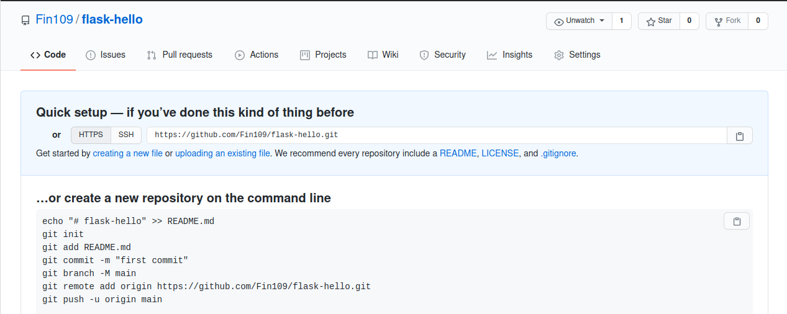
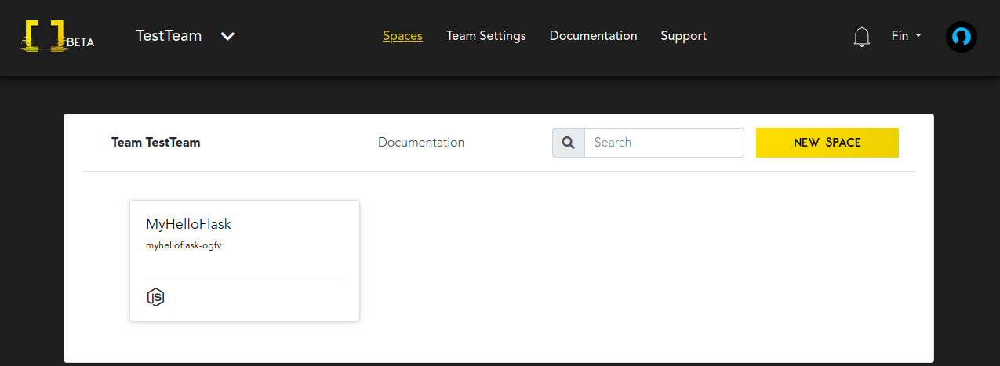
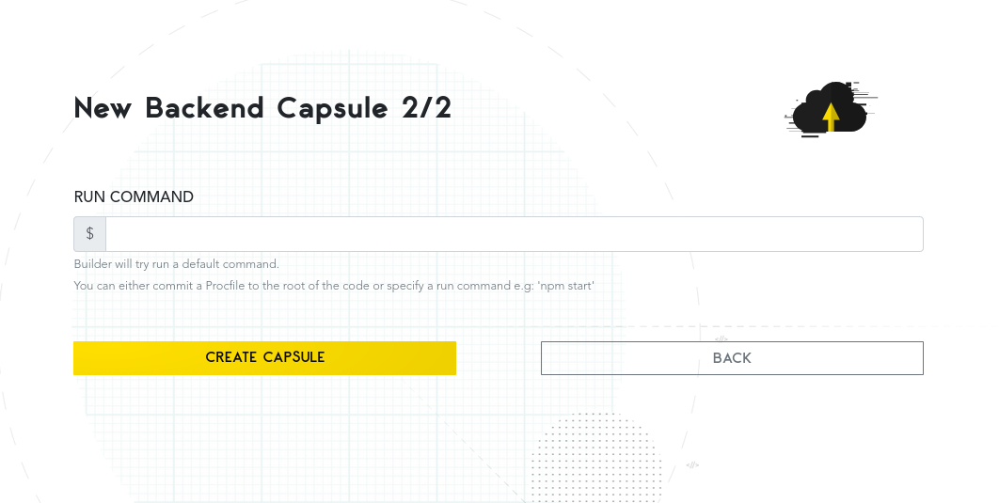
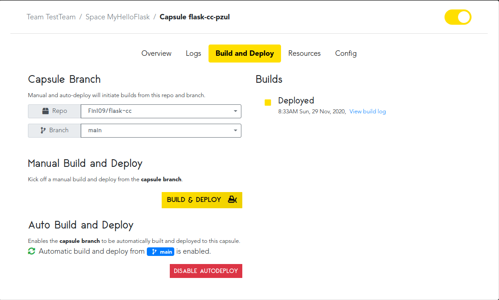

# The Easiest Serverless Platform? CodeCapsules vs Heroku

Producing a web application which the entire world can use is complicated. This involves setting up a physical server,
choosing the operating system, configuring the server, and monitoring the server. We will be taking a look at two serverless applications, CodeCapsules and Heroku, which perform all the above for you at a fraction of
the time. They even accept code from GitHub - the moment you push your code to your repositories' main branch on GitHub, the changes will be visible on your domain.

This guide will help you decide which platform will get your code to production (a website) the quickest. We will see which is easier to set up by creating a simple "Hello, world!" application in Python using Flask, and publishing it on [CodeCapsules](https://codecapsules.io/) and [Heroku](https://www.heroku.com/). 

## Prerequisites

In addition to general programming knowledge, you must have the following:
  - [Python](https://www.python.org/downloads/) version 3.5 or above installed.
  - A [GitHub account](https://github.com/) and [Git](
    https://git-scm.com/book/en/v2/Getting-Started-Installing-Git) installed.
  - Pythons [virtualenv](https://pypi.org/project/virtualenv/) [installed](#installing-virtualenv).

The above links contain instructions on how to:
  - Install Python
  - Create a GitHub account
  - Install Git

### Installing virtualenv

If you already have virtualenv and know what it does, [skip](#creating-the-python-application) to the next section. 


Using virtualenv, you can create a virtual Python environment. This virtual environment will only contain the essential modules for your web-application.

To install virtualenv, open
up your terminal and type:

`
pip3 install virtualenv
`

Now that you have a current version of Python, Git, a GitHub account, and virtualenv
installed, you can create the "Hello, world!" application.

## Creating the Python application

### Setting up the virtual environment

First, create a directory for your project. I named my directory "helloWorld". Open your command line, and enter the created directory.

Within the directory, create the virtual Python environment by typing
`virtualenv env`.

To activate the virtual environment, type the following from within the newly created directory:

(Linux/MacOSX)
`source env/bin/activate`

(Windows)
`env\Scripts\activate.bat`

Your terminal should now look something like this:


As in the image above, ensure that to the left of your username you see **(env)** or similar.
This means you have entered the virtual environment.

### Installing Flask and Gunicorn

For this program we will be using two popular Python tools for web development; [Flask](https://flask.palletsprojects.com/en/1.1.x/) and [Gunicorn](https://gunicorn.org/):

  - Flask is a light-weight web-development framework for Python. It provides a number
of easy to use resources and tools for building and maintaining web applications,
websites, and similar services.

  - Gunicorn is our WSGI server of choice for sending our code to the production environment. Check out this link to read more about [WSGI servers](https://www.fullstackpython.com/wsgi-servers.html).

Install these tools with the following pip command. Ensure you are in your
virtual environment before running this command.

`pip3 install flask gunicorn`

### Coding the application

Now that we have setup our requirements, we can program our application. Create a
new Python file within the current directory and name it anything. I named mine
"helloFlask". Next, enter the following code.

```python
from flask import Flask

app = Flask(__name__) # __Name__ = name of program
@app.route('/') # Display on main page of the domain

def hello():
	return 'Hello, world!'

if __name__ == '__main__':
	app.run()
```

This program will display "Hello, world!" on the domain hosted by CodeCapsules or Heroku.

### Creating the Procfile

A Procfile is necessary to tell our platform of choice what to do with our code. You can read
more about what a Procfile does [here](https://devcenter.heroku.com/articles/procfile).

Create a new file within the same directory. Name it Procfile. After, open the Procfile and enter the following on the first line:

`web: gunicorn fileName:app`

 Replace "fileName" with the name of your Python file. Save the Procfile.

### Freezing the requirements

Our final step before uploading the program to GitHub is to create a list of requirements for the program.
This is necessary for the server to know what needs to install to run our program. Luckily, pip makes this easy. In the same terminal, enter:

`pip3 freeze > requirements.txt`

This will create a file titled "requirements.txt" that contains all the project's requirements. Your directory should look similar to this:
```
ProjectDirectory
+   env
+   helloFlask.py
+   requirements.txt
+   Procfile

```

## Uploading to GitHub

### Creating the remote repository

We can now send our program to GitHub. CodeCapsules and Heroku will connect to our GitHub repository, and use it to create a website. If you already know how to send code from a local repository to a remote repository on GitHub, do so for the code created and [skip](#codecapsules) to the next section. Otherwise, follow these steps:

  1. Go to www.github.com and login.
  2. Find the "Create new repository" button and click it.
  3. Name your repository whatever you like. I named mine "flask-hello".
  4. Copy the URL given to you under "Quick setup".


*The link to your repository is located under Quick setup* ****

### Sending files to the GitHub repository

The final step before deploying the code to CodeCapsules and Heroku is to send our Python file, Procfile, and requirements file to the newly created GitHub repository. Open your terminal and navigate to the folder containing these files. Type each command in order.
```
  git init
  git add Procfile nameOfPythonFile.py requirements.txt
  git commit -m "First commit!"
  git branch -M main
  git remote add origin https://github.com/yourusername/yourrepositoryname.git
  git push -u origin main
```

For step 2 replace "nameOfPythonFile.py" with the name of the Python file containing your code.
For step 5, replace the URL with the URL you copied in the previous section.

Now, you can see your code by going to your repository on [GitHub](www.github.com). We are ready to send our code to production.

## Sending the application to production
We will test two different platforms that will handle production and allow anyone in the world to view our application. We can link our GitHub code to these platforms, without having to worry about managing servers and the other time-consuming work that comes with hosting a web application.

Both CodeCapsules and Heroku aim to make the process of taking and deploying code to a production environment as simple as possible. To test how simple these platforms make this process, I will be keeping track of various metrics that will track this simplicity. First, we will try CodeCapsules.

## CodeCapsules

CodeCapsules is the newest of the two platforms. Based in Cape Town, South Africa, CodeCapsules aims to provide a platform as a contender to Heroku. CodeCapsules advertises ease of use and time saved as their main advantages.

### Creating an account with CodeCapsules and connecting to Github

First, we need to create an account with CodeCapsules. Follow these instructions to get started:

1. Go to [CodeCapsules](www.codecapsules.io).
2. Click "Sign Up" in the top right corner and follow the instructions.
3. Check your email and confirm your account.
4. Go back to [CodeCapsules](www.codecapsules.io) and login into your newly created account.

After logging in, CodeCapsules brings you to a page which will look similar to this. For now, ignore anything that you see on this picture that isn't on your account.



Now that we have created a CodeCapsules account, we can connect CodeCapsules to our GitHub account. Perform the following:

  1. Click your profile name on the top right corner and click edit profile.
  2. Under "GitHub" details, click the GitHub button.
  3. Under repository access, give CodeCapsules access to our recently created repository.

We are now connected to GitHub! Only a few more steps to go. Navigate back to the main screen.

### Creating a team, space, and a capsule

CodeCapsules organizes your code into three different containers:
- Teams
- Spaces
- Capsules

For this project, Capsules are the most important. To create a Capsule, we must create a team and space. A team allows you to invite multiple people to collaborate with you. You may assign team members to different spaces, which can contain different Capsules. Capsules provide cloud resources such as databases, API's, and servers.

Take these steps to get your code into production:

1. Click "Create a New Team" and name it anything.
2. Choose "Create a New Space For Your Apps".
3. Select your region (I chose the Netherlands for this tutorial).
4. Choose your name for the space.
5. Your space is now created! Click on your newly created space.
6. Click "Create a New capsule".
7. Choose the "Backend" Capsule.
8.  Select Sandbox.
9. Select the correct repository under "select your GitHub repository". Ensure the branch is set to main. Click next.
10. Because we have a Procfile in our repository, we do not need to use a run command. Instead, click "Create Capsule".



### Viewing your work

Now that you have created a Capsule, you can see your website.



Click on the "Overview" button. Your URL is displayed under "domain". Enter it into your browser to see your program!

## Heroku

Heroku provides similar services as CodeCapsules. Heroku advertises itself as a _Cloud platform as service_ (PaaS). Heroku aims to allow developers to focus on their core product, while they take care of the rest. How simple is Heroku to use?

### Creating an account with Heroku and creating an application

We must first create a Heroku account. Do the following:

1. Go to www.heroku.com
2. Register an account by clicking Sign up in the top right corner
3. Log in to the registered account
4. Accept terms of service
5. Check your email and confirm your account

Now that we have created a Heroku account, we can create an application. An application is similar to a CodeCapsules "Capsule".


1. Go to www.heroku.com and log in.
2. Click "Create new app"
3. Choose an app name that is not in use (I chose hello-flask-tutorial)
4. Choose your region (I chose the United States)
5. Click "Create app"


### Connecting to GitHub and sending to production

After creating your app, Heroku presents many options to you. Under Deployment method, click "Github", and follow these steps:

1. Click the connect to GitHub option, and perform the required tasks.
2. Now that you are connected to GitHub, type your repositories name under "Search for a repository to connect to". I've named mine "flask-hello".
3. Connect to this repository.


After connecting, click "Deploy Branch" in the "Manual Deploy" section at the bottom of the page. Wait until it has finished deploying. When deployment is finished, navigate to the top of the page and click "Open app" to see the result!

## Results

I performed this process twice for CodeCapsules and Heroku. For these attempts, I recorded how long it took me to get from GitHub to production. Below are the results.

|    Attempt #| CodeCapsules| Heroku |
| ----------- |-------------|--------|
| 1           | ~7.5 min| ~10 min  |
| 2           | 4 min 45 sec       |      6.5 min  |

My first attempt represents the first time I've ever used these platforms. I found that Heroku has much more UI clutter, mostly having to do with various options for increasing the price of the platform. I found the UI wasn't as intuitive for my goal - to deploy a Flask "Hello, world!" application to a website.

CodeCapsules was clearer to me. CodeCapsules follows a direct pipeline - make a team, space, then a Capsule. There is simply less to click on to be able to get to production.

