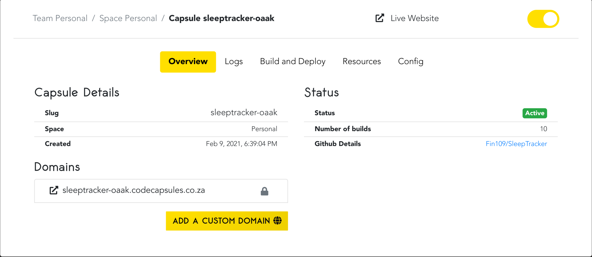
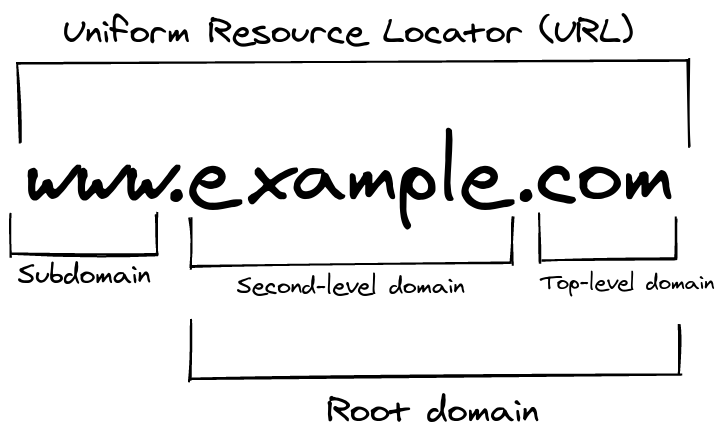

# Custom Domains on Code Capsules

For every application deployed to Code Capsules, Code Capsules provides a default domain that looks something like this: `capsulename.xxxx.codecapsules.co.za`. If you'd like to change this default domain, Code Capsules provides a cost-free method for adding custom domains to applications hosted on Code Capsules

You can find everything relating to your Capsule's domains (including your default domain) under the "Overview" tab in the Capsule. This is also where you can add a purchased custom domain to your application.

Much of this document will revolve around this overview tab. We'll cover various aspects and things to consider when  adding custom domains to applications on hosted on Code Capsules, such as:

- Information on HTTPS and Code Capsules domains.

- Adding custom domains to applications deployed on Code Capsules.

- Routing your purchased domain to your deployed application via _A records_.

- Adding subdomains to applications deployed on Code Capsule by creating _CNAME records_ for your purchased domain.

- Removing domains from applications deployed on Code Capsules.

## SSL Certificates for Your Domain

Before adding a custom domain to an application hosted on Code Capsules, your custom domain **must** have a valid _Secure Sockets Layer Certificate_ (SSL). This is because Code Capsules only supports _HTTPS_ connections. You cannot connect to applications deployed on Code Capsules via _HTTP_.

**With a valid SSL certificate**, your domain can connect to your Code Capsules hosted application via HTTPS.

There are many ways to obtain an SSL certificate for your domain. The most straightforward way is by checking with your domain registrar - many domain registrars offer a way to obtain an SSL certificate for their domains. Ensure that your domain has a valid SSL certificate before adding a custom domain to your application on Code Capsules.

## How to Add a Custom Domain

To add a custom domain to your application on Code Capsules, click on the "Overview" tab in the Capsule hosting your application. Under Domains, you'll see all of the domains associated with your Capsule; including the default domain provided by Code Capsules.

There is also an "Add a Custom Domain" button at the bottom of the page.

**Before adding a custom domain**, consider:

- If your domain name contains non-ASCII characters, you must: **consult Miki about what his plans are for this**.

- Your capsule may route to only **one** root domain. You may not add multiple root domains to your Capsule.

To add a custom domain:

1. Click the "Add a Custom Domain" button.

2. **Save** the IP address provided under "A Record Route" (this will be used shortly).

3. Enter the custom domain you've purchased from a domain registrar under "Domain Name".
  - Make sure that you've entered a _root domain_ only - do not include a
  subdomain.

  - A root domain contains only your _domain name_ and your _top-level domain_ (TLD). Take `example.com`. Here, "example" is the domain name, and ".com" is the TLD.

Once you've entered your root domain, add it by clicking the **Create Domain** button.

### Creating an A record

After adding your custom domain on Code Capsules, you need to create an _A record_ for the domain you've purchased. You'll use the IP that was saved [previously](#adding-a-domain) when creating the A record for your domain. You can add an A record to your purchased domain by visiting your domain registrar's website.

Your A record table should look something like this,

|Record Type|Name|IPv4 Address|   
|-----------|----|------------|
|A Record   |  @ |`provided-IP-Address`|

where:

- "@" refers to your root domain.

- `provided-IP-Address` is the IP address found [previously](#how-to-add-a-custom-domain) under "A Record Route"

Consult your domain registrar for specific instructions for adding A records to your domain. Keep in mind, when making changes to your domain's _DNS records_, changes can take up to **four hours** to take effect.

## How to Add a Subdomain

Before adding a _subdomain_ to your application hosted on Code Capsules, make sure you have already [created an A record](#how-to-add-a-custom-domain) for your purchased domain that routes to an application on Code Capsules. 

When adding a subdomain to your application hosted on Code Capsules, keep in mind:

- Applications hosted on Code Capsules can have a **maximum** of five subdomains.

- _Wildcard domains_ are not allowed on Code Capsules - you'll need to create a CNAME record in your purchased domain for each subdomain you want to create.

To add a subdomain for your application, follow the same process detailed [previously](#adding-a-domain), with some changes:

- This time you **must include** the subdomain you want to create. This means that instead of entering the root domain `domain-name.tld`, you should specify your subdomain as well, such as: `www.domain-name.tld`.

- You do **not** need to save the IP address provided under "A Record Route" when adding subdomains on Code Capsules.

After clicking the **Create Domain** button, you must add a _CNAME record_ to your purchased domain for the subdomain you'd like to create.

### Creating CNAME Records

Creating CNAME records for purchased domains vary for different domain registrars. Consult your domain registrar for information on creating CNAME records. 

In general, the CNAME record table for your domain should look something like this:

|Record Type|Name|Host/Target |   
|-----------|----|------------|
|CNAME      | `subdomain` |`your-root-domain`|

where, 

- `subdomain` is the subdomain you would like to create (`www`, `biz`, `info`).

- `your-root-domain` is your root domain that contains an A record routing to your application on Code Capsules.

As with adding an A record, CNAME records or any other changes to your domain's DNS records may take up to **four hours** to take effect.

## Removing Domains and Subdomains

If you would like to remove any domains or subdomains associated with your Capsule, navigate to the "Overview" tab in your Capsule. Under Domains, you will see a list of all the domains that are associated with your Capsule. 

Next to each custom domain and subdomain, you'll find a trash can icon. **Click the trash can icon** to remove the custom domain or subdomain.

Note, removing a custom domain or subdomain does not affect your domain's DNS records:

- When removing a root domain on Code Capsules, your A record will still be associated with the IP address provided by Code Capsules. Make sure to revert your domain's A record to its default value.

- When removing a subdomain on Code Capsules, make sure to delete the corresponding CNAME record in your purchased domain. 

## Glossary of Terms & Concepts

- **Uniform Resource Locator (URL)**: In the above image, `www.example.com` is the URL. A URL is a combination of three different aspects of a domain: A subdomain, second-level domain, and a top-level domain.

- **Subdomain**: Subdomains are the first part of a URL, the most common being `www`. Subdomains provide users with a consistent naming strategy to access service you may provide (for example, `hr.myapplication.com` may route users to your business' human resources portal).

- **Second-level domain** (SLD): Second level domains make up the middle of a URL. This is your domain's name.

- **Top-level domain** (TLD): Top-level domains are the text at the right-hand side of a URL. TLDs give users an idea about your website. For example, the `.de` TLD lets users know the website probably caters to a German audience.

- **Root Domain**: The root domain is a combination of a second-level and top-level domain **without** a subdomain. `example.com` is an example of a root domain, whereas `www.example.com` is not a root domain.

- **Domain Registrar**: A company accredited to sell domains is called a domain registrar.

- **A Record**: An A record routes domains to IP addresses.

- **Wildcard subdomain**: A wildcard subdomain points all subdomains not created for your purchased domain to a specific place. For example, if a wildcard subdomain was created for `example.com`, and the subdomains `info` and `123` were not created for `example.com`, both `info.example.com` and `123.example.com` would route to `example.com`. 

- **CNAME Record**: A CNAME record, also known as an _alias_ routes subdomains to other domain names. For example, `mail.example.com` may route to `mail.google.com`. CNAME records are unlike A records, which route to a specific IP address.

- **Hyptertext Transfer Protocol** (HTTP): HTTP is a protocol for transferring data from a server (a web-application), to a client (your web-browser). 

- **Hypertext Transfer Protocol Secure** (HTTPS): HTTPS is like HTTP, except the data transferred from the server to client is **encrypted** for better security. 

- **Secure Sockets Layer Certificate** (SSL): An SSL Certificate authenticates a domain and allows encrypted information to send to the domains server - with an SSL certificate you can connect to your domain via HTTPS, i.e: https://www.example.com.
