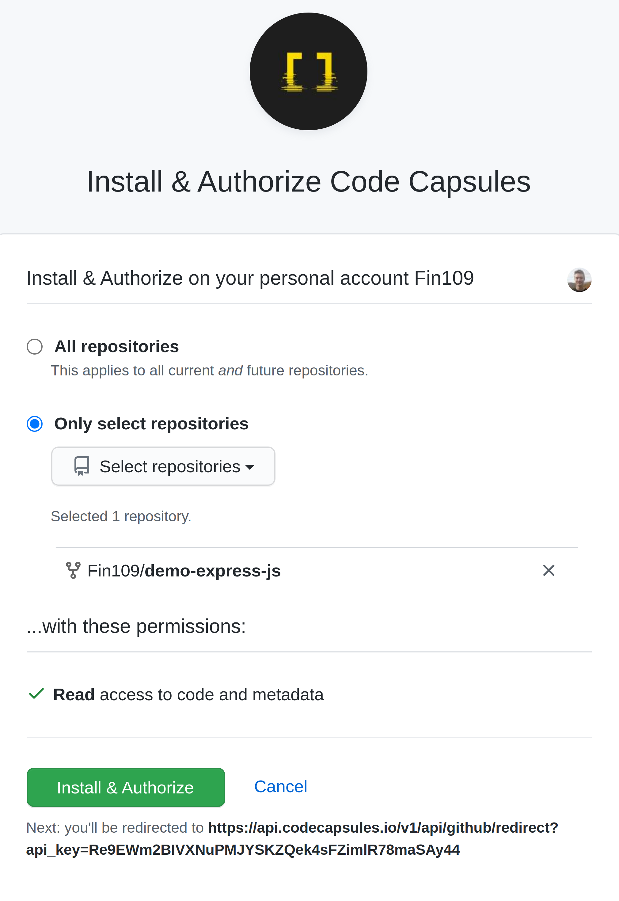

# Getting Started on Code Capsules with Node.js
Deploy a Node.js application and learn how to host backend code on Code Capsules. 

## Set up
Code Capsules connects to GitHub repositories to deploy code online, so you'll need a [GitHub](www.github.com) account to follow this tutorial. 

We'll learn how to deploy backend code with Code Capsules by following this process, using a sample Node.js application provided by Code Capsules. Find the GitHub repository containing the sample Node.js application here: https://github.com/codecapsules-io/demo-express-js

To use this repository, fork the application by navigating to the repository and clicking "Fork" at the top-right of the screen. Once you've forked the application, we are ready to deploy it – no edits necessary. 

## Prepare a Team

To deploy the Node.js web application, we need to create an account with Code Capsules.

To create an account:

1. Register an account at https://codecapsules.io/.
    
2. Confirm your account by viewing the email sent to you.

After creating a new account, you'll see a prompt to create a [Team](Link-to-team-explanation-here). Create a Team, and name it anything you'd like.

With a new Team created, we can create a [Space](https://codecapsules.io/docs/faq/what-is-a-space/)

## Creating a Space and Linking GitHub

Click "Create Space" again. The name here is irrelevant.

Next, we need to link our GitHub repository to our Code Capsules account.

Click the profile image on the top right of the page, and find the "GitHub" button.

Authorize Code Capsules to connect to the Node.js application by:

1. Clicking your GitHub username.
2. Selecting "Only Select Repositories".
3. Choosing the GitHub repository we forked.
4. Pressing "Install & Authorize".

After clicking "Install & Authorize", Code Capsules links to the forked GitHub repository containing the Node.js application – this means we can now create a [Capsule](https://codecapsules.io/docs/faq/what-is-a-capsule/) that'll host the code found in our repository.

## Create the Capsule

Select the Space created previously and add your payment information to create a new Capsule, Afterward, click the "Create a New Capsule for Your Space" button.

1. Choose a "Backend Capsule".
2. Select the "Sandbox" product.
3. Choose the GitHub repository we forked.
4. Press "Next".
5. Leave the "Run Command" blank and create the Capsule.

You can view the build logs under the "Logs" tab in your Capsule. When the Capsule builds, navigate to the "Overview" tab and click on the URL provided to view the application. For a closer look at a Capsules's properties, refer to this [explanation on Capsules](https://codecapsules.io/docs/faq/what-is-a-capsule/).
