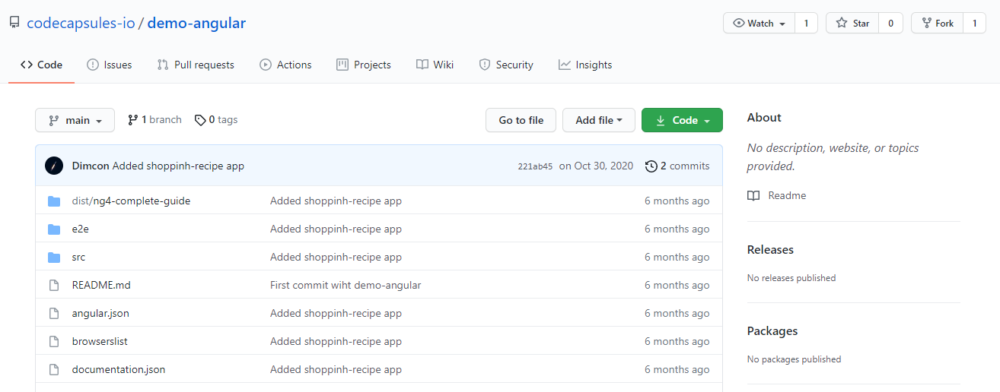
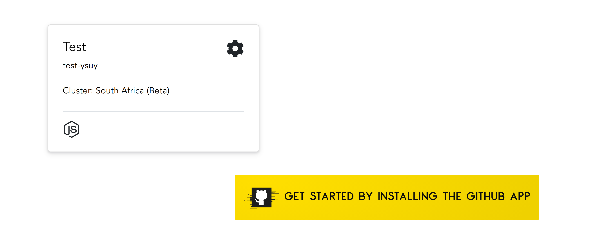

# Getting Started on Code Capsules with Angular 

Deploy an Angular application and learn how to host frontend code on Code Capsules. 

## Set up

Code Capsules connects to GitHub repositories to deploy applications. All you need for this tutorial is a [Code Capsules](https://codecapsules.io/) and [GitHub](https://github.com/) account.  

To demonstrate how to deploy an Angular application with Code Capsules, we'll use our [example application](https://github.com/codecapsules-io/demo-angular) which is ready to be deployed. 

Follow the link above and fork the application by clicking "fork" at the top-right of the repository. With the Angular application forked to your GitHub account, we are ready to deploy it on Code Capsules.

## Code Capsules sign up

Go to [Code Capsules](https://codecapsules.io/) and click on the "Sign Up" button in the top right corner of the webpage. Alternatively, you can click on the "Log In" text next to the Sign Up button if you already have a registered Code Capsules account. Enter your details to sign up for an account or to log into an existing one. 

If you've just signed up for an account you will be directed to the Welcome page on your first login. Click on the "Go To Personal Team" button to advance to the next step.

After clicking on the "Go To Personal Team" button you will be redirected to the Spaces tab for your Personal Team. Code Capsules gives every account a Personal Team as a default. 

## Creating a Team and Space

 

Log in to Code Capsules. After logging in, Code Capsules prompts you to create a team. A [Team](https://codecapsules.io/docs/faq/what-is-a-team/) is a tool that helps manage your various projects. Teams can have multiple members interacting with the projects associated with that particular Team. You can also add a credit card to your Team to handle [Capsule](https://codecapsules.io/docs/faq/what-is-a-capsule) billing. 

Click "Create A New Team" and give it a name of your choice. After creating a Team, you'll be prompted to enter your Team's billing information. Billing information is required to host any applications but **you will not be charged** for hosting the Angular application. Once you've entered billing information, we need to create a [Space](https://codecapsules.io/docs/faq/what-is-a-space).

[Spaces](https://codecapsules.io/docs/faq/what-is-a-space) are another organizational tool for your applications. _You can create multiple spaces within a Team - each Space can consist of numerous Capsules_. Click the "Create A New Space" button and follow the prompts, naming the Space anything you'd like.

Now that we've created a Space, we need to connect the GitHub to Code Capsules.

## Linking to GitHub

Under the Space we've just created, click the "Get Started By Installing the GitHub App" button. Log in to GitHub, and when prompted to "Install Code Capsules", click on your GitHub user name (in the image below, I clicked on "Fin109").

After, choose "Only select repositories" and select the name of the forked Angular application from the dropdown menu. 

Press "Install & Authorize" and you'll return to Code Capsules. Let's deploy the Angular application. 

## Build the Capsule

It's time to create a [Capsule](https://codecapsules.io/docs/faq/what-is-a-capsule). Capsules provide the server for hosting applications on Code Capsules. We'll create a Capsule that hosts the Angular application that we just linked to Code Capsules. Press "Create a new capsule for your space" and:

1. Choose a "Frontend" Capsule.
2. Select the "Trial - Static Site Hosting" product.
3. Choose the GitHub repository we forked.
4. Press next.
5. Leave the "Build command" and "Static content folder path" blank and create the Capsule.

You can view the build logs under the "Logs" tab in your Capsule. When the Capsule builds, navigate to the "Overview" tab and click on the provided URL to view the application. For a closer look at a Capsules's properties, refer to this [explanation on Capsules](https://codecapsules.io/docs/faq/what-is-a-capsule/).

If you want to deploy another Angular application in the future, it'll be useful to check out the script Code Capsules used to build the Angular application. [Navigate to the Angular repository](https://github.com/codecapsules-io/demo-angular/) we forked and take a look at the `package.json` file. On line four you'll see the script Code Capsules used to deploy the application. 

