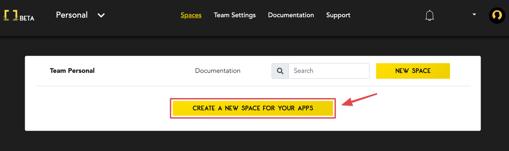
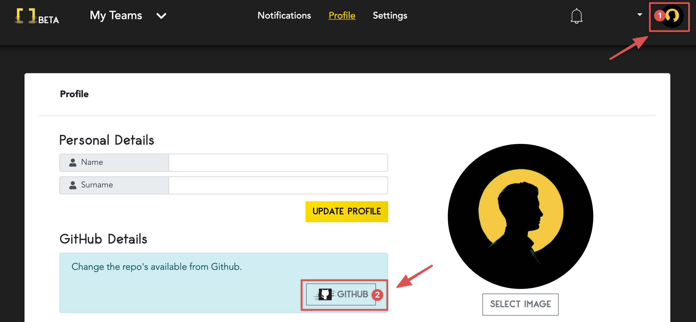
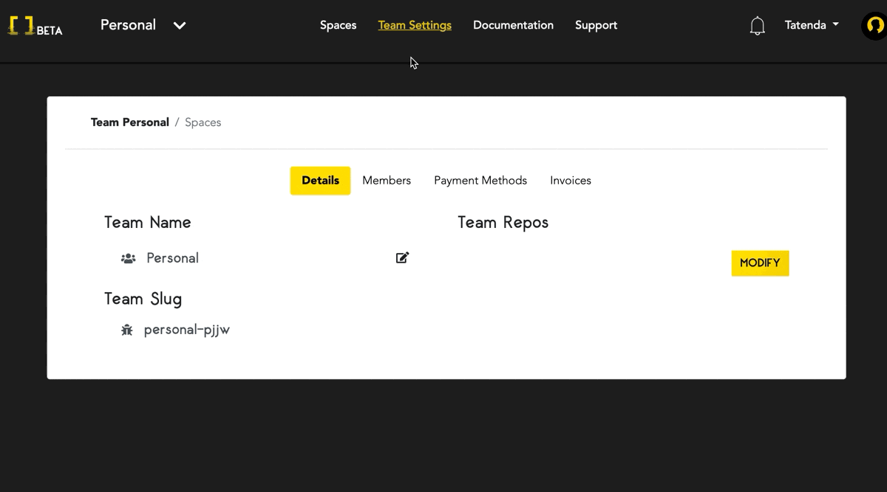
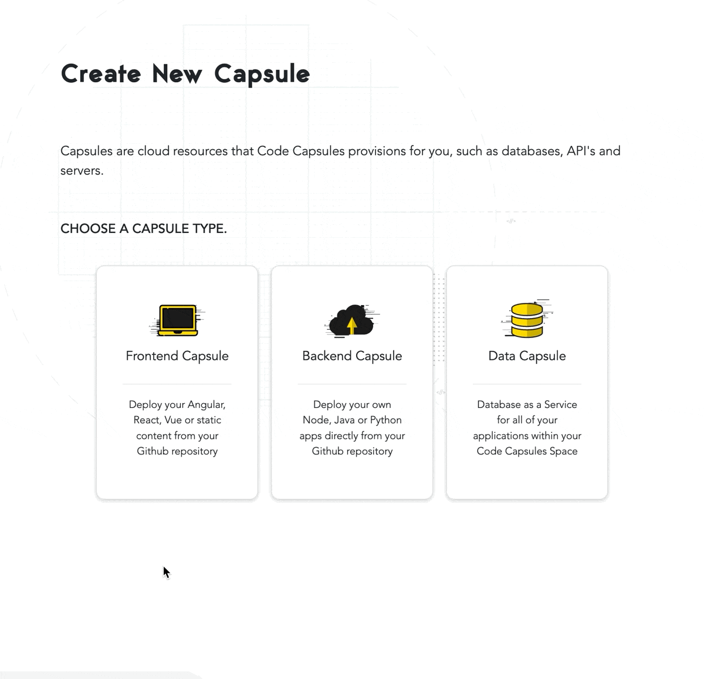
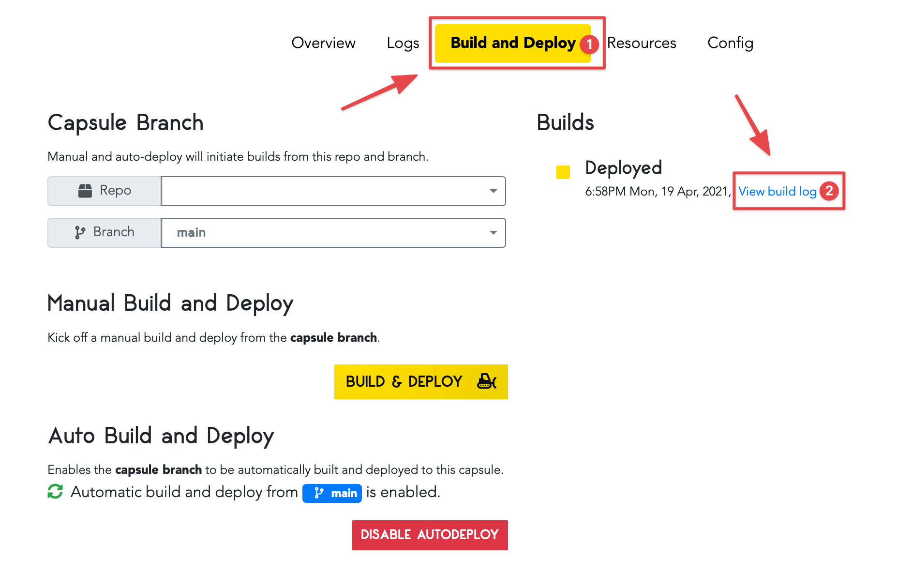

# Getting Started on Code Capsules with Angular 

Deploy an Angular application and learn how to host frontend code on Code Capsules. 

## Set up

Code Capsules connects to GitHub repositories to deploy applications. All you need for this tutorial is a [Code Capsules](https://codecapsules.io/) and [GitHub](https://github.com/) account.  

To demonstrate how to deploy an Angular application with Code Capsules, we'll use our [example application](https://github.com/codecapsules-io/demo-angular). 

Follow the link above and fork the application by clicking "fork" at the top-right of the repository. With the Angular application forked to your GitHub account, we are ready to deploy it on Code Capsules.

## Code Capsules sign up

Go to [Code Capsules](https://codecapsules.io/) and click on the "Sign Up" button in the top right corner of the webpage. Alternatively, you can click on the "Log In" text next to the Sign-Up button if you already have a registered Code Capsules account. Enter your details to sign up for an account or to log into an existing one. 

If you've just signed up for an account you will be directed to the Welcome page on your first login. Click on the "Go To Personal Team" button to advance to the next step.

After clicking on the "Go To Personal Team" button you will be redirected to the Spaces tab for your Personal Team. A [Team](https://codecapsules.io/docs/faq/what-is-a-team/) is an environment for you to manage your spaces and capsules. Teams can have multiple members interacting with the projects associated with that particular Team. Code Capsules gives every account a Personal Team as the default.

## Create a Space for your apps

[Spaces](https://codecapsules.io/docs/faq/what-is-a-space) are an organizational tool for your applications. _You can create multiple spaces within a Team - each Space can consist of numerous Capsules_. Click the "Create A New Space For Your Apps" button and follow the prompts, naming the Space anything you'd like.

Now that we've created a Space, we need to connect the GitHub repository we forked to our Code Capsules.

## Linking to GitHub

To add the repo we forked to the Space we just created, click on the profile image at the top right of the screen. You'll see a GitHub button located under "GitHub" details. 

 

Click the "GitHub" button. To give Code Capsules access to the Angular application:

1. Click your GitHub username.
2. Select "Only Select Repositories".
3. Choose the GitHub repository we forked.
4. Press "Install & Authorize".

After authorizing, Code Capsules will be able to read the contents of the selected repositories. All that's left to deploy the application is to add the repo to your team and create a [Capsule](https://codecapsules.io/docs/faq/what-is-a-capsule). Capsules act as storage space for the different types of applications you'd host on Code Capsules.

## Add Repo to Team

Click on "Team Settings" on the top navigation bar to switch to the Team Settings tab. Once there, click on the "Modify" button under the "Team Repos" section to add the repo to your Personal Team. When the "Edit Team Repos" screen slides in select "Add" next to the repo you want to add to your Personal Team and then confirm. After this is done, all Spaces in your team will have access to this repo. 

## Create and Build the Capsule

It's time to create a [Capsule](https://codecapsules.io/docs/faq/what-is-a-capsule). To do this, navigate to the "Spaces" tab and open the Space you created for this tutorial. Once inside the Space, click the "New Capsule" or "Create A New Capsule For Your Space" button and follow the instructions below.

1. Choose a "Frontend" Capsule.
2. Select the "Trial - Static Site Hosting" product.
3. Choose the GitHub repository we forked.
4. Press next.
5. Leave the "Build command" and "Static content folder path" blank and create the Capsule.

You can view the build logs under the "Build and Deploy" tab in your Capsule. When the Capsule builds, navigate to the "Overview" tab and click on the provided URL to view the application. 

For a closer look at a Capsule's properties, refer to this [explanation on Capsules](https://codecapsules.io/docs/faq/what-is-a-capsule/).

If you want to deploy another Angular application in the future, it'll be useful to check out the script Code Capsules used to build the Angular application. [Navigate to the Angular repository](https://github.com/codecapsules-io/demo-angular/) we forked and take a look at the `package.json` file. On line four you'll see the script Code Capsules used to deploy the application. 
