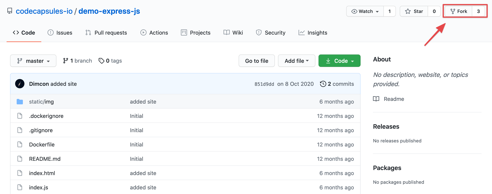
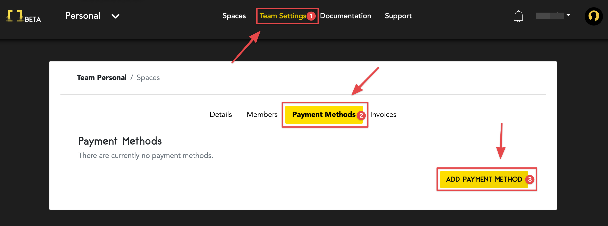
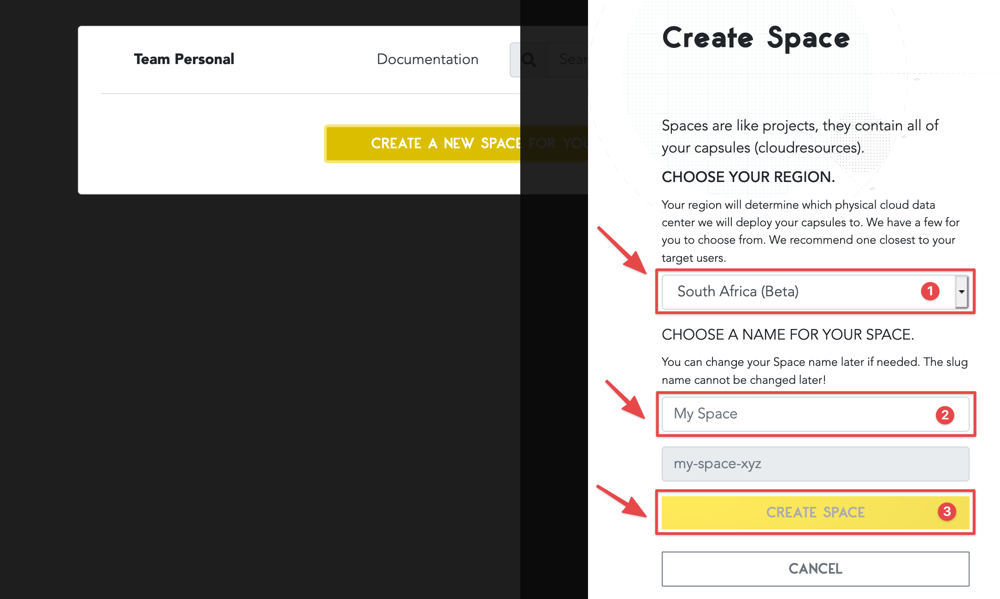
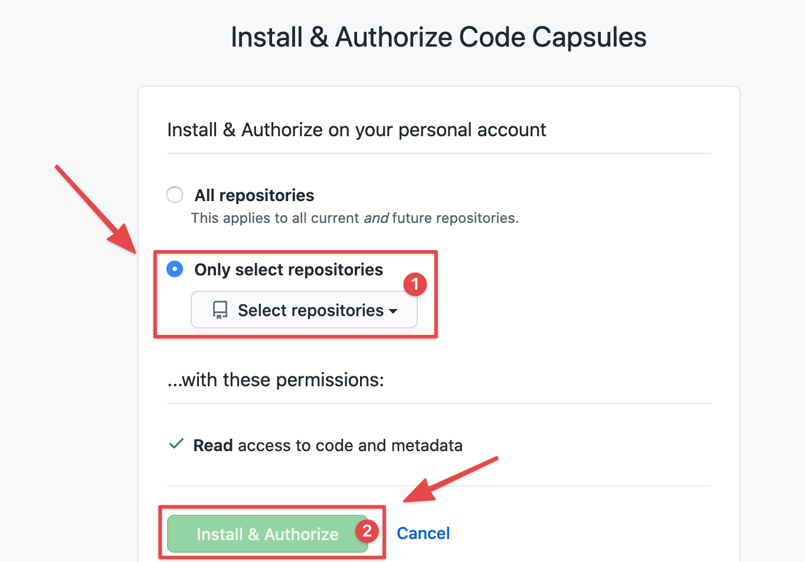
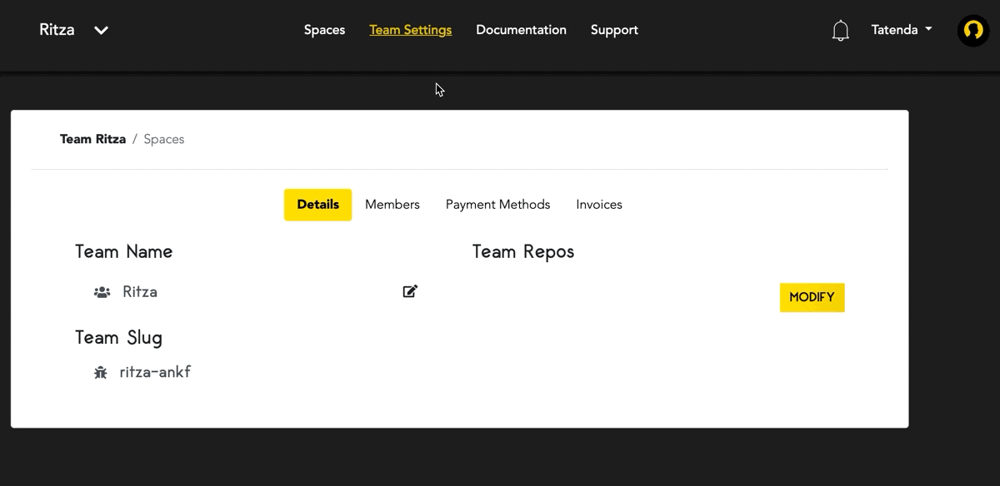
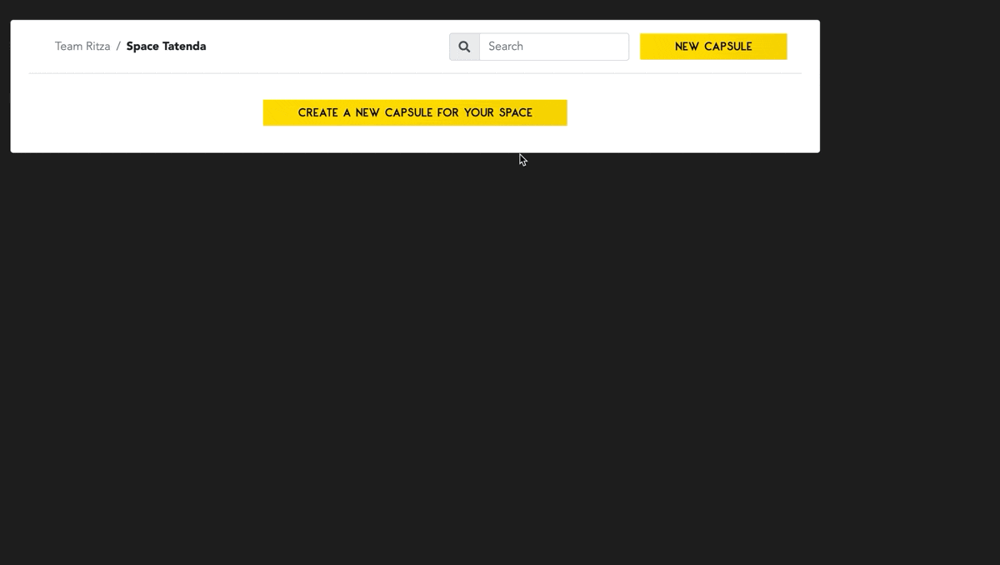

# How to Deploy an Express.js application on Code Capsules

In this tutorial, we'll see how to deploy an Express.js application as well as learn how to host backend code on Code Capsules. 

Code Capsules connects to GitHub repositories to deploy code online, so you'll need a [GitHub](https://github.com) account to follow along. 

## Get Some Example Code

Let's get some example code first by forking the repository containing our [example Express.js application](https://github.com/codecapsules-io/demo-express-js). We'll use this ready-to-be-deployed application to jump straight to the intricacies of how to deploy with Code Capsules. 

To use the repository mentioned above, fork the application by navigating to the repository and clicking "Fork" at the top-right of the screen. Once you've forked the application, we are ready to deploy it. 

## Code Capsules Sign Up

Navigate to [Code Capsules](https://codecapsules.io/) and click on the "Sign Up" button in the top right corner of the webpage. Enter your details to sign up for an account. Alternatively, if you have an account already, go ahead and log in. 

If you've just signed up for an account, you'll be directed to the _Welcome_ page on your first login. Click on the "Go To Personal Team" button to advance to the next step. A [Team](https://codecapsules.io/docs/faq/what-is-a-team/) is an environment for you to manage your spaces and capsules.

After clicking on the "Go To Personal Team" button, you will be redirected to the _Spaces_ tab for your Personal Team. Code Capsules gives every account a Personal Team as a default.

Code Capsules requires us to add payment information in order to use a backend Capsule, which we'll need in this tutorial. Do this by navigating to "Team Settings" at the top of the screen, then add a payment method under "Payment Methods". 

Once you've added payment information, we need to create a Space which will contain our application.

## Create a Space for Your Apps

Now click on the "Create A New Space For Your Apps" button. Alternatively, if you had logged into an existing Code Capsules account, you could click on the "New Space" button to create a new space for this tutorial or select any of your existing ones. After actioning either of these steps, a UI similar to the one shown below should slide in from the right of your screen.  

Select an appropriate region, enter a name for your space, and press "Create Space".

## Linking to GitHub

The next step is to link the GitHub repository we forked earlier to our Code Capsules account. To do this, click the profile image at the top right of the screen, and find the "GitHub" button under _GitHub Details_.

Click the "GitHub" button to give Code Capsules access to the Express application:

1. Click your GitHub username.
2. Select "Only Select Repositories".
3. Choose the GitHub repository we forked.
4. Press "Install & Authorize".

After authorising, Code Capsules will be able to read the contents of the selected repositories. All that's left to deploy the application is to add the repo to your Team and create a [Capsule](https://codecapsules.io/docs/faq/what-is-a-capsule). 

## Add Repo to Team

Click on "Team Settings" on the top navigation bar to switch to the _Team Settings_ tab. Once there, click on the "Modify" button under the _Team Repos_ section to add the repo to your Personal Team. When the "Edit Team Repos" screen slides in, select "Add" next to the repo you want to add to your Personal Team and then confirm. After this is done, all Spaces in your Team will have access to this repo. 

## Create the Capsule

Capsules provide the server for hosting applications on Code Capsules. For a closer look at a Capsule's properties, read [this explanation on Capsules](https://codecapsules.io/docs/faq/what-is-a-capsule/).

Go back to the _Spaces_ tab. Next, click on the Space you just created or are using, and create a new Capsule in that Space. To do this, click the "New Capsule" or "Create A New Capsule For Your Space" button when inside the Space.

1. Choose a "Backend Capsule".
2. Select the "Sandbox" product.
3. Choose the GitHub repository we forked.
4. Press "Next".
5. Leave the "Run Command" blank and create the Capsule.

You can view the build logs under the "Build and Deploy" tab in your Capsule whilst it is building. 

When the Capsule is built, navigate to the _Overview_ tab and click on the URL provided to view the application.  

This application also exposes a `GET` endpoint at `/api/data`. If [curl](https://curl.se/download.html) is installed on your computer (MacOSX and Linux distributions generally have curl installed), we can request the data exposed at that endpoint using the URL that Code Capsules provided. Try this in your terminal:

`curl https://<Your-CodeCapsules-URL/api/data`

The response should look like: 

{`"data":[{"id":1,"title":"Some data"},{"id":2,"title":"Some other data"}]}`

If you'd like to deploy another Express.js application in the future, take a close look at the `package.json` file in the [repository we forked](https://github.com/codecapsules-io/demo-express-js). On line six you can see the "start" script that Code Capsules used to build and deploy the Express.js application. 
