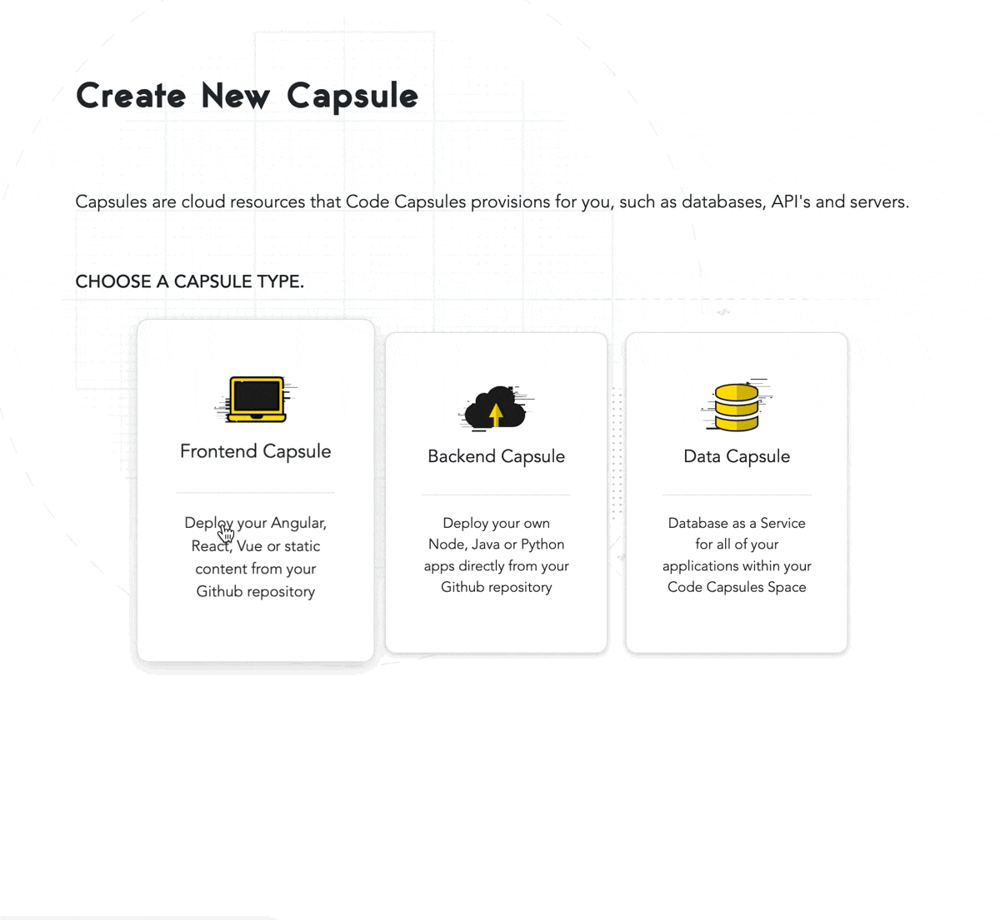

# How to Deploy a Static HTML Site on Code Capsules

Deploy a static HTML site and learn how to host frontend code on Code Capsules.

## Set Up

For this tutorial, you'll need:
- A [Code Capsules](https://codecapsules.io/) account. 
- A [GitHub](https://github.com/) account.  

This tutorial will focus on deploying frontend code to Code Capsules – we'll deploy a simple static HTML website and see how this process works. The HTML code has already been provided by Code Capsules. Follow this [link](https://github.com/codecapsules-io/demo-html) to view the repository.

In order to deploy this repository to Code Capsules, we'll need to fork the repository by clicking "fork" at the top-right of the repository. Feel free to make any edits to the HTML code if you want to. Then, we can move on to deploying the static website.

## Sign Up for Code Capsules

If you don't already have a [Code Capsules](https://codecapsules.io/) account, head to the site and click the "Sign Up" button in the top right. Enter your details to create an account, or log into an existing one. 

If you've just created an account, make sure to confirm it by checking your email for a message from Code Capsules. On your first login, you'll be directed to the _Welcome_ page. Click on the "Go To Personal Team" button. 

After clicking on the "Go To Personal Team" button, you will be redirected to the _Spaces_ tab for your Personal Team. A [Team](https://codecapsules.io/docs/faq/what-is-a-team/) is an environment for you to manage your Spaces and Capsules. Teams can have multiple members interacting with the projects associated with that particular Team. Code Capsules gives every account a Personal Team as the default. For this tutorial, we'll use the provided Team to host our static frontend website for free.

## Create a Space for Your Apps

[Spaces](https://codecapsules.io/docs/faq/what-is-a-space) are an organisational tool for your applications. Click the "Create A New Space For Your Apps" button and follow the prompts, naming the Space anything you'd like.

Now that we've created a Space, we need to connect the GitHub repository we forked to our Code Capsules.

## Link to GitHub

Code Capsules deploys code online by "linking" to your GitHub repositories. For Code Capsules to gain access to the forked repository containing the HTML code, we need to give it permission.

We can do this by clicking the profile image at the top right of the page. Here, we'll see a "GitHub button" located under "GitHub Details".

Click on the "GitHub" button. You can authorise Code Capsules to connect to the forked repository by:

1. Clicking your GitHub username.
2. Selecting "Only Select Repositories".
3. Choosing the GitHub repository we forked.
4. Pressing "Install & Authorize".

Once authorised on your GitHub account, Code Capsules will be able to access the repository and deploy the code. Now we just need to tell Code Capsules to deploy the HTML code, by adding the repository to our Personal Team and creating a [Capsule](https://codecapsules.io/docs/faq/what-is-a-capsule).

## Add Repo to Team

On Code Capsules, click on "Team Settings" on the top navigation bar to switch to the _Team Settings_ tab. Once there, click on the "Modify" button under the _Team Repos_ section to add the repo to your Personal Team. When the "Edit Team Repos" screen slides in, select "Add" next to the repo you want to add to your Personal Team and then confirm. After this is done, all Spaces in your Team will have access to this repo. 

## Create the Capsule

The next step is to create a [Capsule](https://codecapsules.io/docs/faq/what-is-a-capsule/) which provides the server for hosting our application on Code Capsules. To do this, click "Spaces" on the top navigation bar to switch to the _Spaces_ tab and open the Space you created above. Once inside the Space, click the "New Capsule" or "Create A New Capsule For Your Space" button and follow the instructions below.

1. Choose a "Frontend" Capsule.
2. Select the "Trial – Static Site Hosting" product.
3. Choose the GitHub repository we forked.
4. Press next.
5. Leave the "Build command" and "Static content folder path" blank and create the Capsule.

While the Capsule is building, you can view its logs under the "Build and Deploy" tab in the Capsule. 

Once built, you can navigate to the _Overview_ tab and click on the provided URL to view the application. For a better understanding of Capsules, [read this explanation on Capsules](https://codecapsules.io/docs/faq/what-is-a-capsule/).
