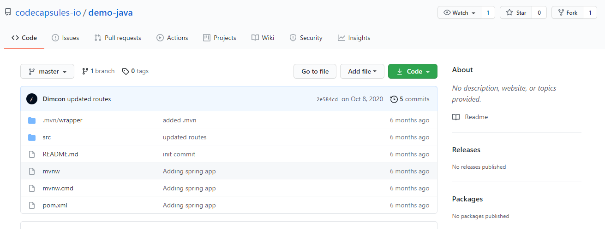
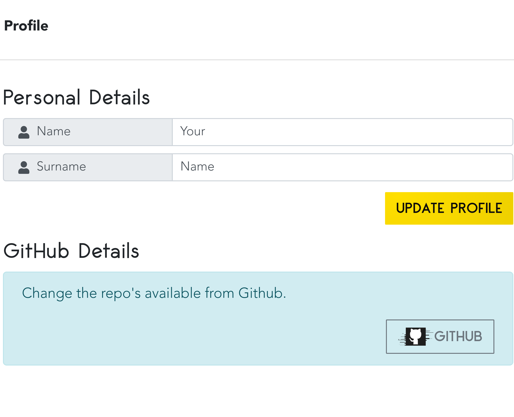
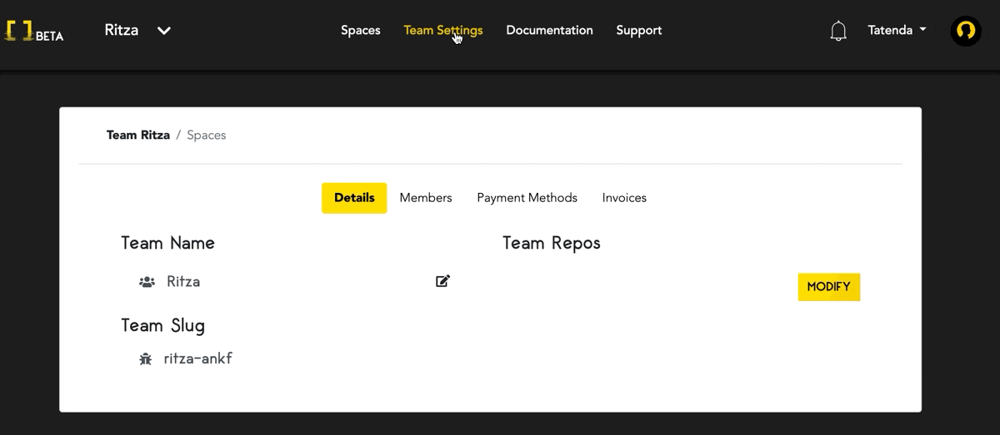

# Getting Started with Code Capsules by Deploying a Pre-made Java Application

Learn how to deploy backend Code on Code Capsules by deploying a Java application.

Prerequisites:

* A [GitHub](https://github.com) account

## Setup

We're going to learn how to deploy backend code on Code Capsules using an example Java application provided by Code Capsules. The source code for the application can be found [here](https://github.com/codecapsules-io/demo-java) on our GitHub account. Code Capsules connects to GitHub repositories to deploy applications online. 

We can use this repository by forking it. Navigate to the repository and "Fork" it by clicking the fork button at the top right of the repository. After forking the application, we can deploy it on Code Capsules - no further edits required. 

## Code Capsules Account Sign Up

First we need to register an account with [Code Capsules](https://codecapsules.io). Alternatively, you can click on the "Log In" text next to the Sign Up button if you already have a registered Code Capsules account. Enter your details to sign up for an account or to log into an existing one. 

If you've just signed up for an account, make sure to confirm it by checking for an email from Code Capsules.On your first login you will be directed to the Welcome page. Click on the "Go To Personal Team" button to advance to the next step. A [Team](https://codecapsules.io/docs/faq/what-is-a-team/) is an environment for you to manage your spaces and capsules.

Code Capsules gives every account a Personal Team as a default.

## Create a Space for your apps

Now click on the "Create A New Space For Your Apps" button. Alternatively, if you had logged into an existing Code Capsules account you could click on the "New Space" button to create a new space for this tutorial or select any of your existing ones. After actioning either of these steps a UI similar to the one shown below should slide in from the right of your screen.  

Select an appropriate region and enter a name for your space and press "Create Space".

## Add Payment Information

Because we're deploying backend code, we need to add our payment information. Add payment information by navigating to "Team Settings" at the top of the screen. Add a payment method by clicking "Payment Methods".

After adding payment information, we need to give Code Capsules access to the Java application that we forked. Then we can get to deploying the application.

## Linking to GitHub

To give Code Capsules access to the Java application, we need to link our forked Java repository to our Code Capsules account.

To link the repository, click the profile image at the top right of the screen. Next, find the GitHub button under "GitHub Details".

Click the GitHub button. To give Code Capsules access to the Java application:

1. Click your GitHub username.
2. Select "Only Select Repositories".
3. Choose the GitHub repository we forked.
4. Press "Install & Authorize".

After authorizing, Code Capsules will have access to the Java application. The next step is to add the repository to our "Personal Team" so that all Capsules created under that Team can read its data. 

## Add Repo to Team

Click on "Team Settings" on the top navigation bar to switch to the Team Settings tab. Once there, click on the Modify button under the "Team Repos" section to add the repo to your Personal Team. When the "Edit Team Repos" screen slides in select "Add" next to the repo you want to add to your Personal Team and then confirm. After this is done, all Spaces in your team will have access to this repo. 

Now all that's left to do before deploying the application is to create a [Capsule](https://codecapsules.io/docs/faq/what-is-a-capsule). This Capsule will act as storage space for the Java application.

## Create the Capsule

Go back to the "Spaces" tab. Next, click on the Space you just created or are using and create a new capsule in that space. To do this, click the "New Capsule" or "Create A New Capsule For Your Space" button when inside the space.

To deploy the Java application, click the button "Create a New Capsule for Your Space". Next:

1. Choose a "Backend Capsule".
2. Select the "Sandbox" product.
3. Choose the GitHub repository we forked.
4. Press next.
5. Leave the "Run Command" blank and create the Capsule.

After creating the Capsule, the Capsule will build the Java application. You can view the build logs by clicking the "Logs" tab in the Capsule.

Once built, navigate to the "Overview" tab. Code Capsules provides a default URL for viewing applications - find this under "domains". Click the URL to view the application.

If you'd like to deploy another Java application in the future, take a look at the [Java repository](https://github.com/codecapsules-io/demo-java) to see how the project was set up. [Maven](https://maven.apache.org/what-is-maven.html) was used to build the application and the spring [Spring](https://spring.io/) framework.