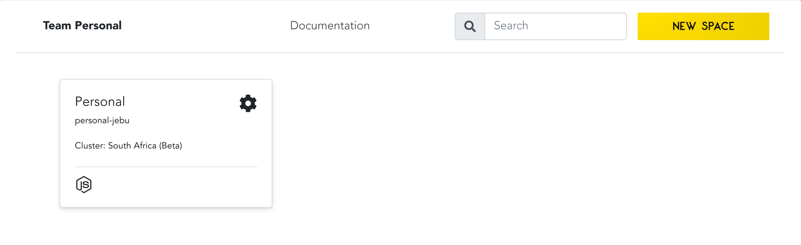

# Getting Started with Code Capsules by Deploying a Pre-made Java Application
Learn how to deploy backend Code on Code Capsules by deploying a Java application.

## Setup

We're going to learn how to deploy backend code on Code Capsules using a sample Java application. To follow this tutorial we'll need an account with [GitHub](www.github.com). This is necesarry because the sample Java application is in a GitHub repository, and because Code Capsules connects to GitHub repositories to deploy applications online. 

After registering an account with GitHub, you can find the Java application here: https://github.com/codecapsules-io/demo-java

We can use this repository by forking it. Navigate to the repository and "Fork" it by clicking the fork button at the top right of the repository. After forking the application, we can deploy it on Code Capsules - no further edits required. 

## Creating a Code Capsules Account and Adding Payment Information

First we need to create an account with [Code Capsules](https://codecapsules.io). Make sure to confirm your Code Capsules account by checking for an email from Code Capsules. After creatiing an account, you'll redirect here:

This is the default Code Capsules [Team](https://codecapsules.io/docs/faq/what-is-a-team/), called "Team Personal" (you can see the name of the Team at the top left), The box in the centre is the default [Space](https://codecapsules.io/docs/faq/what-is-a-space/), called "Personal" (find the Space's name in the Space box).

Every user has a default "Personal" Team and Space. Ths personal Team is important - with a personal team, you can host static frontend websites for free.

Because we're deploying backend code, we need to add our payment information. Add payment information by navigating to "Team Settings" at the top of the screen. Add a payment method by clicking "Payment Methods".

After adding payment information, we need to give Code Capsules access to the Java application that we forked. Then we can get to deploying the application.

## Linking to GitHub

To give Code Capsules access to the Java application, we need to link our forked Java repository to our Code Capsules account.

To link the repository, click the profile image at the top right of the screen. Next, find the GitHub button under "GitHub Details".

Click the GitHub button. To give Code Capsules access to the Java application:

1. Click your GitHub username.
2. Select "Only Select Repositories".
3. Choose the GitHub repository we forked.
4. Press "Install & Authorize".

After authorising, Code Capsules can deploy the Java application. Now all that's left to do before deploying the application is to create a [Capsule](https://codecapsules.io/docs/faq/what-is-a-capsule). This Capsules will act as a storage space for the Java application.

## Create the Capsule

Return to the personal Team. Next, click on the personal Space at the centre of the screen.

To deploy the Java application, click the button "Create a New Capsule for Your Space". Next:

1. Choose a "Backend Capsule".
2. Select the "Sandbox" product.
3. Choose the GitHub repository we forked.
4. Press next.
5. Leave the "Run Command" blank and create the Capsule.

After creating the Capsule, the Capsule will build the Java application. You can view the build logs by clicking the "Logs" tab in the Capsule. Once built, navigate to the "Overview" tab. Code Capsules provides a default URL for viewing applications - find this under "domains". Click the URL to view the application.

If you'd like to deploy another Java application in the future, take a look at the [Java repository](https://github.com/codecapsules-io/demo-java) to see how the project was set up. [Maven](https://maven.apache.org/what-is-maven.html) was used to build the application and the spring [Spring](https://spring.io/) framework.