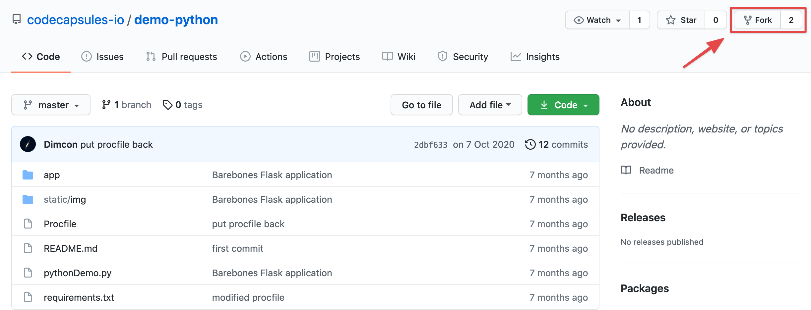
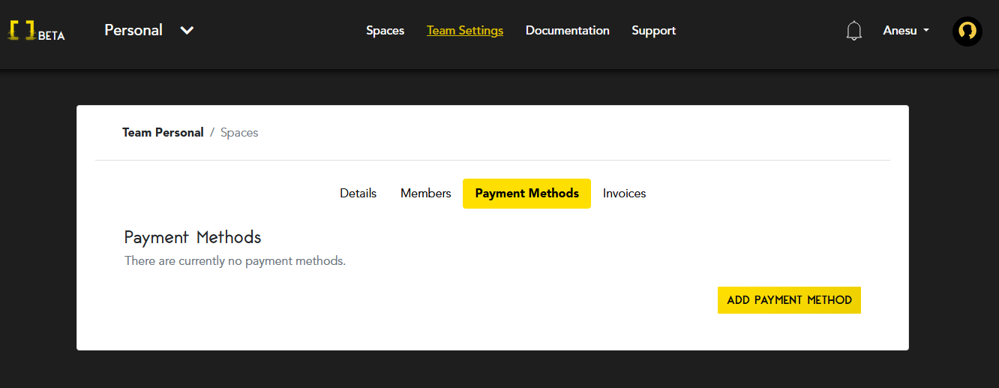
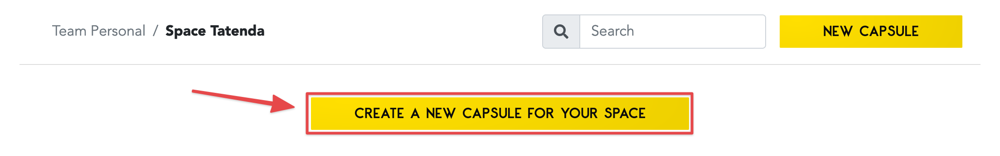

# Getting Started on Code Capsules with Python Flask

Deploy a Flask application and learn how to host backend code on Code Capsules. 

## Set Up

Here, we'll learn how to deploy backend code with Code Capsules and Flask. Because Code Capsules connects with GitHub to deploy code, you'll need a [GitHub](https://github.com) account to follow this tutorial. We'll use a sample Flask application provided by Code Capsules to demonstrate deployment – you can find the GitHub repository for the application [here](https://github.com/codecapsules-io/demo-python).

To deploy this repository, we'll need to fork the application by clicking "Fork" at the top right of the GitHub repository. Once forked, we're ready to deploy the application – feel free to make any edits to it, otherwise continue. 

## Creating an Account with Code Capsules

First, we'll need to create an account with [Code Capsules](https://codecapsules.io/). Do so, and make sure to confirm your account by checking your email. 

After creating a new account, you'll be greeted with a screen that looks like this: 

Click on the "Go To Personal Team" button, and you will be redirected to the _Spaces_ tab for your Personal Team. Code Capsules provides a personal [Team](https://codecapsules.io/docs/faq/what-is-a-team/) and a personal [Space](https://codecapsules.io/docs/faq/what-is-a-space/) (located in the middle of the screen) to every new user. 

For this tutorial, we'll need to add payment information to create a backend Capsule. Navigate to "Team Settings" at the top of the screen, then add a payment method under "Payment Methods". 

Once you've added payment information, we need to permit Code Capsules to access our GitHub repositories. 

## Linking to GitHub

In order to host our Flask application on Code Capsules, we need to link our forked GitHub repository to our Code Capsules account.

Find the profile image at the top right of the page and click on it. You'll see a GitHub button located under "GitHub" details. 

Click on the "GitHub" button. You can authorise Code Capsules to connect to the Flask application by:

1. Clicking your GitHub username.
2. Selecting "Only Select Repositories".
3. Choosing the GitHub repository we forked.
4. Pressing "Install & Authorize".

Once you've clicked the "Install & Authorize" button, Code Capsules will link to the GitHub repository containing the Flask application. The next step is to add the repository to our "Personal Team" so that all Capsules created under that Team can read its data. 

## Add Repo to Team

Click on "Team Settings" on the top navigation bar to switch to the _Team Settings_ tab. Once there, click on the "Modify" button under the _Team Repos_ section to add the repo to your Personal Team. When the "Edit Team Repos" screen slides in, select "Add" next to the repo you want to add to your Personal Team and then confirm. After this is done, all Spaces in your team will have access to this repo. 

Now, all we have left to do is to create a [Capsule](https://codecapsules.io/docs/faq/what-is-a-capsule) that will host our Flask application. But first, let's create a space for the capsule.

## Create a Space for Your Apps

Navigate to the _Spaces_ tab and click on the "Create A New Space For Your Apps" button. Alternatively, if you had logged into an existing Code Capsules account, you could click on the "New Space" button to create a new space for this tutorial or select any of your existing ones. After actioning either of these steps, a UI similar to the one shown below should slide in from the right of your screen.  

Select an appropriate region and enter a name for your space and press "Create Space".

## Create the Capsule

Capsules provide the server for hosting applications on Code Capsules.

We can deploy our Flask application to Code Capsules by clicking the "Create a New Capsule for Your Space" button. Do so, then:

1. Choose a "Backend Capsule".
2. Select the "Sandbox" product.
3. Choose the GitHub repository we forked.
4. Press next.
5. Leave the "Run Command" blank and create the Capsule.

While the Capsule is building, you can view its logs under the "Build and Deploy" tab in the Capsule. Once built, you can navigate to the "Overview" tab and click on the provided URL to view the application. 

For a better understanding of Capsules, take a look at [this explanation](https://codecapsules.io/docs/faq/what-is-a-capsule).

If you'd like to deploy your own Flask application, take a close look at the [Flask repository](https://github.com/codecapsules-io/demo-python) we forked. There, you'll find a file named `Procfile`. Code Capsules reads Procfiles to build and deploy Flask applications. [Click here](https://pythonhosted.org/deis/using_deis/process-types/) to read more about Procfiles. 
