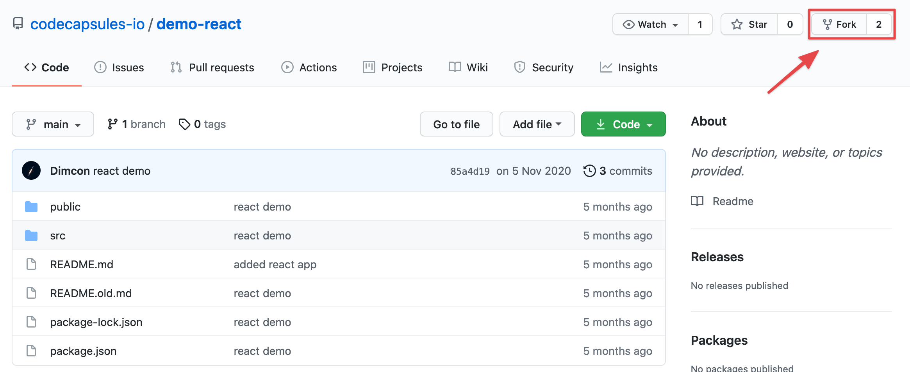
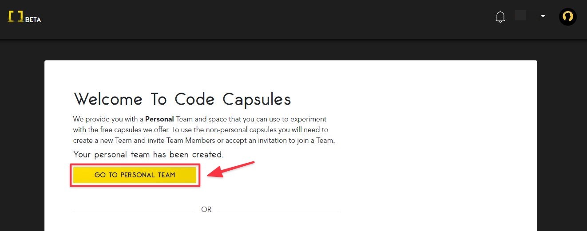
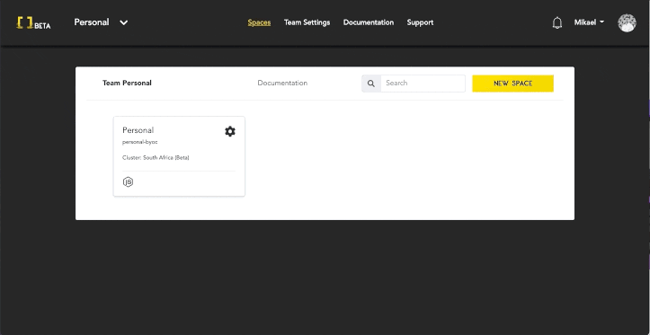
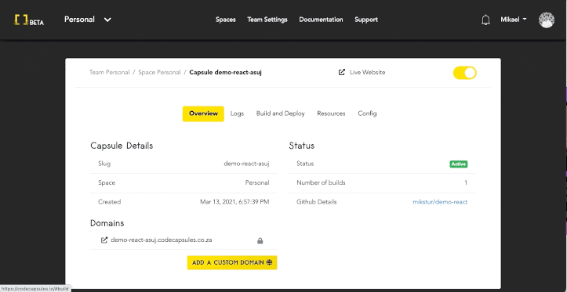

# How to Deploy a React Application on Code Capsules

If you've built a web app with React, you probably want to deploy it to production to share it with the rest of the world. In this guide, we'll show you how to do that, step by step.

You'll need 

* A [GitHub](https://github.com) account
* An account on [Code Capsules](https://codecapsules.io)

## Getting some example code

We'll use [our example React application](https://github.com/codecapsules-io/demo-react) for the demonstration, but you can use your own React application instead, or work from ours as a starting point.

Fork the project to your own account by clicking on the above link and pressing "fork" in the top right.

## Code Capsules sign up

Navigate to [Code Capsules](https://codecapsules.io/) and click on the "Sign Up" button in the top right corner of the webpage. Alternatively, you can click on the "Log In" text next to the Sign Up button if you already have a registered Code Capsules account. Enter your details to sign up for an account or to log into an existing one. 

If you've just signed up for an account you will be directed to the Welcome page on your first login. Click on the "Go To Personal Team" button to advance to the next step.

After clicking on the "Go To Personal Team" button you will be redirected to the Spaces tab for your Personal Team. Code Capsules gives every account a Personal Team as a default. 

## Create a Space for your apps

Now click on the "Create A New Space For Your Apps" button. Alternatively, if you had logged into an existing Code Capsules account you could click on the "New Space" button to create a new space for this tutorial or select any of your existing ones. After actioning either of these steps a UI similar to the one shown below should slide in from the right of your screen.  

Select an appropriate region and enter a name for your space and press "Create Space".

## Linking to GitHub

To host our React application on Code Capsules, we need to link our forked GitHub repository to our Code Capsules account.

We can link the GitHub repository by clicking the profile image at the top right of the screen, and finding the GitHub button under "GitHub Details"

Click the "GitHub" button. To give Code Capsules access to the React application:

1. Click your GitHub username.
2. Select "Only Select Repositories".
3. Choose the GitHub repository we forked.
4. Press "Install & Authorize".

After authorizing, Code Capsules will be able to read the contents of the selected repositories. All that's left to deploy the application is to add the repo to your team and create a [Capsule](https://codecapsules.io/docs/faq/what-is-a-capsule). This Capsule will act as a storage space for the React application.

## Add Repo to Team

Click on "Team Settings" on the top navigation bar to switch to the Team Settings tab. Once there, click on the Modify button under the "Team Repos" section to add the repo to your Personal Team. When the "Edit Team Repos" screen slides in select "Add" next to the repo you want to add to your Personal Team and then confirm. After this is done, all Spaces in your team will have access to this repo. 

## Create the Capsule

Return to the "Spaces" tab. Next, click on the Space you just created or are using and create a new capsule in that space. To do this, click the "New Capsule" or "Create A New Capsule For Your Space" button when inside the space.

As we want to host a React application choose to create a frontend capsule as shown below.

Select the repository with the project you want to host on Code Capsules and enter the build command that will be used by Code Capsules when building your project. Also enter the static folder holding the static files for your project.

After creating the Capsule, the Capsule will build the React application. You can view the build logs by clicking the "Build and Deploy" tab in the Capsule and then "View build log". 

Once built, navigate to the "Overview" tab. Code Capsules provides a default URL for viewing applications - find this under "domains". Click the URL to view the application.

If you'd like to deploy another React application in the future, take a look at the [React repository](https://github.com/codecapsules-io/demo-react). Code Capsules was able to deploy the application by reading the `package.json` file. You can find the script that Code Capsules used to run the application on line 16 of the `package.json` file.
