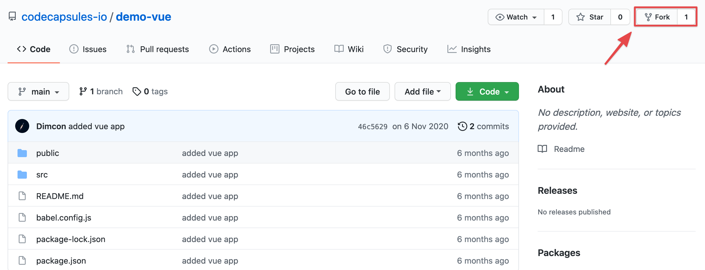
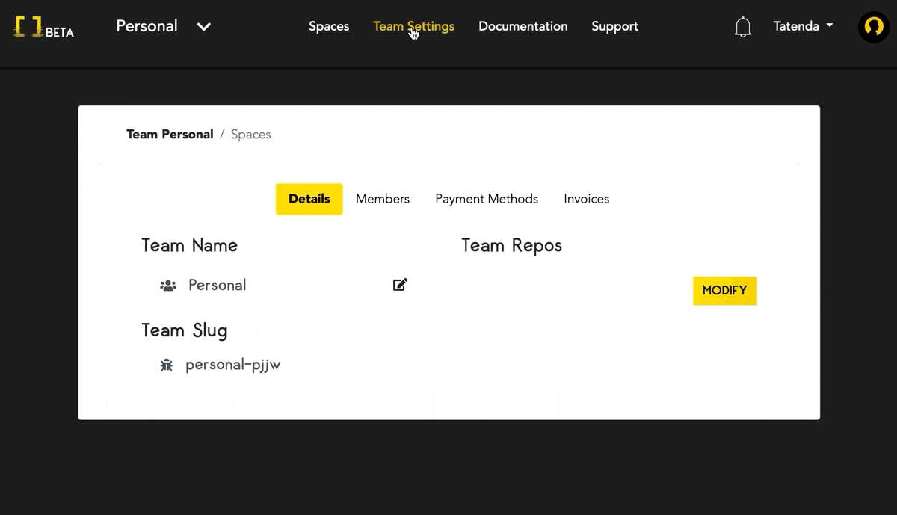
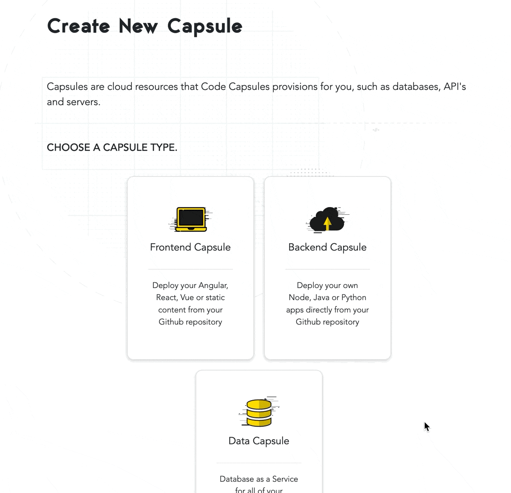

# Getting started on Code Capsules with Vue

Deploy a Vue application and learn how to host frontend code on Code Capsules. 

Prerequisites:

* A [GitHub](https://github.com) account

## Set up

Here we'll look at a step-by-step process for deploying a Vue application on Code Capsules using example source code provided by Code Capsules on their GitHub. You can find the repository [here](https://github.com/codecapsules-io/demo-vue) and you can also link any of your GitHub repositories to Code Capsules, and Code Capsules will deploy it.

To be able to deploy this repository to Code Capsules, make sure to fork the Vue application. You can do so by visiting the repository and clicking the "Fork" button at the top right of the repository. 

After forking the application, we can deploy the application. Make any edits you'd like to the repository and continue.

## Creating an Account with Code Capsules

First, let's create an account with [Code Capsules](https://codecapsules.io). Make sure to confirm your Code Capsules account by checking your email. On your first login you will be directed to the Welcome page. Click on the "Go To Personal Team" button to advance to the next step. 

A [Team](https://codecapsules.io/docs/faq/what-is-a-team/) is an environment for you to manage your spaces and capsules. Code Capsules gives every account a Personal Team as a default. The default Personal Team allows users to host static frontend websites for free.

## Create a Space for your apps

Now click on the "Create A New Space For Your Apps" button. Alternatively, if you had logged into an existing Code Capsules account you could click on the "New Space" button to create a new space for this tutorial or select any of your existing ones. After actioning either of these steps a UI similar to the one shown below should slide in from the right of your screen.  

Select an appropriate region and enter a name for your space and press "Create Space".

## Linking to GitHub

So we can host our Vue application on Code Capsules, we need to link our forked GitHub repository to our Code Capsules account.

We can link the Vue application by clicking the profile image at the top right of the screen, and finding the GitHub button under "GitHub Details"

Click the GitHub button. To give Code Capsules access to the Vue application:

1. Click your GitHub username.
2. Select "Only Select Repositories".
3. Choose the GitHub repository we forked.
4. Press "Install & Authorize".

After authorizing, Code Capsules will be able to read the repository containing the Vue application. All that's left to deploy the application is to add the repo to our Team and create a [Capsule](https://codecapsules.io/docs/faq/what-is-a-capsule). 

## Add Repo to Team

Click on "Team Settings" on the top navigation bar to switch to the Team Settings tab. Once there, click on the Modify button under the "Team Repos" section to add the repo to your Personal Team. When the "Edit Team Repos" screen slides in select "Add" next to the repo you want to add to your Personal Team and then confirm. After this is done, all Spaces in your team will have access to this repo. 

## Create the Capsule

Capsules act as storage spaces for applications. For a closer look at a Capsule's properties, refer to this [explanation on Capsules](https://codecapsules.io/docs/faq/what-is-a-capsule/).

To deploy the Vue application, go back to the "Spaces" tab. Next, click on the Space you just created or are using and create a new Capsule in that space. Click the "New Capsule" or "Create A New Capsule For Your Space" button when inside the space. Next:

1. Choose a "Frontend" Capsule.
2. Select the "Trial - Static Site Hosting" product.
3. Choose the GitHub repository we forked.
4. Press next.
5. Use `npm run build` for the "Build command" and `dist` for "Static content folder path" 
6. Press "Create Capsule".

After creating the Capsule, the Capsule will build the Vue application. You can view the build logs by clicking the "Logs" tab in the Capsule. 

Once built, navigate to the "Overview" tab. Code Capsules provides a default URL for viewing applications - find this under "domains". Click the URL to view the application.

If you'd like to deploy another Vue application in the future, take a look at the [Vue repository](https://github.com/codecapsules-io/demo-vue). Code Capsules was able to deploy the application by reading the `package.json` file. You can find the script that Code Capsules used to run the application on line five in the `package.json` file.
