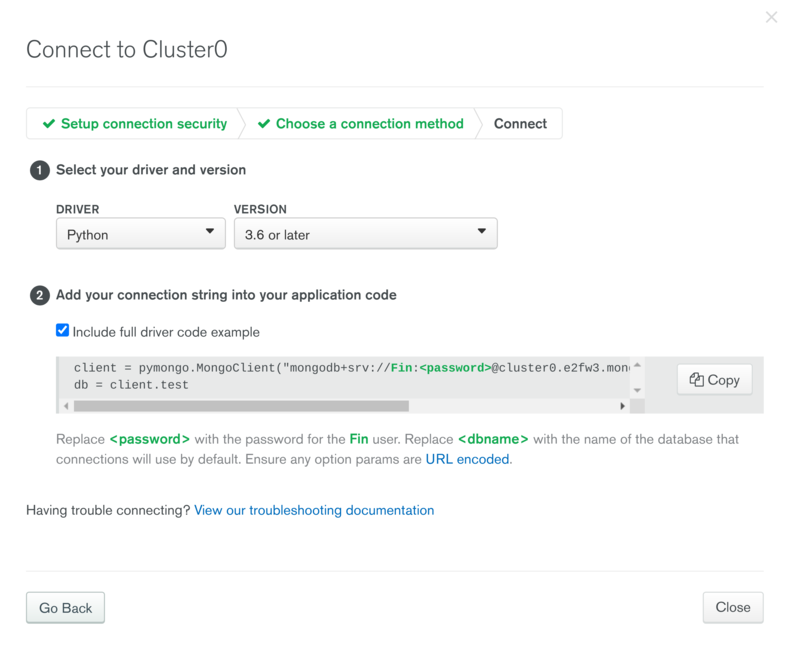
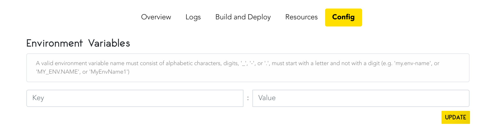

# How to Connect a MongoDB using MongoDB Atlas with your Code Capsules Application

## What is MongoDB Atlas?

[MongoDB Atlas](https://www.mongodb.com/cloud/atlas) is a _database as a service_ that hosts and manages MongoDBs online. In some ways, this service is similar to Code Capsules. Instead of managing and hosting applications, MongoDB Atlas manages and hosts MongoDBs for you – leaving you to worry about working with your database. 

If you have a project idea or a project already hosted on Code Capsules that needs a database, this guide will help you. We'll walk step by step through creating an account with MongoDB Atlas and cover how to connect your application on Code Capsules to MongoDB Atlas.

## Creating an Account, Organization, and Project with MongoDB Atlas

First, create an account with [MongoDB Atlas](https://www.mongodb.com/cloud/atlas) and log in. 

Your MongoDB Atlas account consists of two organisational tools – _Organizations_ and _Projects_:

- Projects contain all the [clusters](https://www.capitalone.com/tech/cloud/what-is-a-cluster/) that host your databases.
- Organizations contain all of the Projects that you've created. 

Let's start by creating an organization. Navigate to the "Organizations" tab on your dashboard and click "Create an Organization". Then:

1. Name your organization.
2. Choose your cloud service.
3. Invite anyone you'd like to your organization, then hit "Create Organization".

Next up is creating a project:

1. Navigate to the "Projects" tab.
2. Click "New Project" at the top right of the screen.
3. Choose a name for your project and hit "Next".
4. Add any necessary project members, then click "Create Project".

Next, we'll set up a cluster that'll host your database.

### Setting up a cluster 

After creating the project, you'll see a "Build a Cluster" button. Click it, and follow the instructions to set up a new cluster. You can choose a paid cluster or a free "Shared Cluster". These "Shared Clusters" are appropriate for small projects or for learning how to use MongoDB.

MongoDB Atlas will begin to create your cluster – this can take a couple of minutes. While the cluster generates, we can set up some configurations for your database.

#### Access configurations

MongoDB Atlas requires you to create a "user" in order to access the database in your cluster. You can think of "users" as administrator accounts.

1. Navigate to the "Database Access" tab under "Security".
2. Click "Add New Database User".
3. Choose the "Password" authentication method and follow the instructions. 
	-	**Make sure** to select "read and write to any database" under "Database User Privileges".

Now we need to authorize an IP address to connect to the database. Navigate to the "Network Access" tab under "Security". You'll see a button "Add IP Address". Adding an IP address means only computers on that IP address can connect to the database. 

Click "Add IP Address". We have a couple of options for adding an IP address.

- If you only want to access the database from your current IP address, hit "Add Current IP Address" (note: If you select this option, Code Capsules will not be able to access your database).

- **If you already have an application** on Code Capsules, or **plan on hosting an application** on Code Capsules, select "Allow Access From Anywhere".

By this time, the cluster hosting your database should be ready. Let's see how we can connect to it.

## Connecting to the Cluster

Under "Data Storage" on the dashboard:

1. Click "Clusters".
2. Find your cluster.
3. Click "Connect". 

There are multiple ways to connect to the a MongoDB Atlas cluster - we want to connect the database to an application, so, click "Connect your application".

MongoDB Atlas provides drivers for various programming languages to connect to their databases. Choose your driver and version, and check the "Include full driver code example" box to see the code you'll need to connect to your database.

Below is their Python driver, with "Fin" as the user. 


In your driver, you'll see something like this: `mongodb+srv://YOURUSERNAME:<password>@cluster0.e2fw3.mongodb.net/<dbname>?retryWrites=true&w=majorhostity`. This is a [URI](https://danielmiessler.com/study/difference-between-uri-url/). To connect your application to your database, copy and paste the driver into your code. In your URI, **replace** `<password>` and `<dbname>` with the user's password we created [previously](#setting-up-a-cluster-and-access-configurations) . 

If you plan on hosting your application on Code Capsules, we need to perform one last step. 

## Connecting your Database to Code Capsules

Code Capsules connects to your GitHub repository containing your application's code. Therefore, anyone can see your code. This means you **should not** push your URI to GitHub. If you did, anyone could use your database. To get around this, set up an [environment variable](https://medium.com/chingu/an-introduction-to-environment-variables-and-how-to-use-them-f602f66d15fa) in your code for your URI and set the environment variable on Code Capsules.

For example, an environment variable in Python program would look like:

```python
import os

client = pymongo.MongoClient(os.getenv('DATABASE-URI'))
db = client.test

### Do something here
```

On Code Capsules you would then set an environment variable named `DATABASE-URI`, containing the URI. 

To set environment variables on Code Capsules, host your application on Code Capsules and navigate to the "Config" tab in your Capsule. Make sure to click "Update" when done.


