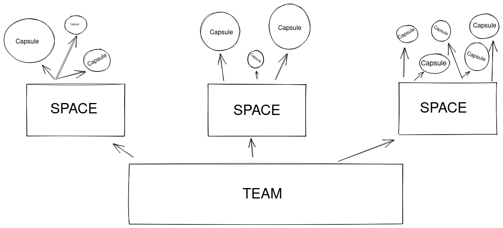

# FAQ

## Teams, Spaces, and Capsules

[Teams](https://codecapsules.io/docs/faq/what-is-a-team), [Spaces](https://codecapsules.io/docs/faq/what-is-a-space), and [Capsules](https://codecapsules.io/docs/faq/what-is-a-capsule) are the foundation of [Code Capsules](https://codecapsules.io). "_Teams contain Spaces and Spaces contain Capsules_".

**Teams** are to organize people. Multiple people can join your Team, and each member of the Team can interact with the Spaces and Capsules that the Team contains. Furthermore, Teams are associated with a payment method – you add a credit card to a Team, and Code Capsules bills this credit card when a charge incurs.

**Spaces** are the second layer of organization. Spaces can contain any amount of Capsules and are excellent tools for larger projects. If your project involves complicated frontend and backend code, splitting your code into multiple Capsules – each within the same space – may help with organization.

**Capsules** provide the actual computational power for running your applications. While Teams and Spaces are organizational tools, Capsules connect to GitHub repositories containing your applications and hosts them on a server. Capsules can run both frontend and backend applications.

For a single, simple project, you would have exactly one team, containing one space, containing one capsule. If you wanted to set up a frontend only project (e.g. a React app) backed by a REST API, you would have two capsules in your space: a frontend Capsule for the React application and a backend Capsule for the REST API.

## What is a Team?

Code Capsules provides Teams for collaborative development. Multiple members may belong to a team.

A Team may contain multiple [Spaces](https://codecapsules.io/docs/faq/what-is-a-space/) and [Capsules](https://codecapsules.io/docs/faq/what-is-a-capsule/). Members of the Team can interact with these Spaces and Capsules.  

Furthermore, Teams handle the payment for all of its Capsules. You set up a payment method for the entire Team (a credit card), and Code Capsules charges that payment method appropriately.

## What is a Space?

Spaces are an organizational tool for [Capsules](https://codecapsules.io/docs/faq/what-is-a-capsule/). Each Space can contain any number of Capsules. Spaces come in handy when working with a large project – it may be useful to split the project into multiple Capsules.

## What is a Capsule?

A Capsule provides the actual server for running your applications. Code Capsules offers two distinct Capsule types: Frontend Capsules and Backend Capsules.

- Frontend Capsules deploy Angular, React, Vue, or static content from the GitHub repository housing your application.

- Backend Capsules deploy Node.js, Java, or Python applications from the GitHub repository containing your code.

Capsules automatically build and deploy upon creation. One can monitor the build process by navigating to the "Logs" tab, or by pressing "View build log" under the "Build and Deploy" tab.

Upon deployment, an HTTPS subdomain is generated for the Capsule. The subdomain assigned to the app is available in the "Config" tab. Clicking on the subdomain will open the link in a new tab.

You can turn Capsules off by toggling the switch at the top right of the Capsule view (next to "Live Website").

