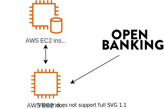

# SaaS vs PaaS vs IaaS

If you've spent any amount of time trying out or researching cloud services, you've probably come across acronyms like SaaS, PaaS and IaaS. Respectively, these are:

* Software as a Service
* Platform as a Service
* Infrastructure as a Service

But what do any of these terms actually mean? And what's the difference between them? In this article, we will provide a practical, hands-on overview of the differences, strengths and weaknesses of these three types of cloud services, along with examples of each and the types of things you might build with them.

Let's say we're interested in building a budgeting application. This will initially be for personal use, but we might want to let other people use it in future, or even build a business out of it. We could choose to use any of these three types of services to build our application, but each one has different pros and cons. The one you choose will determine both the skills we'll need, and the limitations we'll need to work with.

Roughly speaking, we will need greater depth and breadth of technical expertise as you move up the ladder from SaaS to IaaS, but we'll also have more flexibility. Below, we'll go through each one and discuss how we might use it to build our budgeting application.

## Software as a Service (SaaS)

| Pros | Cons |
| ---- | ---- |
| Quick to get started with.  | Limited flexibility. |
| Requires little or no programming knowledge. | Significant vendor lock-in. |
&nbsp; | Likely to be inefficient and costly at scale. |

Just about any application that runs in your browser can be considered Software as a Service. Software as a Service (SaaS) offerings include Google Drive and its associated office suite – Google Docs, Google Sheets, and others – as well as other file management services like Dropbox, communication platforms like Slack, and knowledge management solutions like Notion and Confluence.

If we were to build a budgeting application using SaaS, we could do it without writing a large amount of code. We could start with a simple Google Sheet, attached to a Google Form, where the user would manually enter each transaction they make during the month. The user would specify the amount, whether it's an income, expense or investment, and add a comment about what it was for: e.g. "Monthly salary" or "Groceries". We could then use macros to calculate the user's total income and expenditure for each month.

We could make this more complex by [using multiple forms and spreadsheets](https://alicekeeler.com/2015/01/08/multiple-google-forms-to-one-spreadsheet/) to do things like allowing the user to set up a budget at the beginning of each month. We could also integrate investments into our spreadsheets, using the [GOOGLEFINANCE](https://support.google.com/a/users/answer/9308730?hl=en) macro to fetch stock prices in real time.

We could then expand out of spreadsheets and forms by using another SaaS platform like [IFTTT](https://ifttt.com/) or [Zapier](https://zapier.com/) to send a monthly digest email to the user's GMail address, or warning emails if they start coming close to their allotted budget for a particular kinds of expenses. And if the user is more active on [Slack](https://slack.com/) than email, we could also set up Slack alerts.

If we want something more than email and Slack alterts, we could use a SaaS platform such as [Glide](https://www.glideapps.com/pricing) to build a custom application uses our original spreadsheets as a data backend. With a bit of tweaking, we could make it possible for others to use it.

Our full application architecture would now look like this:

In this way, we can get a fully functional budgetting application with multiple integrations working by using different SaaS solutions together, and without writing any code. However, if we're interested in building a business out of this application, we may soon run into problems like expensive per-user fees and a lack of flexibility and control. Glide's visual editor may not allow us to design our application in the exact way we want to, or we may run up against the limitations of what sorts of data analysis can reasonably be done using spreadsheets.

SaaS platforms also have the strongest vendor lock-in of the three types of services we discuss in this article. If the SaaS we're using closes down or radically changes its software, we may be unable to extract all of your data. And even if we are able to extract our data, it's unlikely that we'll be able to import it directly into a different SaaS and keep going.

For example, if our budget application uses a lot of functionality specific to Google Sheets, such as the GOOGLEFINANCE macro, and Google decides to shut down Sheets, we should be able to download our sheets as XLSX files and move them to a competing platform, such as [Microsoft Office 365](https://www.office.com/). But we'll then have to do a lot of manual tinkering to get everything to work again on this new service. In some cases, we may even have to remove functionality that's not supported by the new service.

And seeing as we're using multiple SaaS platforms together, as in the above architecture, we're dependent on them continuing to support each other. For example, if Slack changes its API in a way that breaks Zapier's integration with it, our budgeting application's Slack integration will be broken until Zapier updates their software. Worse still, if Slack chooses to stop supporting the kinds of integrations we want, we will have to scramble to find an alternative solution to notify users about their budgets.

SaaS solutions provide a great way to quickly prototype ideas, but maybe prove unreliable and limiting if you need them to work over a long timescale or for a large number of users. Using Google Sheets and some integrations to build a budgeting app for yourself is not a bad idea, and you could even develop it to the point of accepting other users, but if you want to build a sustainable business with your application, you may be better off looking into a PaaS or IaaS solution instead.

## Platform as a Service (PaaS)

| Pros | Cons | 
| ––-|––- |
| Requires no infrastructure set-up. | May be inefficient or costly at scale. |
| The vendor is responsible for system maintenance and security patches. | Less vendor lock-in than SaaS, more than IaaS. |

Unlike most SaaS solutions, Platform as a Service (PaaS) solutions are specifically intended for use by developers. You can think of a PaaS as anywhere you can upload code and have it automatically deployed and run. PaaS solutions include Code Capsules, Heroku, Netlify, Google App Engine and AWS Elastic Beanstalk.

If you've deployed a Capsule before, you'll be familiar with the process of working with a PaaS. If you haven't, it generally goes like this:

1. Write application code in a language and framework of your choice.
2. Push code to a source code repository on a code hosting platform such as GitHub.
3. Link your GitHub profile to the PaaS of your choice, locate the repository you want to deploy, and click deploy.
4. Your application will be live on a URL that looks like myapp.paas.com.

Depending on the PaaS and the type of application being deployed, the developer may need to include deployment configuration instructions with their application code. For example, in [many of our tutorials](!!!LINK/S!!!), it is necessary to create files named `Procfile` and `requirements.txt` prior to deployment.

Users of a PaaS will need to write a lot of code. In return, they get flexibility and a reduced level of vendor lock-in compared to building on SaaS solutions. Writing your own custom code provides you with far more customisation options and areas where you can make specific optimisations. Users of PaaS solutions do not require system administration knowledge, as the PaaS will be responsible for configuring their code to run correctly.

Different PaaS solutions target different parts of the standard three-layer application stack made up of frontend (HTML and JavaScript that runs in users' browsers), backend (code that runs on servers) and data persistence (databases and datastores that record information such as user login details).

Some PaaS solutions are highly focused on a single part of the stack, while others offer solutions for multiple areas of the stack. The table below gives some examples of each.

Areas of the stack | PaaS solution examples
–––––––––-|–––––––––––-
Frontend           | Netlify, Vercel, AWS S3, GitHub Pages, Code Capsules (Frontend capsules)
Backend            | Heroku, OpenShift, AWS Elastic Beanstalk, AWS Lambda, Code Capsules (Backend capsules)
Data persistence   | MongoDB Atlas, AWS RDS, Azure SQL Database

Frontend code can be included with backend code, and some PaaS solutions offer data persistence solutions, so you may be able to deploy a complete application as a single project on a single PaaS, but you can also use multiple PaaS solutions for different stack components.

If we were to build our budgeting application on PaaS solutions, we would start by writing the application code. We might do this in Python with a framework like Flask, in Node.js with a framework like Express, in Ruby with a framework like Sinatra, or any number of other languages, depending on PaaS support. We may also use a frontend framework such as Vue or React. We would also need to choose a data store: either a relational database like [PostgreSQL](https://www.postgresql.org/) or a NoSQL document store like [MongoDB](https://www.mongodb.com/). Then we would need to choose one or more PaaS solutions which supported our chosen technologies.

Let's say we developed our budgeting application using Code Capsules to host our back and frontend code and [MongoDB Atlas](https://www.mongodb.com/cloud/atlas) to store our data. We could combine the backend and frontend code into a single backend capsule. Alternatively, we could create a frontend capsule with our application frontend and have it interact with an API created in a backend capsule – we might do this if we wanted to reuse our backend for a mobile application.

Our budgeting app would be a web application with user login. Custom functionality would need to be dveloped for entering transactions, setting budgets and viewing reports on your spending, but we would have totally flexibility in how all of this worked, without being constrained by the interfaces of Google Sheets or Google Forms. For example, we could create specialised forms for common transactions with user-friendly features like autocomplete based on existing data.

If we're feeling really ambitious, we could integrate [open banking](https://en.wikipedia.org/wiki/Open_banking) into our application have transactions fetched automatically rather than needing to be entered manually.

Using a single backend capsule, our application architecture would look something like this:

Using a backend and frontend capsule, our application architecture would look like this:

In the above architecture, we could replace the frontend module with a Netlify site, and the backend module with a collection of AWS Lambda functions, or just about any other PaaS solution that provides the appropriate area of the stack.

Using PaaS solutions is the middleground between using SaaS and IaaS solutions in terms of easiness of setup versus flexibility and control. Using a PaaS will lead to some level of vendor lock-in, especially if you use something like AWS Lambda. However, in most cases we will be able to move our code to a different PaaS if the one we're using shuts down or stops supporting something we rely on. We may have to do some reconfiguration, but this is likely to be less onerous than moving between SaaS solutions.

As we are not doing our own system administration when we use a PaaS solution, we won't be able to optimise our infrastructure for the needs of our application. If we're not careful about how we design our application, it may end up being [much more expensive to run](https://einaregilsson.com/serverless-15-percent-slower-and-eight-times-more-expensive/) than it would be on an IaaS solution.

## Infrastructure as a Service (IaaS)

Pros | Cons
––-|––-
Highly flexible. | Requires programming and system administration knowledge.
Can be configured more precisely and efficiently than SaaS and PaaS solutions. | Requires regular maintenance.
Very little vendor lock-in | ...

Infrastructure as a Service (IaaS) solutions are the most technically demanding of their users. Rather than providing end-user software or deployment for user-developed code, most IaaS solutions merely provide you with virtual machines (VMs), commonly called a compute instances. These are fully capable computers that you have fully control over and responsibility for. Examples of IaaS services include AWS EC2, Google Cloud Platform's Compute Engine and Digital Ocean's Droplets.

To deploy an app using an IaaS solution, we follow these general steps:

1. Create a virtual machine, specifying how much CPU power, RAM and hard drive storage space you want, as well as its operating system.
2. Specify firewall rules for this virtual machine – for most simple web applications, you'll need to specify that TCP ports 80 and 443 should be open, as well as port 22, for your remote access.
3. Access your virtual machine over SSH, generally using an SSH key like you would with GitHub.
4. Install a web server, database management system, and all the other requirements for your application.
5. Upload your application's code to your server.
6. Ensure that all of your supporting software is configured correctly and your application's code files can be located and read by your webserver, and then start your application.
7. Buy a domain name and configure it to point to the IP address of your virtual server.

This is quite a lot more effort than using a PaaS, and it requires some specialised knowledge in addition to programming.

In our budgeting app example, we would be able to take the same code you might
deploy to a PaaS and use that on an IaaS: for example, we could take code we've uploaded to Code Capsules and upload it to an AWS EC2 instance instead. We would just need to install and set up your own webserver – usually Apache or nginx – and our own database –
either a traditional relational database like PostgreSQL or a NoSQL document
store like MongoDB.

We could also put the database on a second EC2 instance, and configure your networking rules to allow both instances to speak to each other over the relevant port. Our application architecture would look now look like the diagram below – note that we would retain our open banking integration, as that is defined in code.

The benefit this gives you is total control over your infrastructure, which can have efficiency and cost savings over working with a PaaS. How much will depend on your level of expertise and the amount of time you can allocate to optimising and managing your infrastructure. Depending on our application's architecture, we might create more than one VM for serving the application and managing the database, using load balancers and data replication. Alternatively, we may just dynamically increase the CPU speed, RAM and disk space of one or two VMs.

The other major benefit to using IaaS over SaaS or PaaS is that it has essentially no vendor lock-in. Just about everything you do on an AWS EC2 instance will work just as well on a virtual machine provided by Google Compute Engine or Digital Ocean, or even a physical server in a pre-cloud datacentre.

But with great power comes great responsibility. Anything we build on an IaaS solution will require regular maintenance – we will be responsible for keeping our virtual machines' software up-to-date. This is extremely important for internet-facing infrastructure, as out-of-date software can contain security vulnerabilities which could lead to our application being hacked, even if all of our own code is completely secure.

# Conclusion

The choice between SaaS, PaaS and IaaS solutions will depend on your and your team's depth and breadth of expertise, how you aim to manage your time, and what stage of development you're in. The same application could go from a proof-of-concept build on SaaS solutions to a custom built application running on PaaS solutions, and then move over the IaaS to improve performance or costs.

Or you could use a mix of all three: the choice between SaaS, PaaS and IaaS does not have to all-or-nothing. Instead, it's worth making an independent decision for each area of your application stack. For example, you can have an application that runs on an AWS EC2 instance (IaaS), stores data in an AWS RDS database (PaaS) and sends users notifications on Slack (SaaS). Or you could create a Netlify website (PaaS) that communicates with a an API deployed on Code Capsules (PaaS), which in turn uses a PostgreSQL database running on an AWS EC2 instance (IaaS). The possibilities are endless.

