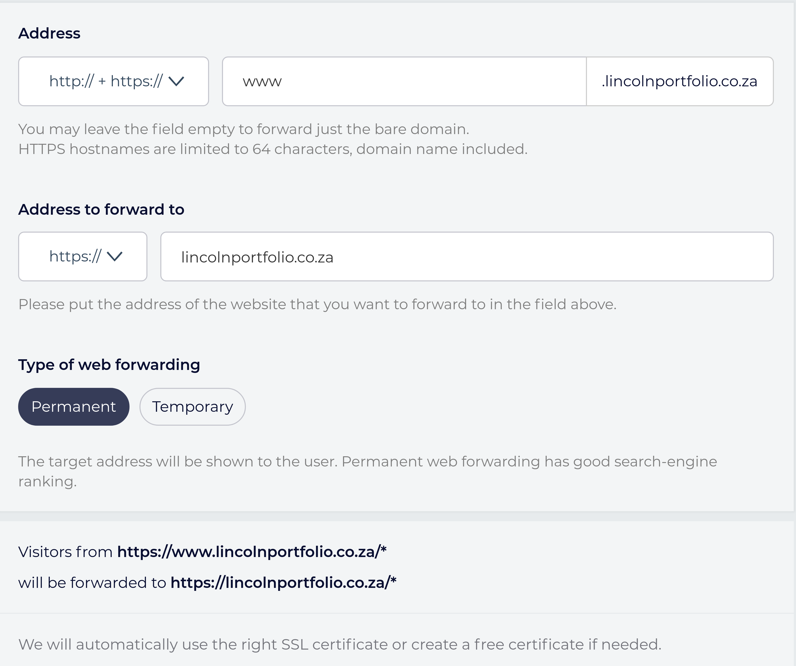
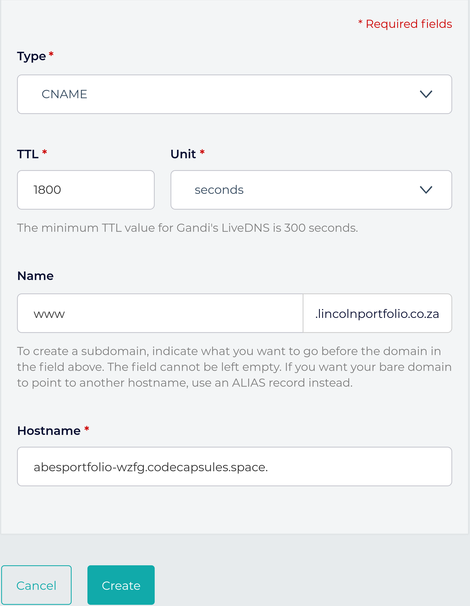

# Customising Your Domain on Code Capsules

In this tutorial, we'll set up a custom domain name for your website or application hosted on Code Capsules.

## Why Custom Domains and How Do They Work?

Custom domains garner name recognition for your web-application or website. Consider the Google search-engine: without a domain, you would need to type in the [IP](https://www.popularmechanics.com/technology/a32729384/how-to-find-ip-address/) address for it. This would be far more difficult to remember than the URL www.google.com – instantly recognizable. 

Web-addresses like www.google.com act as placeholders for an IP address and help us remember the website. When you type a URL in your search bar, your computer sends a request with the URL to the _Domain Name System_ (DNS) – a cluster of servers worldwide containing domain names and corresponding IP addresses. The DNS then returns the URL's corresponding IP address, and you connect to the website you were trying to reach. 

Following this guide, we'll learn how to buy a domain and route it to a Code Capsules hosted web-application. Along the way, we'll learn more about the DNS and related topics.

## Prerequisites

To complete this tutorial, we'll need:

- A web-application hosted on [Code Capsules](www.codecapsules.io). 
- A valid payment method (credit card, PayPal, cryptocurrency, bank transfer) to purchase a custom domain.

## Where to Buy a Domain

Domain Registrars are businesses accredited to sell domains. We'll purchase a domain from the registrar www.gandi.net. Some things to keep in mind when choosing a domain name:

- Domains that don't contain [highly sought after words](https://webhostingcompare.co.za/most-expensive-domain-names-sold-south-africa/) are usually inexpensive. 

- You can save on domains by using [less popular Top-level domains](https://en.wikipedia.org/wiki/Top-level_domain)(TLD's) – for example: rather than register a ".com" website, register a ".info" website.

Keeping these tips in mind, let's purchase a domain.

### Purchasing a domain from Gandi

To purchase a domain on Gandi:

1. Navigate to www.gandi.net.
2. Enter the domain you want in the domain search box (ex: https://www.lincolnsportfolio.co.za)
3. Add the domain to the shopping cart.
4. Checkout by clicking the shopping cart at the top right of the screen.
5. Decide how many years you'd like to host the domain, and press the Checkout button.

Follow the prompts to create an account and purchase your domain. Then log in to Gandi.net with your new account and click the "Domain" button on the dashboard.

If Gandi has processed the domain, find it under the "Active" tab – if it's still processing, view it under the "Pending" tab. Processing a domain can take some time.

Before routing the new domain to a web application, we have something left to consider – the security of your web-application.

## HTTP vs. HTTPS

Domain names are one portion of a URL (Uniform Resource Locator) – Google's domain name is [google.com](www.google.com]), and the _URL_ is http://www.google.com. Similarly, [example.com](www.example.com) is a domain name, and http://www.example.com is the URL associated with it.

HTTP stands for _Hypertext Transfer Protocol_. When you see HTTP beginning a URL such as http://www.google.com, you know that the information retrieved by entering this address returns in [clear text](https://www.pcmag.com/encyclopedia/term/cleartext). This means data is vulnerable when interacting with this website, presenting a problem for any website dealing with sensitive information. The alternative is HTTPS – _Hypertext Transfer Protocol Secure_. 

HTTPS encrypts data sent between you and the server that you're connected to. Because of the security risks [associated with HTTP](https://www.w3.org/Protocols/rfc2616/rfc2616-sec15.html), many websites "force" an HTTPS connection. Try entering http://www.google.com in your web browser. You'll notice the `http` portion automatically becomes `https`. 

Like the Google example, we'll make sure that if a user attempts to connect via `http://www.yourwebsitehere.com`, they'll redirect to `https:/www.yourwebitehere.com`. 

Setting up HTTPS is a quick process with Gandi – let's do that for your domain.

## Setting Up HTTPS for Your Domain

To set up HTTPS with the domain, we need to register a free SSL (Secure Sockets Layer) certificate. In short, an SSL certificate helps encrypt the data sent when connected via HTTPS.

To register an SSL certificate for our domain we must:

1. Click on the domain under the **active** tab.

2. Navigate to the **Web Forwarding** tab.

3. Click **Create** at the top right.

4. From the **Address drop-down menu**, choose "HTTP:// + HTTPS://"

5. Type "www" in the textbox to the right. 

6. From the **Address to forward to** drop-down menu, choose "HTTPS://"

7. Type in the name of the domain. 

8. Choose "Permanent" under **Type of web forwarding**

	

9. The above image shows an example form – click create when done.

10. Repeat this process, but choose "http://" in the **Address drop-down** and type "*" in the textbox next to it.

This will forward any users connect to `http://www.yourdomainhere.tld` or `http://yourdomainhere.tld` to `https://yourdomainhere.tld` – it forces users to take advantage of HTTPS. After creating this forwarding address, Gandi automatically creates an SSL certificate. This can take some time to process. 

You'll need to verify your email address with Gandi before receiving the SSL certificate, so check your email for a verification link from Gandi.

Now that the domain has an SSL certificate, we'll route your Code Capsules web-application to the domain. Navigate to your domain on the Gandi dashboard.

## Routing Your Web-application to The Domain

Click the "DNS Records" tab at the top of the page. DNS records contain your domain's "information". When users enter your domain in their search bar, their computer will receive these records (or information). 

Gandi supplies numerous DNS records with default values upon domain creation. We'll only concern ourselves with entries containing the "A" and "CNAME" types.

An _A record_ stores the IP address of the server that hosts your web-application (in this case, Code Capsules). When you type in a domain name, your computer requests the A record associated with the domain from the DNS. The DNS returns the A record containing the IP address – this is what you finally connect to.

Let's modify the default A record to route to your web-application:

1. On [Code Capsules](www.codecapsules.io), navigate to the Capsule you wish to route to your new domain.

2. Click **Overview** then **Add A Custom Domain**.

3. Copy the supplied IP address and type in the name of the web-address purchased.

4. Click **Create Domain**.

5. At the DNS record tab in domain view on Gandi, edit the entry with "A" as the type.

6. Enter "@" for its name and paste the Code Capsules supplied IP address in the IPv4 address text box.

7. Click create.

**It may take up to 3 hours for these changes to process**. View your web-application by typing `https://yourdomainname.tld`, replacing your domain name with "yourdomainname" and ".tld" with your extension (such as .com).

Notice that if you type `https://www.yourdomainhere.tld`, you'll receive a 404 error. To fix this, we'll add a new "CNAME" record. A CNAME is like an alias for a domain – we're going to create one that tells the DNS that it should direct users who enter the leading "www." to the same place as those who leave it out. 

To allow users to enter in "www." before your domain name:

1. Return to Code Capsules and press the **Add A Custom Domain** button again.

2. Under domain name, enter `www.yourdomainname.tld`, replacing your name and TLD appropriately.

3. Return to the DNS record tab on Gandi, and press **Add** at the top right.

4. Choose the CNAME type.

5. Enter "www" in the name text-box.

6. Type your default Code Capsules web-application URL under **Hostname** (find this in the "Overview" tab in your web-application's Capsule), with a period at the end. It should look like the below:
	

7. Click create.

You can now view your web-application by entering either `https://yourdomainname.tld` or `https://www.yourdomainname.tld`. Once more, it **may take up to 3 hours for these changes to process**.  

## What Next?

We've learned how to purchase, secure, and configure a domain, route a domain to your Code Capsules application, and even a little bit about DNS. 

If you're interested, there is still a lot to learn about DNS. A fine place to start is [Amazon Web Services' page on DNS](https://aws.amazon.com/route53/what-is-dns/). 

If you'd like to know about the rest of the DNS records associated with your new domain, this [Google help page](https://support.google.com/a/answer/48090?hl=en) contains a good overview

Finally, if you'd like to read more about how the HTTP protocol works, [this Mozilla Developers Network page](https://developer.mozilla.org/en-US/docs/Web/HTTP/Overview) is a good place to start.

