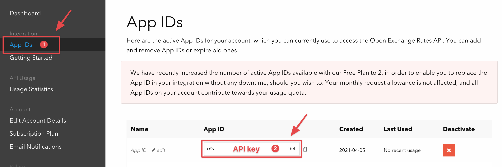
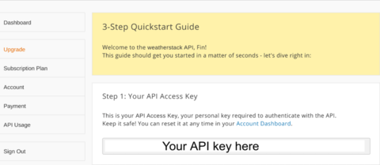

# How to Create and Host an API Using Flask and Code Capsules

## What is an API and Why Care? 

An _API_, or Application Programming Interface, is a tool enabling developers to interact with data online. Imagine: you navigate to a weather website and see your location's temperature displayed on their homepage. How did they present this information?

Without a doubt, they used an API. APIs are hosted on a server and operate as an access point between the user and some data. 

Part of this guide takes a look at the [WeatherStack](https://weatherstack.com/) API - an API providing weather data. For the weather website to retrieve your location's temperature, they would've sent a request to an API like WeatherStack. In the request, they would include information about your computer's location. WeatherStacks API would then return the data related to your locale – the temperature and other weather information. After, the weather website displays this data and you finally see the temperature on their homepage.

Following this tutorial, we'll learn how to create a personal API with Python (using [Flask](https://palletsprojects.com/p/flask/)). We'll use data from the [WeatherStack](https://weatherstack.com/) and [OpenExchangeRates](https://openexchangerates.org/) APIs to create our own. Our API will give us access to USD exchange rates and the temperature of a given city. 

Then we'll host the API on [Code Capsules](https://codecapsules.io/). By hosting it on Code Capsules, anyone will be able to request information from the API, no matter their location. 

## Prerequisites
Before starting, we'll need a [GitHub](www.github.com) account and know how to push code [from a local repository to a remote repository](https://docs.github.com/en/github/importing-your-projects-to-github/adding-an-existing-project-to-github-using-the-command-line). 

Also ensure you've installed the following:

- [Git](https://git-scm.com/downloads)
- [Python](https://www.python.org/downloads/) 3.XX+
- [Virtualenv](https://virtualenv.pypa.io/en/latest/installation.html) 


## Setting Up Our Environment

First, let's set up a virtual Python environment using Virtualenv. Virtualenv provides a clean Python install – no 3rd-party libraries or packages – and ensures we'll be working in a similar environment.  

1. Open your terminal and create an empty folder.
2. Navigate to the folder via your terminal, and enter `virtualenv env`.

To activate the virtual environment enter one of the following:

**Linux/MacOSX**
`source env/bin/activate`

**Windows**
`\env\Scripts\activate.bat`

If the virtual environment has properly activated, you'll see `(env)` to the left of your name in the terminal.


### Installing the Dependencies 

Now that we've activated the virtual environment, let's take a look at the packages we'll use to create our API: 

- [Flask](https://palletsprojects.com/p/flask/) is a minimal web-development framework for Python. Flask provides resources and tools for building and maintaining web applications, websites, and more.
- [Gunicorn](https://gunicorn.org/) is a [WSGI](https://medium.com/analytics-vidhya/what-is-wsgi-web-server-gateway-interface-ed2d290449e) server that will help serve our Python application (the API hosted on Code Capsules). 
- [Requests](https://pypi.org/project/requests/) is a Python library that will help us interact with APIs.

From your terminal where you activated the virtual environment, install these packages with `pip3 install flask gunicorn requests`. 

## Registering Accounts On OpenExchangeRates and WeatherStack

Our API will return the current temperature of a chosen city and the exchange rate between USD and three currencies. We'll create our API by combining data from two other APIs – [WeatherStack](https://weatherstack.com) and [OpenExchangeRates](https://openexchangerates.org/). As their names suggest, WeatherStack will provide the temperature data, and OpenExchangeRates the exchange rate data. 

Registering an account is required so that we can receive a unique _API key_. An API key ensures that a user is allowed to use the API in question. Let's create an account and retrieve API keys for OpenExchangeRates and WeatherStack. 

### Creating An Account with OpenExchangeRates

First, let's register an account on OpenExchangeRates. Navigate to https://openexchangerates.org/signup/free and:

1. Sign up and log in.
2. On the dashboard, click "App IDs". 
3. **Save** your "App ID" (API key) on your computer.
 
	

Obtaining the WeatherStack API key is similar:

1. Create a free account on [WeatherStack](https://weatherstack.com/product)
2. Log in and save the API key presented to you.
	
	

Now we can retrieve data from the  OpenExchangeRates and WeatherStack APIs using our API keys - let's try that out now.

### Testing OpenExchangeRates and WeatherStack

First, let's see how requesting data from OpenExchangeRates works. Create a file named `app.py` and open it.

To request data from an API, the API provider gives its customers a URL that acts as an access point for the API. Take a look at the code below – the `EXCHANGE_URL` variable contains one such URL. 

Enter the following code, replacing "YOUR-API-KEY-HERE" with the **OpenExchangeRates** API key saved earlier.

```python
import requests

EXCHANGE_URL = 'https://openexchangerates.org/api/latest.json?app_id=YOUR-API-KEY-HERE'
exchange_data = requests.get(EXCHANGE_URL)  

print(exchange_data.json())
```

What's happening here? 

- We use the `requests` module to "get" data from the API.
	- The API is accessed through the `EXCHANGE_URL` variable. 


- Near the end of the `EXCHANGE_URL` variable, notice `/api/latest.json`. `latest` signifies an API _endpoint_. 
  - OpenExchangeRates has many endpoints. Each endpoint provides a different set of data. For example, you could request data from the `historical` endpoint (`https://openexchangerates.org/api/historical/`) to access past exchange rates. The `latest` endpoint returns the "latest" exchange rates.


- We print the data using the `.json()` method. The `.json()` method displays the data in [JSON](https://www.json.org/json-en.html) (Javascript Object Notation), which we can work with like a Python dictionary. 


After running the program, you may have noticed a lot of data printed. Let's modify the code to only receive exchange rates from USD to EUR, CAD, and ZAR. 

Replace your code with the below:

```python
import requests

EXCHANGE_URL = 'https://openexchangerates.org/api/latest.json?app_id=YOUR-API-KEY-HERE'
EXCHANGE_PARAMS =  {'symbols':'ZAR,EUR,CAD'}

exchange_data = requests.get(EXCHANGE_URL, EXCHANGE_PARAMS)  

print(exchange_data.json()['rates']) # Print only exchange rates

```

Now we've included an `EXCHANGE_PARAMS` variable. Providing an API _parameter_ determines the data received and parameters vary depending on the API endpoint in use. You can find a list of parameters for the `latest` endpoint [here](https://docs.openexchangerates.org/docs/latest-json). 

In our case, we supplied the parameter `symbols` with the three currencies we want data for.  
 
Now that we've obtained the exchange rates, let's retrieve the temperature for a city. Let's modify the program by adding the following below the `print(exchange_data.json())` line. Make sure to replace 'YOUR-API-KEY-HERE' with the **WeatherStack** API key.

```python
WEATHERSTACK_URL = 'http://api.weatherstack.com/current?access_key=YOUR-API-KEY-HERE'
WEATHERSTACK_PARAMS = {'query':'Cape Town'}

weather = requests.get(WEATHERSTACK_URL,params=WEATHERSTACK_PARAMS) 

print(weather.jsonify()['current']['temperature']) # Print nly the temperature - print without indexing to see all the values returned!

```

Here we retrieve the temperature for Cape Town, South Africa. You can request any cities temperature by replacing "Cape Town" with a city of choice. 

## Creating Our API

Now we'll get to creating the API with Flask. Our API will package the WeatherStacks and OpenExchangeRates data together, and when requested, return it.

This means we won't have to go through the same process as before – instead, with a single line like `requests.get(MY_CODE_CAPSULES_URL)`, we'll be able to fetch the exchange rates and temperature. 

On to creating the API – make sure to open the `app.py` file, then continue.

### Beginning Steps with Flask

First, we can remove all the print statements in our `app.py` file. Afterwards, edit the file accordingly:

```python
import requests
from flask import Flask, jsonify # Import Flask, import jsonify to return JSON info
app = Flask(__name__) 

@app.route('/') # Create main page of web-application
def index():
	return "Welcome to my API!" # Display text on main page

EXCHANGE_URL = 'https://openexchangerates.org/api/latest.json?app_id=YOUR-API-KEY-HERE'
EXCHANGE_PARAMS =  {'symbols':'ZAR,EUR,CAD'}

exchange_data = requests.get(EXCHANGE_URL, EXCHANGE_PARAMS)  

WEATHERSTACK_URL = 'http://api.weatherstack.com/current?access_key=YOUR-API-KEY-HERE'
WEATHERSTACK_PARAMS = {'query':'Cape Town'}

weather = requests.get(WEATHERSTACK_URL,params=WEATHERSTACK_PARAMS) 


if __name__ == '__main__':
	app.run() # Run the application

```

After instantiating a Flask object, we add `@app.route('/')`. The `@` symbol is known as a [Python decorator](https://realpython.com/primer-on-python-decorators/) – their use isn't very important for our application. Just understand that 

```python
@app.route(`/`)
def index():
	return "Welcome to my API!"
```

creates the homepage for your API. After hosting it on Code Capsules, "Welcome to my API!" will greet you upon connecting to the provided URL.

Next, we'll implement the ability to "get" (using `requests.get()`) our data from the API when it's hosted. 

### Combining the APIs

We've already written code to retrieve our data – now we just need to "combine" it and create an endpoint to fetch it. 

Modify the program accordingly:

```python
import requests
from flask import Flask, jsonify # Import Flask, import jsonify to return JSON info
app = Flask(__name__) 

@app.route('/') # Create main page of web-application
def index():
	return "Welcome to my API!" # Display text on main page

@app.route('/get',methods=['GET']) # Add an endpoint to access our API
def get():
	EXCHANGE_URL = 'https://openexchangerates.org/api/latest.json?app_id=YOUR-API-KEY-HERE'
	EXCHANGE_PARAMS =  {'symbols':'ZAR,EUR,CAD'}

	exchange_data = requests.get(EXCHANGE_URL, EXCHANGE_PARAMS)  

	WEATHERSTACK_URL = 'http://api.weatherstack.com/current?access_key=YOUR-API-KEY-HERE'
	WEATHERSTACK_PARAMS = {'query':'Cape Town'}

	weather = requests.get(WEATHERSTACK_URL,params=WEATHERSTACK_PARAMS)

	return jsonify({'usd_rates':exchange_data.json()['rates'],'curr_temp':weather.json()['current']['temperature']})

if __name__ == '__main__':
	app.run()
``` 

`@app.route('/get', methods=['GET'])` adds an endpoint, `/get`, allowing us to retrieve data from the API. When Code Capsules gives us a URL for our API, we'll be able to use this URL plus the endpoint to `requests.get()` data from our API. This is identical to how we've obtained data from OpenExchangeRates and WeatherStacks.
 
Next, the line:
```python
return jsonify({'usd_rates':exchange_data.json()['rates'],'curr_temp':weather.json()['current']['temperature']})
``` 

returns our data in JSON. Here, the exchange rate data is stored under `'usd_rates'` and the temperature data under `curr_temp`. This means if we request our data and store it in a variable like `my_data`, we'll be able to print out the exchange rates by executing `print(my_data['usd_rates'])`, and print the temperature by executing `print(my_data['curr_temp'])`.

The API is complete – only a few steps left before hosting it on Code Capsules.

## Freezing Requirements and Creating the Procfile

Before sending our API to GitHub (so Code Capsules can host it) we need to `requirements.txt` file, and a "Procfile".  

The `requirement.txt` file contains information about the libraries we've used to make our API. To create a `requirements.txt` file, first ensure your terminal is still in the virtual environment. Then, in the same directory as the `app.py` file, enter `pip3 freeze > requirements.txt` in your terminal. Code Capsules will now know what to install on its server to successfully host our API.

Next, create a new file named `Procfile` within the same directory. Open the `Procfile` and enter:

`web: gunicorn app.py:app`

This tells Code Capsules to use the gunicorn web-framework.

## Hosting the API on Code Capsules

The API is ready to host on Code Capsules, follow these steps to get our API online:

1. Create a remote repository on Github.
2. Push the `Procfile`, `requirements.txt`, and `app.py` files to the repository.
3. Link the repository to your Code Capsules account.
4. Create a new Team and Space (as necessary).

With the repository linked to Code Capsules, we just need to store the API on a Capsule:

1. Create a new Capsule.
2. Choose the "Backend" Capsule and continue.
3. Select your product type and GitHub repository, click next. 
4. Leave the "Run Command" blank (our `Procfile` handles this step).
5. Create the Capsule.

Once the Capsule has built, the API is hosted! Let's take a quick look at how to interact with it.

### Viewing and Interacting with Our API

Once the Capsule has built, Code Capsules will provide you with a URL (found in the "Overview tab"). Entering the URL in your browser, you'll be greeted with "Welcome to my API!". To view the API data, add `/get` to the end the URL. 

Depending on your browser (Google Chrome was used below), you'll see something like this:


Of course, you can also interact with the API through code. In a new file, try out the following, replacing the URL with your Code Capsules URL (ensure `/get` is at the end of the URL):

```python
import requests

MY_URL = 'https://my-code-capsules-url.codecapsules.space/get'

api_data = requests.get(MY_URL) 

print(api_data.json())
```

All done!

## Further Reading

We've learned a lot about APIs; how to interact with them, how to use API endpoints, and how to create and host an API with Flask and Code Capsules. If you'd like a more in-depth look at APIs, check out [this article](https://www.smashingmagazine.com/2018/01/understanding-using-rest-api/).

If you're interested in learning more about Flask or want to know what else you can do with it, start with their [tutorial](https://flask.palletsprojects.com/en/1.1.x/tutorial/) or their [documentation](https://flask.palletsprojects.com/en/1.1.x/).
