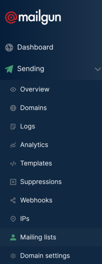
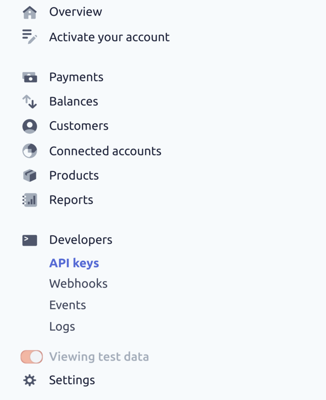
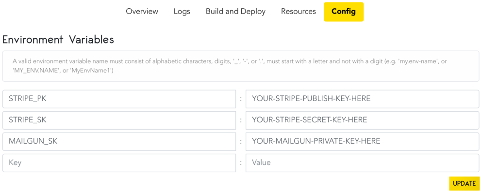

# Adding Functionality to Your Web Application: Setting up Stripe Checkout and Email Subscription with Flask and Code Capsules

## What We'll Cover

Constructing a frontend for your web application is the first step towards providing an interactive user experience. The next step is building a working backend, or making your web application functional. Buttons are nice to have, but it's more interesting to have those buttons do something. That's what we'll focus on today.

Through a step-by-step process, we'll develop this functionality. We'll use [Flask](https://flask.palletsprojects.com/en/1.1.x/) and a frontend template to create a web application that allows users to buy products through [Stripe Checkout](https://stripe.com/payments/checkout) (a tool for creating a "checkout" process for products) and subscribe to an email list with help from the [Mailgun](https://www.mailgun.com/) email API service.

Then, we'll host the web application on Code Capsules so people around the world can buy your product and subscribe to your mailing list.


## Requirements

To successfully complete this project, we'll need:

- A text editor (like [Sublime](https://www.sublimetext.com) or [VSCode](https://code.visualstudio.com/)) installed.
- [Python 3.XX+](https://www.python.org/downloads/) installed.
- [Virtualenv](https://pypi.org/project/virtualenv/) installed.
- [Git](https://git-scm.com/) installed and a [GitHub](https://github.com/) account.
- A [Code Capsules](https://codecapsules.io) account.

## Setting Up the Frontend

We'll use the [Laurel](https://cruip.com/laurel/) frontend template from https://cruip.com to add our functionality. This template is perfect for our project – there is already an email subscription box that just needs to be implemented and, with a few modifications, we'll implement a "Buy Now" button.

After downloading the Laurel template:

1. Create a directory named `project`.

2. Within the `project` directory, create a sub-directory named `templates`.

3. Open the downloaded template and extract the files within the `laurel` directory into the `templates` subdirectory.

You can view the template by opening the `index.html` file in the `templates` subdirectory. We'll change the first "Early access" button to "Buy Now" and implement Stripe Checkout functionality for it.

Then we'll change the second "Early access" button at the bottom of the template to "Subscribe", and implement the email subscription functionality for it.

First, let's change the "Early access" button texts.

### Modifying the "Early access" text

We'll start with changing the first "Early access" button to "Buy Now". Open the `index.html` file in a text editor.

Find this line:

```html
<div class="hero-cta"><a class="button button-shadow" href="#">Learn more</a><a class="button button-primary button-shadow" href="#">Early access</a></div>
```

Replace it with:

```html
<div class="hero-cta">
    <a class="button button-shadow" href="#">Learn more</a>
    <a id="checkout-button" class="button button-primary button-shadow" href="#">Buy Now</a>
</div>
```

As well as changing "Early access" to "Buy Now", we've added [SOMETHING?], and given it an ID with `id="checkout-button"`. This will be useful when implementing Stripe Checkout.

Next, find this line:

```html
<a class="button button-primary button-block button-shadow" href="#">Early access</a>
```

Replace "Early access" with "Subscribe".

View the changes by saving the `index.html` file and re-opening it in a web browser. We have one more task before building our Flask backend.

### Project directory restructuring

To make a functional web application out of our template, Flask requires a specific directory structure, so we will need to reorganise the `project` directory. To do this:

1. Create a new directory named `static` in the `project` directory.

2. Navigate to the `templates` directory and then the `dist` directory.

3. Copy all of the directories located in `dist` into the `static` directory that we created above.

Your `project` file structure should look like this:

```
project
    static
      css
        + style.css
      images
        + iphone-mockup.png
      js
        + main.min.js
    templates
```

This was necessary because Flask **strictly** serves CSS, JavaScript, and images from the `static` directory, and renders HTML files in the `templates` directory. Because we've moved our template's files around, we now need to edit our `index.html` file to point to their new locations.

Flask uses the [Jinja](https://jinja.palletsprojects.com/en/2.11.x/templates/) templating library to allow us to embed backend code in HTML. This code will be executed on the webserver before a given page is served to the user, allowing us to give that page dynamic functionality and make it responsive to user input.

The first thing we will use Jinja templating for is to dynamically locate and load our `index.html` file's stylesheet. Open the `index.html` file in the `templates` folder and find this line:

```html
<link rel="stylesheet" href="dist/css/style.css">
```

Replace the value of `href` with the string below.

```html
<link rel="stylesheet" href="{{url_for('static',filename='css/style.css')}}">
```

In Jinja, anything between `{{` and `}}` is server-side code that will be evaluated before the page is served to users, i.e. when it is [*rendered*](https://flask.palletsprojects.com/en/1.1.x/tutorial/templates/). In this way, we can include the output of Python functions and the values of Python variables in our HTML. Jinja syntax is similar to Python, but not identical.

In the Jinja code above, we're calling the function `url_for()`, which asks Flask to find the location of our `style.css` file in our `static` directory.

Speaking of Flask, we're almost ready to implement our functionality.

## Setting Up the Virtual Environment

We'll create a [virtual environment](https://docs.python.org/3/library/venv.html) for our project. The virtual environment will be useful later on when we host our web application on Code Capsules, as it will ensure that the Python libraries we use for development are installed in the Capsule.

To create a virtual environment, navigate to the `project` directory in a terminal and enter `virtualenv env`.

Activate the virtual environment with:

**Linux/MacOSX**: `source env/bin/activate`

**Windows**: `\env\Scripts\activate.bat`

If the virtual environment has activated correctly, you'll notice `(env)` to the left of your name in the terminal. Keep this terminal open – we'll install the project requirements next.

### Installing the requirements

For our project, we'll use the following libraries:

- [Flask](https://flask.palletsprojects.com/en/1.1.x/) is a lightweight Python web development framework.

- [Gunicorn](https://gunicorn.org/) is the [WSGI server](https://en.wikipedia.org/wiki/Web_Server_Gateway_Interface) we'll use to host our application on Code Capsules.

- [Requests](https://pypi.org/project/requests/) is a Python library that allows us to send [HTTP requests](https://www.w3.org/Protocols/rfc2616/rfc2616-sec5.html).

- [Stripe](https://pypi.org/project/stripe/) is another Python library that will help us interact with the [Stripe API](https://stripe.com/docs/api).

Install these by entering the command below in the virtual environment.

```
pip3 install flask gunicorn requests stripe
```

Now we can build the backend for our web application.

## Creating the Flask Application

In the `projects` folder, create a new file named `app.py`. This file will contain all of our Flask code.

Open the `app.py` file in a text editor and enter the following:

```python
from flask import Flask, render_template, request
import requests, stripe

app = Flask(__name__)

@app.route("/",methods=["GET","POST"])
def index():
  return render_template("index.html")

if __name__== '__main__':
  app.run(debug=True)   
```

We import the following functions from `flask`:

- `Flask`, which provides the Flask application object.
- `render_template()`, which will render our `index.html` file.
- `request`, an object which contains any information sent to our web application – later this will be used to retrieve the email address entered in our subscription box. Be careful not to confuse this with the `requests` library.

The `index` function has a [route decorator](https://flask.palletsprojects.com/en/1.1.x/api/#flask.Flask.route) which causes it to execute when Flask receives an HTTP [`GET`](https://developer.mozilla.org/en-US/docs/Web/HTTP/Methods/GET) or [`POST`](https://developer.mozilla.org/en-US/docs/Web/HTTP/Methods/POST) request for the "/" URL, i.e. when someone navigates to the website's domain or IP address in a browser.

When `render_template("index.html")` runs, Flask will look in the `templates` directory for a file named `index.html` and render it by executing its Jinja template code and serving the resulting HTML. To see this, run `app.py` with `flask run` in your terminal. Open the provided IP address in your browser – the web application should look like this:


Let's make this web application useful and implement the first bit of functionality – the email list feature.

### Signing up for Mailgun

We'll use [Mailgun](https://www.mailgun.com/) to handle our email subscriber list. Mailgun is free up to 5,000 emails per month. [Register with Mailgun](https://signup.mailgun.com/new/signup) and continue.

With an account registered, create a mailing list by doing the following:

1. Log in to Mailgun.

2. Click "Sending" then "Mailing lists" on the dashboard.

    

3. At the top right, click "Create mailing list".

4. Enter whatever you'd like for the address prefix, name, and description – leave everything else default.

5. Click "Add mailing list".

Navigate to the mailing list we just created. You'll see something called an _alias address_ – Mailgun provides every new mailing list with one. When you send an email to your alias address, Mailgun sends a copy of the email to everyone who is subscribed to your mailing list. Jot down your alias address, we'll use it soon.

Next, you'll need to retrieve the [API key](https://cloud.google.com/endpoints/docs/openapi/when-why-api-key) for your Mailgun account. We'll use this API key in our web application to validate your Mailgun account when people subscribe to your mailing list.

Find the API key by clicking on your account at the top right of the screen. Click "API keys", and make a note of your **private** API key.

## Implementing the Subscribe Button

With the mailing list created, we can implement the subscribe button.

Re-open the `index.html` file. At the bottom of the file, find the line:

```html
 <section class="newsletter section">
```

From the above line down to its corresponding `</section>` tag, replace all of the markup with the following:

```html
<section class="newsletter section">
  <div class="container-sm">
    <div class="newsletter-inner section-inner">
      <div class="newsletter-header text-center">
        <h2 class="section-title mt-0">Stay in the know</h2>
        <p class="section-paragraph">Lorem ipsum is common placeholder text used to demonstrate the graphic elements of a document or visual presentation.</p>
      </div>
      <form method="POST">
        <div class="footer-form newsletter-form field field-grouped">
          <div class="control control-expanded">
            <input class="input" type="email" name="email" placeholder="Your best email&hellip;">
          </div>
          <div class="control">
            <button class="button button-primary button-block button-shadow" type="submit">Subscribe</a>
            </div>
          </div>
        </form>
      </div>
    </div>
</section>
```

The important part of this HTML for our functionality is the `form` tag. Let's take a closer look at it.

```html
      <form method="POST">
        <div class="footer-form newsletter-form field field-grouped">
          <div class="control control-expanded">
            <input class="input" type="email" name="email" placeholder="Your best email&hellip;">
          </div>
          <div class="control">
            <button class="button button-primary button-block button-shadow" type="submit">Subscribe</a>
            </div>
          </div>
        </form>
```

This contains one `input`, for the user's email address, and a `button` for submitting that email address. When the user clicks on the button, an HTTP request will be sent from their browser to our Flask backend, containing the email address. As per the `method` attribute of the `form` tag, this will be a [POST request.

Recall that the Python code we entered in the last section provided for both `GET` and `POST` HTTP requests. As submitting this form will also send a request to "/", we can differentiate between a user browsing to our website (`GET`) and subscribing to our mailing list (`POST`) by looking at the HTTP method. We'll do that in the next section.

### Subscribe functionality in Flask

Return to the `app.py`  file. Find this line:

```python
@app.route("/",methods["GET","POST"])
```

Just above it, enter this code:

```python
def subscribe(user_email, email_list, api_key):
  return requests.post(
        "https://api.mailgun.net/v3/lists/"+email_list+"/members",
        auth=('api', api_key),
        data={'subscribed': True,
              'address': user_email,})
```

This function is called when a user clicks the "Subscribe" button. It takes three arguments:

- `user_email`: The email the user has entered.

- `email_list`: Your Mailgun alias address.

- `api_key`: Your Mailgun secret API key.

The real logic is contained in the `return` line. Here, we use `requests.post()` to add the `user_email` to our `email_list`, by sending (or "posting") all of the values in `data` to Mailgun's [email list API](https://documentation.mailgun.com/en/latest/api_reference.html).

Next, modify the current `index()` function like below, replacing `MAILGUN_ALIAS` and `YOUR-MAILGUN-PRIVATE-KEY` with the email alias and private API key we previously retrieved:

```python
@app.route("/",methods["GET","POST"])
def index():
  if request.method == "POST":
    user_email = request.form.get('email')
    response = subscribe(user_email,
      'MAILGUN_ALIAS',
      'YOUR-MAILGUN-PRIVATE-KEY')

  return render_template("index.html")
```

In the [previous section](#implementingthesubscribebutton), we added the `POST` method to the subscribe button. We will therefore know when someone has clicked the subscribe button with the line:

```python
if request.method == "POST":
```

If they've clicked the subscribe button, we obtain the email they entered by referencing the relevant `input` field's `name` attribute in `request.form.get`, and adding the email to the mailing list our `subscribe` method.

Try it out: enter an email address and hit "Subscribe". Navigate back to the "Mailing lists" tab on Mailgun and click on the list we created. You will find the email address you just submitted under "Recipients".

All that's left is to add functionality to our "Buy Now" button.

## Implementing "Buy Now" with Stripe Checkout

Stripe Checkout allows business owners to accept payments on their web applications. Let's [create an account](https://dashboard.stripe.com/register). After creating an account, log in and find your API keys by clicking "Developers" then "API keys" on the dashboard.



Here we'll see two API keys – a *publishable* API key, and a *secret* API key. You can think of these as a username and password. Stripe uses the publishable API key to identify your account, and the secret API key to ensure it's really you using it.

Open the `app.py` file. Above the subscribe function, add the following lines, replacing `YOUR PUBLISHABLE KEY HERE` and `YOUR SECRET KEY HERE` appropriately:

```python
app.config['STRIPE_PUBLISH_KEY'] = 'YOUR PUBLISHABLE KEY HERE'
app.config['STRIPE_SECRET_KEY'] = 'YOUR SECRET KEY HERE'
stripe.api_key = app.config['STRIPE_SECRET_KEY']
```

In third code, we place the two Stripe keys in our Flask app's configuration settings for ease of access, then set our Stripe secret API key.

These are test API keys that we'll use to check out our product. With these keys, no charges will be incurred when making payments. However, before we can make a payment, we need a product, so let's create one. Return to Stripe, log in, and navigate to the "Products" tab on the dashboard.

### Creating a product

Create a product by doing the following:

1. Click "Add product" on the top right.
2. Name the product.
3. Add a description and price.
4. Choose "One time" payment.
5. Click "Save product"

After the last step, save the API key found in the "Pricing" section. We'll use this API key to tell Stripe which product we want our customers to pay for.

### Adding functionality in Flask

Time to create the "Buy Now" button logic. Open `app.py` again and modify the index function accordingly. Replace "YOUR-PRICE-API-KEY" with the API key for your product, that we saved in the previous section.

```python
@app.route("/",methods=["GET","POST"])
def index():
  session = stripe.checkout.Session.create(
    payment_method_types=['card'],
    mode = 'payment',
    success_url = 'https://example.com/success',
    cancel_url = 'https://example.com/cancel',
    line_items=[{'price':'YOUR-PRICE-API-KEY',
          'quantity':1,
    }]
    )

  if request.method == "POST":
    user_email = request.form.get('email')

    response = subscribe(user_email,
      'MAILGUN_ALIAS',
      'YOUR-MAILGUN-PRIVATE-KEY')

  return render_template("index.html",
    checkout_id=session['id'],
    checkout_pk=app.config['STRIPE_PK'],
    )
```

We use the `stripe` library to create a new "Session" object. This object contains multiple variables affecting how our customers interact with the "Buy Now" button. For more information on these variables, see Stripe's [documentation](https://stripe.com/docs/api/checkout/sessions/object).

We also return two new variables – `checkout_id` and `checkout_pk`. `checkout_id`, which we get from Stripe, stores information about the potential purchase (price, payment type, etc). `checkout_pk` stores our private API key, which we added to the Flask app's configuration settings above. When a customer buys our product, their money is sent to the account associated with this private API key.

Let's see how our HTML will use these new variables and redirect us to the Stripe Checkout page.

### "Buy Now" button functionality in the HTML file

With our Flask logic finished, we can implement the "Buy Now" button functionality in our `index.html` file. Open the `index.html` and find this section:

```html
<div class="hero-copy">
  <h1 class="hero-title mt-0">Landing template for startups</h1>
  <p class="hero-paragraph">Our landing page template works on all devices, so you only have to set it up once, and get beautiful results forever.</p>
  <div class="hero-cta"><a class="button button-shadow" href="#">Learn more</a><a id='checkout-button' class="button button-primary button-shadow" href="#">Buy Now</a></div>
</div>

```

Directly below the `</div>` line, add:

```html

<script src="https://js.stripe.com/v3/"></script>
<script>
  const checkout_pk= '{{checkout_pk}}';
  const checkout_id = '{{checkout_id}}';
  var stripe = Stripe(checkout_pk)
  const button = document.querySelector('#checkout-button')

  button.addEventListener('click', event =>{
    stripe.redirectToCheckout({
        sessionId: checkout_id
      }).then(function(result){

        });
    })
</script>
```

This code adds a JavaScript event which will trigger when the customer clicks the "Buy Now" button, and will redirect them to the Stripe Checkout page. The Stripe Checkout page changes according to the information stored in `checkout_id`.

Also, take a look at the Jinja code in these lines:

```javascript
const checkout_pk= '{{checkout_pk}}';
const checkout_id = '{{checkout_id}}';
```

When the `index.html` template is rendered before being served to the user, Flask will substitute in the current values of the Python variables that we passed to `render_template()`. While `checkout_pk` will remain the same throughout, `checkout_id` will be unique for each purchase.

The "Buy Now" button is good to go – run `app.py` again. Try making a payment using the [test credit card number](https://stripe.com/docs/testing) `4242 4242 4242 4242` with any name, expiration date, and security code. No charges will be incurred.

## Hosting the Application on Code Capsules

Now that we've added all the functionality, we need to create some files that Code Capsules will use when hosting our application. We'll also take a look at a security problem  in our current application, and how to fix it before we go live.

### Creating the "requirements.txt" file and procfile

To host this application on Code Capsules, we need to create a `requirements.txt` file and a `Procfile`.

1. In the `project` directory, ensure the virtual environment is activated and then enter `pip3 freeze > requirements.txt`.

2. Create another file named `Procfile`, containing the line `web: gunicorn app:app`.

With the `requirements.txt` file, Code Capsules will now know what libraries to install to run the application. The `Procfile` tells Code Capsules to use the `gunicorn` WSGI server to serve HTML rendered by Flask to end-users.

Now we can fix that security problem mentioned before, and host the application.

### Removing secret keys

We need to send our application to GitHub so Code Capsules can host it. But currently this project's code contains all of our API keys. It is considered **very** poor practice to send personal API keys to GitHub, especially public repositories. Anyone could find them and incur charges on your debit card. Luckily, there is a workaround.

By working with [environment variables](https://opensource.com/article/19/8/what-are-environment-variables), we can use our API keys on Code Capsules without exposing them on GitHub. We will alter our application to retrieve our API keys from environment variables, which we will set on Code Capsules.

To do this, change the code at the top of `app.py` as follows:

```python
from flask import Flask, render_template, request
import requests, stripe, os


app = Flask(__name__)
app.config['STRIPE_PK'] = os.getenv("STRIPE_PK")
app.config['STRIPE_SK'] = os.getenv("STRIPE_SK")
stripe.api_key = app.config['STRIPE_SK']
```

Notice that we've imported a new Python module, [os](https://docs.python.org/3/library/os.html), which allows us to retrieve with environment variables using the `os.getenv()` method.

We've now done this with our Stripe publishable and secret API keys and our Mailgun secret key. On Code Capsules, we'll set environment variables named `'STRIPE_PK'`, `'STRIPE_SK'`, and `'MAILGUN_SK'`. This way, our API keys do not have to be stored on GitHub and will remain secret. Notice, we aren't adding environment variables for the Stripe product API key. This doesn't contain any sensitive information. It just displays a product's price.

Your final `app.py` code should look like this:

```python
from flask import Flask, render_template, request
import requests, stripe, os

app = Flask(__name__)
app.config['STRIPE_PK'] = os.getenv("STRIPE_PK")
app.config['STRIPE_SK'] = os.getenv("STRIPE_SK")
stripe.api_key = app.config['STRIPE_SK']


def subscribe(user_email, email_list, api_key):
  return requests.post(
        "https://api.mailgun.net/v3/lists/"+email_list+"/members",
        auth=('api', api_key),
        data={'subscribed': True,
              'address': user_email,})

@app.route("/",methods=["GET","POST"])
def index():

  session = stripe.checkout.Session.create(
    payment_method_types=['card'],
    mode = 'payment',
    success_url = 'https://example.com/success',
    cancel_url = 'https://example.com/cancel',
    line_items=[{'price':'YOUR-PRICE-API-KEY',
          'quantity':1,
    }]
    )

  if request.method == "POST":
    user_email = request.form.get('email')

    response = subscribe(user_email,
      'MAILGUN_ALIAS',
      os.getenv("MAILGUN_SK"))

  return render_template("index.html",
    checkout_id=session['id'],
    checkout_pk=app.config['STRIPE_PK'],
    )

if __name__== '__main__':
  app.run(debug=True)   
```

We can now safely host our application.

### Pushing to GitHub and hosting the application on Code Capsules

Before we create the Capsule that will host our code, take the following steps:

1. Create a GitHub repository for the application.
2. Send all code within the `project` directory to the repository on GitHub.
3. Log in to [Code Capsules](https://codecapsules.io).
4. Grant Code Capsules access to the repository.
5. Create a Team and Space as necessary.

Now let's create the Capsule:

1. Click "Create A New Capsule".
2. Select your repository.
3. Choose the Backend Capsule type.
4. Create the Capsule.

All that's left is to set the environment variables. Navigate to the Capsule and click on the "Config" tab. Use the image below as a guide to properly add your environment variables. Replace each value with the appropriate API key.



After entering the API keys, __make sure to click "Update"__.

All done – now anyone can view the web application and interact with the "Buy Now" and "Subscribe" buttons.

## Further Reading

We covered a lot in this tutorial: how to use Flask to implement functionality for frontend code, how to set up an email subscriber list, and how to work with Stripe.

Earlier I mentioned more information on the `url_for()` function. Check out [Flask's documentation](https://flask.palletsprojects.com/en/1.1.x/api/#flask.url_for) for more information.

For further information on how Jinja templates work and what can be done with them, check out this link to learn more about [Flask templating and Jinja2](https://realpython.com/primer-on-jinja-templating/).

Now that you have a functional email subscriber list, you may be interested in [sending emails to your list](https://documentation.mailgun.com/en/latest/user_manual.html?highlight=template%20variables#sending-messages).
