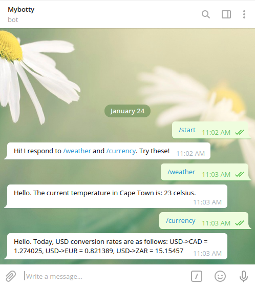
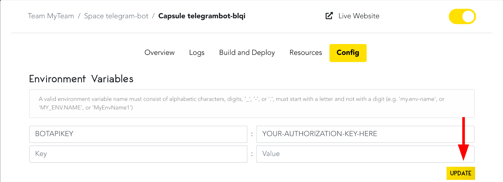

# How to Create and Host a Telegram Bot on Code Capsules

## Introduction

Creating a bot on Telegram is an excellent way to get started learning how to create bots. We'll be taking a close look at the [Telegram Not API](https://core.telegram.org/bots/api) to learn how to implement the weather and currency exchange API we [created in this guide](link-to-article-here.io). By implementing this API, your bot will tell you the temperature and various currency exchange rates.

We'll also learn how to host this bot using [Code Capsules](www.codecapsules.io), so anyone at any time can text your bot and retrieve the same information. Along the way, we'll learn some key concepts about hosting bots on a server (via Code Capsules) to keep your bot secure and efficient. 

Let's get started!

## Requirements

To create a Telegram bot, we'll need:

- [Python](https://www.python.org/) 3.6+ installed.
- A [GitHub account](https://github.com/) and [Git](https://git-scm.com/) installed.
- [Virtualenv](https://pypi.org/project/virtualenv/) installed.
- A [Telegram](https://telegram.org/) account.
- A [Code Capsules](https://codecapsules.io/) account.
- To have created and hosted an API following [this](linktoapitutorialhere.ioo) tutorial.

## About Telegram Bots

Telegram bots act as Telegram accounts - no extra phone number necessary. Users interact with Telegram bots by sending commands to them. Commands sent to the bot's account on Telegram pass to wherever the bot's programming is stored (in our case, on Code Capsules).

The command determines what will return - for example, when we send "/weather" to our bot later in this article, the message returned to us will be the current weather for Cape Town, South Africa.

Let's create a Telegram bot.

### Registering a bot account and talking to the BotFather

To create a Telegram bot we must download [Telegram]. Both desktop and phone versions of Telegram will work. Registering a bot with Telegram is an interactive process - first, we need to talk to the BotFather.

1. Log in to Telegram.
2. Search for the account "BotFather".
3. Start a chat with the BotFather.

As the name suggests, the BotFather is a bot. The Botfather helps developers register other Telegram bots. Follow these steps to create a bot with the BotFather:

1. Press "start".
2. Type `/newbot`.
3. Choose a name for your bot.
4. Choose a username for your bot (must end in "bot")

After choosing a username, the BotFather will reply with some very **important** information. For every new bot, the BotFather generates an __authorization token__ - a string authorizing the bot and allowing it to send requests to the Telegram bot API. Make sure to save this token somewhere.

To see if the bot was successfully created, search for the bot's username. You should see the bot and be able to start a conversation with it. Right now, we can only `/start` a conversation with our bot - without any programming, there won't be much to say, and the bot won't reply.

We should give the bot some functionality.

## Developing the bot functionality

We're going to implement two commands for our bot.

- When we send the command `/weather` to our bot account on Telegram, we want to receive the current temperature in Cape Town, South Africa.

- Sending the command `/currency` will return the exchange rate from USD to CAD, EUR, and ZAR.

Let's get started.

### Creating the virtual environment and installing python-telegram-bot

First, we need to create a directory. Do so, then create a file named `bot.py`. In the same directory, open a terminal and create a [virtual environment](https://docs.python.org/3/tutorial/venv.html) by entering `virtualenv env`.

Enter the virtual environment using the appropriate command:

**Linux/MacOSX**

`source env/bin/activate`

**Windows**

`env\Scripts\activate.bat`

The virtual environment will help manage our dependencies for when we host the bot on Code Capsules.

To interact with the Telegram bot API, we need to download the [python-telegram-bot](https://github.com/python-telegram-bot/python-telegram-bot) library, a wrapper for the [Telegram bot API](https://core.telegram.org/bots/api). Download it by entering `pip install python-telegram-bot` in the terminal.

Next, open `bot.py` in a text editor. `bot.py` will contain all of the logic for our Telegram bot.

### Retrieving data from API

When we message our bot `/currency` or `/weather`, we want the bot to return the currency and weather data from the API created in [this article](linktoartice.io).

Retrieve the API data by copying and pasting the following, replacing `YOUR-URL-HERE` with the URL pointing to the API hosted on Code Capsules.

```python
import requests

url = 'YOUR-URL-HERE/GET'
data = requests.get(url) # requests data from API
data = data.json() # converts return data to json

# Retrieve values from API
curr_temp = data['curr_temp']
cad_rate = data['usd_rates']['CAD']
eur_rate = data['usd_rates']['EUR']
zar_rate = data['usd_rates']['ZAR']


def return_weather():
	print('Hello. The current temperature in Cape Town is: '+str(curr_temp)+" celsius.")


def return_rates():
	print("Hello. Today, USD conversion rates are as follows: USD->CAD = "+str(cad_rate)+
		", USD->EUR = "+str(eur_rate)+", USD->ZAR = "+str(zar_rate))


return_weather()

return_rates()
```
Here we request the currency and weather data from the API and parse the temperature and conversion rates. Then we print out the data using `return_weather()` and `return_rates()`

Try this program out, then continue.

### Creating the bot

At the top of the `bot.py` file, add the line:
```python
from telegram.ext import Updater, CommandHandler
```
From the `python-telegram-bot` library, we import two classes: `Updater` and `CommandHandler`. We'll talk about these classes soon.

We don't need to print our data anymore - we'll instead return a string to our bot, so the bot can display it on Telegram. Replace `def return_weather()` and `def return_rates()` with:

```python
def return_weather():
	return'Hello. The current temperature in Cape Town is: '+str(curr_temp)+" celsius."


def return_rates():
	return "Hello. Today, USD conversion rates are as follows: USD->CAD = "+str(cad_rate)+ ", USD->EUR = "+str(eur_rate)+", USD->ZAR = "+str(zar_rate)
```

Now, replace the `return_weather()` and `return_rates()` function calls with:

```python

def weather(update, context):
    context.bot.send_message(chat_id=update.effective_chat.id, text=return_weather())

def currency(update, context):
	context.bot.send_message(chat_id=update.effective_chat.id, text=return_rates())

def start(update, context):
	context.bot.send_message(chat_id=update.effective_chat.id, text='Hi! I respond to /weather and /currency. Try these!')

def main():
	updater = Updater(token='YOUR-BOT-TOKEN-HERE', use_context=True)
	dispatcher = updater.dispatcher

	weather_handler = CommandHandler('weather', weather)
	currency_handler = CommandHandler('currency',currency)
	start_handler = CommandHandler('start',start)

	dispatcher.add_handler(weather_handler)
	dispatcher.add_handler(currency_handler)
	dispatcher.add_handler(start_handler)

	updater.start_polling()

if __name__ == '__main__':
	main()

```

What's happening here? Let's break it down, starting from the beginning of `def main()`:


- We instantiate an `Updater()` class and assign it to the variable `updater`.
	- The [Updater](https://python-telegram-bot.readthedocs.io/en/latest/telegram.ext.updater.html#telegram.ext.updater.Updater) class retrieves updates (such as commands sent to our bot) from Telegram and passes them to the [Dispatcher](https://python-telegram-bot.readthedocs.io/en/latest/telegram.ext.dispatcher.html#telegram.ext.Dispatcher) class.

	-Upon `Updater` instantiation, a `Dispatcher` is created automatically for us. We access this `Dispatcher` class with the line
	`dispatcher = updater.dispatcher`.


- Next, we create three different `CommandHandler` classes.
	- As the name suggests, a `CommandHandler` handles Telegram commands.
	
	- For example, the line `weather_handler = CommandHandler(...)` allows us to message our bot `/weather`. When `/weather` is sent, the `weather()` function calls.


- Looking above `def main()` We see `def weather(...)`, `def currency(....)` and `def start(...)`. These functions provide the logic for our bot commands. Note: we define a function named `start()`. This function defines what happens when we `/start` a conversation with our bot.


- Taking a closer look at the `def weather()` function definition:

	- This function calls the `python-telegram-bot` function `send_message()`. 
	
	- The `text=return_weather()` parameter means that the bot will display thetext returned by calling the `return_weather()` function. 


- Looking back to the `main()` function, we add the `weather_handler`, `currency_handler` and `start_handler` to our `dispatcher`. 

	- When our Telegram bot receives a command, the dispatcher will activate and handle any commands sent to it.


- Finally, `updater.start_polling()` begins _polling_ updates from Telegram  -  our application will "poll" our Telegram bot for any commands sent to it.
	- In the [next](#polling-vs.-webhook) section we'll talk about the pitfalls with polling and look at an alternative.


The code `bot.py` file should now look like this - once again, make sure to replace `YOUR-URL-HERE` with the URL of the API we created in the [API tutorial](link-to-API-tutorial-here)


```python
from telegram.ext import Updater, CommandHandler
import requests


url = 'YOUR-URL-HERE/GET'
data = requests.get(url) # requests data from API
data = data.json() # converts return data to json

# Retrieve values from API
curr_temp = data['curr_temp']
cad_rate = data['usd_rates']['CAD']
eur_rate = data['usd_rates']['EUR']
zar_rate = data['usd_rates']['ZAR']


def return_weather():
	return'Hello. The current temperature in Cape Town is: '+str(curr_temp)+" celsius."

def return_rates():
	return "Hello. Today, USD conversion rates are as follows: USD->CAD = "+str(cad_rate)+ ", USD->EUR = "+str(eur_rate)+", USD->ZAR = "+str(zar_rate)

def weather(update, context):
    context.bot.send_message(chat_id=update.effective_chat.id, text=return_weather())

def currency(update, context):
	context.bot.send_message(chat_id=update.effective_chat.id, text=return_rates())

def start(update, context):
	context.bot.send_message(chat_id=update.effective_chat.id, text='Hi! I respond to /weather and /currency. Try these!')

def main():
	updater = Updater(token='YOUR-BOT-TOKEN-HERE', use_context=True)
	dispatcher = updater.dispatcher

	weather_handler = CommandHandler('weather', weather)
	currency_handler = CommandHandler('currency',currency)
	start_handler = CommandHandler('start',start)

	dispatcher.add_handler(weather_handler)
	dispatcher.add_handler(currency_handler)
	dispatcher.add_handler(start_handler)

	updater.start_polling()

if __name__ == '__main__':
	main()
```

While running this program, we can send messages to our bot. We'll **not** be able to send messages to our bot while this program isn't running - that's where hosting it on Code Capsules will come in. When we've hosted it on Code Capsules, we can message our bot from any computer or phone.

Try running this program and talk to your bot. Below is a "conversation" with a bot created using this program.



We've created a bot and are almost ready to deploy it to Code Capsules - there is, however, a downside to our current implementation. Let's take a look at it.

### Polling v. Webhook

There are two ways for our `bot.py` file to sense updates (commands sent to our bot). 

Currently the `bot.py` file "polls" Telegram continually, requesting info from the Telegram API regardless of whether a command was sent to the bot. If we hosted this current version on Code Capsules, we would be wasting bandwidth - more often than not, the poll will return no new updates.

Instead of polling Telegram for changes, we can create a __Webhook__. Webhooks send data when an action occurs -  instead of our application regularly requesting updates from our bot (regardless of if there are any updates), it'll only send information **if** the bot on Telegram received a command.

When we host our bot on Code Capsules, we'll receive a URL for our server. We'll set up a webhook by telling Telegram to send us any commands sent to our bot account to that URL. Let's set up a webhook for our bot.

### Creating a webhook

Replace `def main()` with

```python
def main():
	TOKEN = 'YOUR-BOT-TOKEN-HERE'
	PORT = int(os.environ.get('PORT','8443'))

	updater = Updater(TOKEN, use_context=True)
	dispatcher = updater.dispatcher

	weather_handler = CommandHandler('weather', weather)
	currency_handler = CommandHandler('currency',currency)
	start_handler = CommandHandler('start',start)

	dispatcher.add_handler(weather_handler)
	dispatcher.add_handler(currency_handler)
	dispatcher.add_handler(start_handler)


	updater.start_webhook(listen='0.0.0.0', port=PORT, url_path = TOKEN)
	updater.bot.setWebhook('YOUR-CODECAPSULES-URL HERE'+TOKEN)
	updater.idle()

```

We've only changed a couple of things. Starting from the top, moving down:

- `TOKEN`: A new variable created containing your bots authorization token.
- `PORT`: The port on our Code Capsules server from which our bot will receive information from Telegram.
- `updater.start_webhook()`: Find the documentation [here](https://python-telegram-bot.readthedocs.io/en/stable/telegram.ext.updater.html)
- `updater.bot.setWebhook('YOUR-CODECAPSULES-URL-HERE'+TOKEN)`: Find the documentation [https://python-telegram-bot.readthedocs.io/en/stable/telegram.bot.html] - we'll replace 'YOUR-CODECAPSULES_URL-HERE' when we create a Capsule to host our bot on.
- `update.idle()`: Find the docuentation [here](https://python-telegram-bot.readthedocs.io/en/stable/telegram.ext.updater.html)

Because we'll push our code to GitHub, we need to hide our bots authentication key. If we don't, anyone could use our authentication key and take control of our bot.

Replace

```python
TOKEN = 'YOUR-BOT-TOKEN-HERE'
```
with
```python
TOKEN = os.getenv('BOTAPIKEY')
```

When we host our bot on Code Capsules, we'll create an [environment variable] named "BOTAPIKEY" - this environment variable will contain the bots authentication key. `os.getenv('BOTAPIKEY')` will look for an environment variable of the name "BOTAPIKEY"

## Hosting the bot on Code Capsules

The bot is almost finished - follow these steps to host it on Code Capsules.

1. Navigate to the directory containing the `bot.py` file and enter the virtual environment.
2. Create a file named `Procfile` (this will tell what Code Capsules to do with the `bot.py` file)
3. Open it, and enter `web: python3 app.py`. Save the file.
4. Enter `pip3 freeze > requirements.txt` to generate a list of requirements for our Code Capsules server.
5. Create a GitHub repository and send the `requirements.txt`, `Procfile`, and `bot.py` files to the repository.

Now we can create the Capsule to host our bot on:

1. Log in to Code Capsules, and create a Team and Space as necessary.
2. Link Code Capsules to the GitHub repository created in step 5.
3. Enter your Code Capsules Space.
4. Create a new Capsule, selecting the "Backend" capsule type.
5. Select the GitHub repository containing the bot - leave "Repo Subpath" empty and press "Next"
6. Leave the "Run Command" blank and press "Create Capsule"

We're nearly done - one final step.

### Creating an environment variable and supplying our domain

Remember: We haven't supplied our webhook with a domain yet, and we still need to create an environment variable for our bots authorization token. To create an environment variable:

1. Navigate to your Capsule.
2. Click the "Config" tab.
3. Add an environment variable named "BOTAPIKEY" with the value being the bots authorization key - make sure to hit **update** after adding the variable.

	

Next, let's supply our webhook with the correct domain.

1. Navigate to the "Overview" tab and copy the domain found under "Domains".
2. Open the `bot.py` file and find the line `updater.bot.setWebhook('YOUR-CODECAPSULES-URL HERE'+TOKEN)`
3. Replace "YOUR-CODECAPSULES_URL" with the domain just copied.
4. Commit and push these changes to GitHub.

After pushing these changes, the Capsule will re-build. Once the Capsule builds, the bot ready. Give it a try, send a message to the bot. 

## Conclusions and further reading

We've covered a lot - from creating a Telegram bot - to learning about the difference between webhooks and polling.

If you're interested in learning more about what you can do with Telegram bots, check out [this link](https://core.telegram.org/bots). If you have some ideas but require a deeper understanding of the `python-telegram-bot` library, browse their [GitHub repository](https://github.com/python-telegram-bot/python-telegram-bot).

We covered webhooks quickly, you can find a more thorough explanation of webhooks [here](https://www.chargebee.com/blog/what-are-webhooks-explained/).