# Chatting with your code, using a Slackbot with Node.js

Slack is a really useful communication tool when working in teams. Many developers find themselves using it almost constantly when working on projects. 

One of the stand out features is the rich API Slack exposes, to allow developers to integrate with it. 

In this tutorial, we'll use the Slack API to give our apps a voice. We'll be able to talk to our apps running on Code Capsules, to ask their status and see if they are up and running. They will also be able to alert us when they are booted up, so we know if they have been successfully deployed or restarted. 

## Overview and Requirements

As we're building a Slackbot, you'll need to sign up for an account at Slack, if you haven't already got one. It's probably best to use a Slack workspace that you can safely send many test messages to while we are creating this bot, without disturbing people working. 

We'll also need the following: 

- Git setup and installed, and a registered GitHub account.
- Node.js installed
- A registered Code Capsules account.
- An IDE or text editor to create the project in. This tutorial was made using Visual Studio Code, but feel free to use any tool you like. 

## Setting Up the Project

### Create a new Repo on Github
We need a place to store our code from which Code Capsules can deploy to a capsule. 

Head over to Github, and create a new repo. We're calling it _slackbot_ here, but you can call it whatever you'd fancy.

Note: You can also use an existing backend project, perhaps one of the tutorials you built earlier, to add this code to, if you'd like to monitor that. 

### Getting the Base Project Initialised

Now we can get some base code setup. Let's start by cloning the new GitHub repo onto our local computer.

Now, go into the directory of the repo you've just cloned. 

We can init a new node project by typing the following at the command line / terminal:

```bash
npm init
```

We can just press _enter_ for each of questions it asks - the defaults are good to start with. 

### Installing Packages

Now that we have our project initialised, we can add the packages we will need for our bot. These are:

- [Express](http://expressjs.com). This acts as our web server and http request router. We'll use this to route requests from Slack to the correct logic. 
- [body-parser](https://www.npmjs.com/package/body-parser). This interprets and parses payload data from http requests. We'll need this to parse the url-encoded data Slack sends with a request to us. 
- [superagent](https://www.npmjs.com/package/superagent). This package allows us to make outgoing http requests. We'll need this to send a message to Slack. 

Let's type in the following at the command line / terminal to install the packages:

```bash
npm install express body-parser superagent 
```

Now lets create an `index.js` file, which will be the main file for our app. An easy way to do this is to open up your project folder in an editor, like [Visual Studio Code](visual-studio). Now you can create a new `index.js` file. 

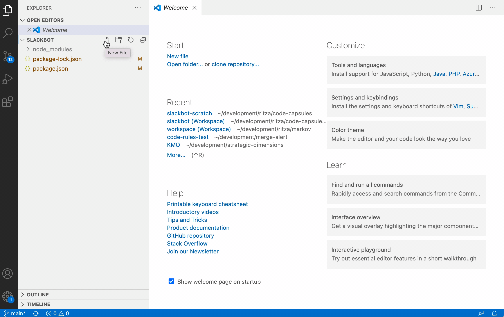

Save this blank file. 

Great, it's time to push this boilerplate project up to git. We can do it with the following from the command prompt or terminal: 

```bash
git add . 
git commit -am 'added base files for project'
git push origin
```

### Create a new Code Capsule 

We'll need a place to host our app. 

1. Log in to Code Capsules, and create a Team and Space as necessary.
2. Link Code Capsules to the GitHub repository created above. You can do this by clicking your user name at the top right, and choosing _Edit Profile_. Now you can click the _Github_ button to link to a repo. 
3. Create a new Capsule, selecting the "Backend" capsule type.
4. Select the GitHub repository you create above. If you are only using the repo for this project, you can leave the _Repo Subpath_ field empty. You may need to add your repo to the team repo if you haven't already. Click the _Modify Team Repos_ to do so. 
5. Click _Next_, then on the following page, click _Create Capsule_. 

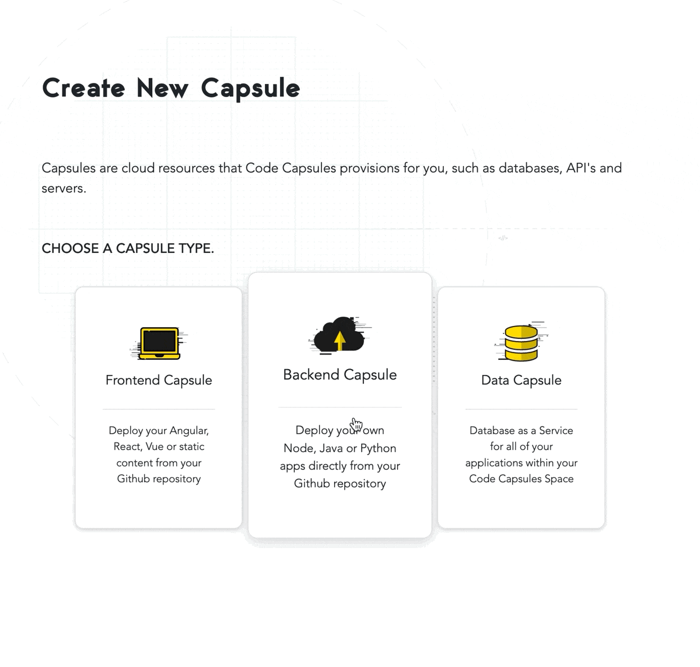

### Registering an App on Slack

After you've created a workspace on Slack, or logged into an existing one, head over to [https://api.slack.com](https://api.slack.com) and click on _Create a custom app_. 

In the screen that comes up, we can give our app a name, and choose which workspace we want to add it to. You can choose any name you wish - we've used _Serverbot_ here. Now we can click _Create App_. 

Great! We've created our app. Now we can configure it. 

For this tutorial, we would like the following two functions:

1. Our Code Capsules app should automatically send us a notification whenever it starts up. This allows us to easily know when a new deploy is successful. It can also alert us to any potential crashes and restarts. 
2. We want to query our Code Capsules app from Slack at any time to see how it's doing. 

Our first requirement can be configured on the Slack side by clicking _OAauth & Permissions_ on the left panel. Scroll down to the _Scopes_ section, and click _Add an OAuth Scope_ under the _Bot Token Scopes_ section, and choose _Chat:Write_ from the options list. This now allows our bot to initiate and post messages to us when it starts up. 

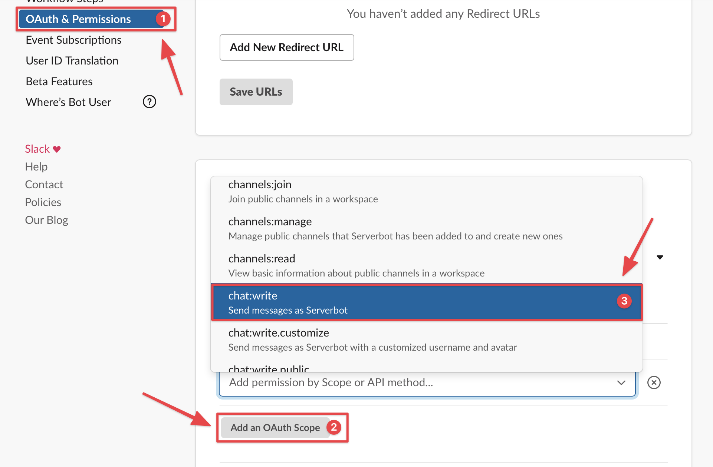

Our second requirement can be configured by setting up a _slash command_. Click on the _Slash Commands_ menu item on the left, under _Features_. 

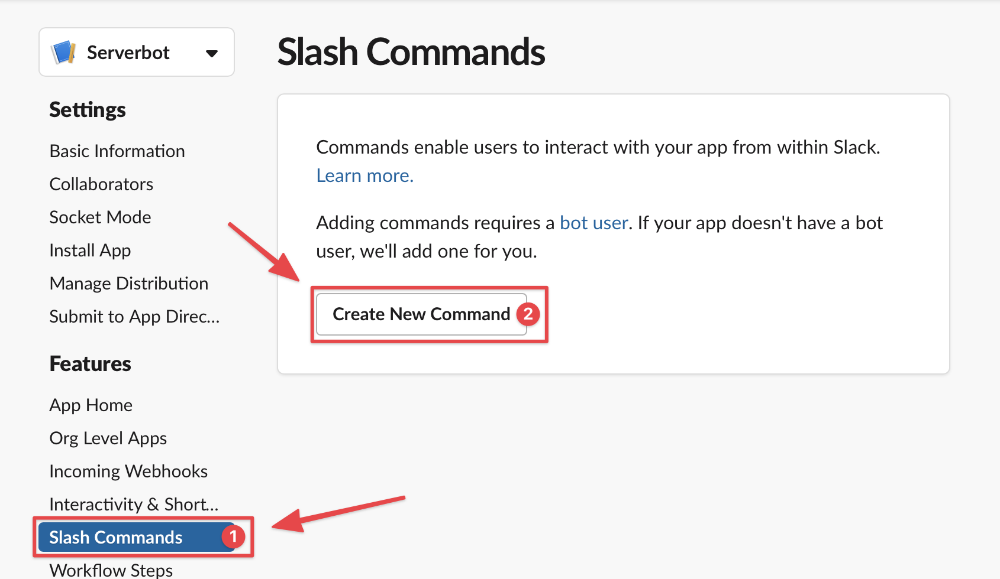

Then click _Create a new Command_. We'll give the command the name _/stats_. For the _Request URL_, copy the _Domain_ name from your Code Capsules Overview page. 

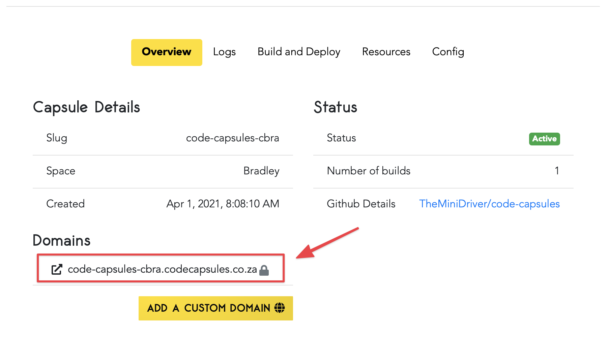

Paste your domain into the _Request URL_ box on Slack, and add `/slack/command/stats` to the end of it. We can fill in a description as well, something like 'Returns key stats from the app' 

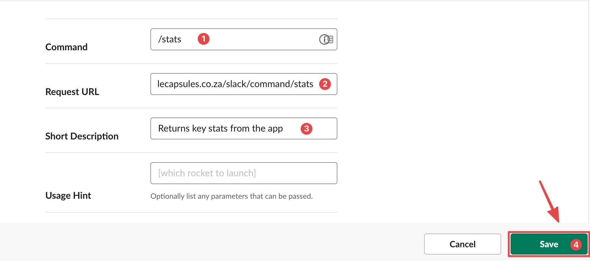

Great, now we can click _Save_ at the bottom of the page to finish setting up our slash command. 


## Writing the Slackbot code

Now that we have all our systems setup, we can get onto the coding part. 

### Adding the Base Code

Let's add the boiler-plate code to startup a new Express server. Open up the `index.js` file and add the following:  

```javascript
const express = require('express'); 

const app = express();

let port = process.env.PORT || 3000
app.listen(port, ()=>{
  console.log(`App listening on port ${port}`);
});
```

### Sending a Startup Message to Slack

Ok, cool, we've got the base code to create an Express app, and start it up to begin listening for requests. Now we can add some code to send a message to Slack when it boots up, not just locally to the console. If we look at the [docs on Slack](https://api.slack.com/messaging/sending), we see that we can POST to the endpoint https://slack.com/api/chat.postMessage to send a message. In their example, they specify that we need :
1. An access token
1. The channel ID of the channel to post the message to
1. The message we want to post as the requirements. 

To get the access token, head over to your app dashboard on Slack, and click on the _OAuth & Permissions_ menu item on the left hand side. Then click the _Install to Workspace_ button, and then the _Allow_ button. After this, you should should see a newly generated _Bot User OAuth Token_. Copy this token - this is our access token. 

We could just put this token in our code. However, this is not really considered best practice for sensitive secrets and credentials. Rather than do that, we can add this secret as an **Environment Variable**, and access it from the Node.js [process object, on the `.env` property](https://nodejs.org/api/process.html#process_process_env)

To add the access token to the environment in Code Capsules, head over to the capsule we created earlier, and click on the _Config_ tab. Now we can fill in our environment variable for the access token. Add a new environment variable with name `SLACK_BOT_TOKEN` and set the value to the token copied from Slack. 


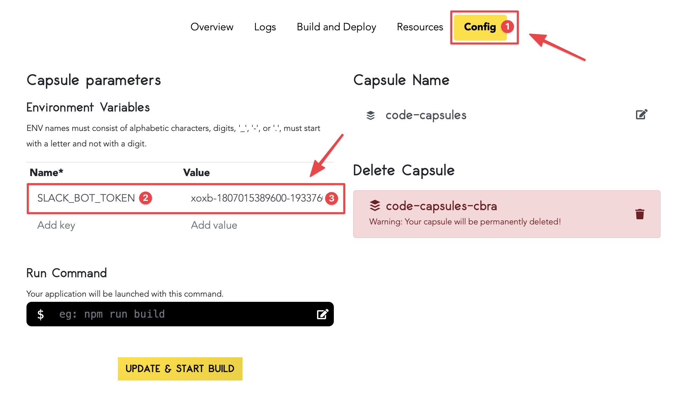

Now that we've added our access token, we need to find the ID of the channel we want to post to. Find a channel on your Slack workspace that you want to send to, or create a new channel. Now we can get the channel ID by right-clicking on the channel name to bring up a context menu. Now, we can choose _Copy Link_ from that menu: 

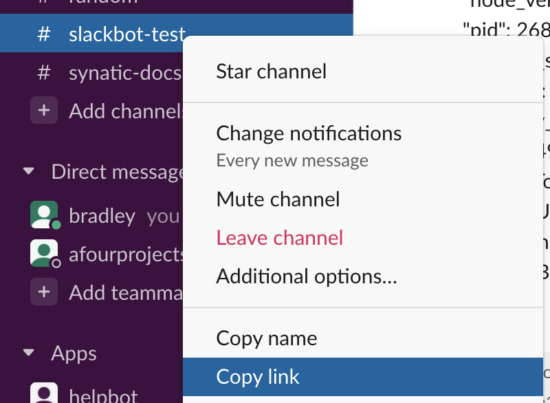


If we paste that link, we get something like `https://<workspace-name>.slack.com/archives/C01SZ6Z3TCY`. The last part of that URL is the channel ID - so in this example case, `C01SZ6Z3TCY`

Let's add this to our environment variables as well, as it keeps all the configuration in one place. Head back over to your Capsule, and add in a environment variable with name `SLACK_CHANNEL_ID` and set the value to the channel ID we extracted above. 

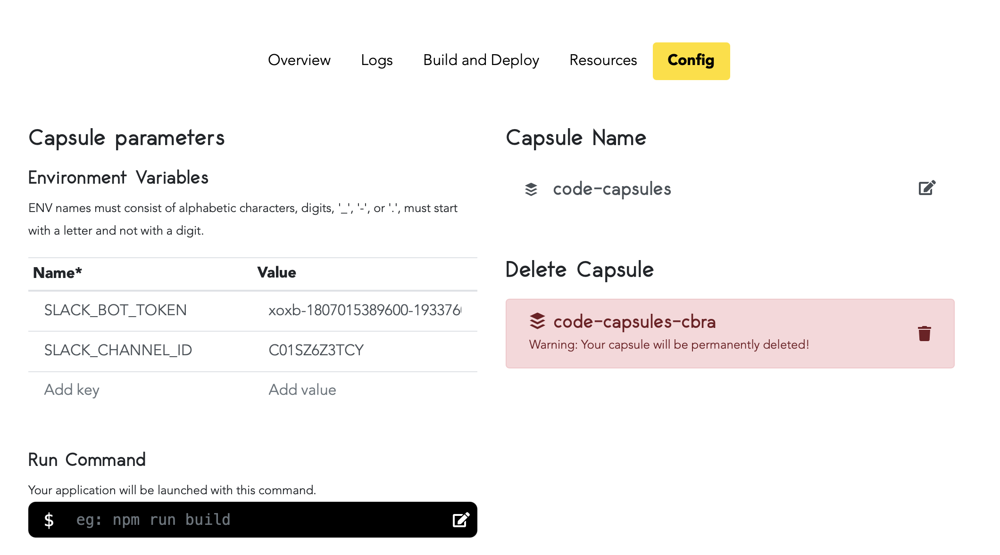

We also need to invite our bot to the chosen channel, so that it will be able to post there. Go to the channel, and @ mention the name you gave the bot to add it. Click _Invite Them_ when Slack prompts you. 

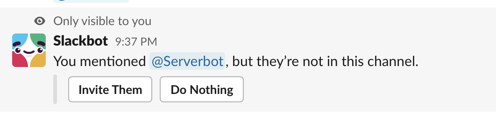

Now let's add the code to call Slack on startup, and write a message to our channel. We can modify our boiler plate code above to make the HTTP POST to the endpoint https://slack.com/api/chat.postMessage. We'll use [Superagent](https://www.npmjs.com/package/superagent) to make the call. 

```javascript
let port = process.env.PORT || 3000
app.listen(port, ()=>{
  console.log(`App listening on port ${port}`);
  sendStartupMessageToSlack(); 
});

function sendStartupMessageToSlack(){
    superagent
      .post('https://slack.com/api/chat.postMessage')
      .send({
        channel:process.env.SLACK_CHANNEL_ID, 
        text:"I'm alive and running"
      })
      .set('accept', 'json')
      .set('Authorization', 'Bearer '+ process.env.SLACK_BOT_TOKEN)
      .end((err, result) => {
      });
}
```
We've added in a function `sendStartupMessageToSlack` which makes the call out to Slack. Notice that we send the auth token in a header, using `.set('Authorization', 'Bearer '+ process.env.SLACK_BOT_TOKEN)`. The `Authorization` header is a standard HTTP header. 

The channel and the message are sent in the body. Feel free to modify the startup message from _I'm alive and running_ to whatever you'd like. 

### Deploy to Code Capsules

This seems like a great time to test out our app on Code Capsules. There is one thing we have to do before that though, to make it work. We need to tell Code Capsules how to run our app. By default, Code Capsules will call `npm start` after deploying the code. Therefore, we just need to add a `start` script to our `package.json` file in order for our code to be run on Code Capsules. 

Open the `package.json` file. Under the `scripts` section, add the line `"start": "node index.js"`. The `package.json` file should look like this now: 

```javascript

{
  "name": "slackbot",
  "version": "1.0.0",
  "description": "",
  "main": "index.js",
  "scripts": {
    "test": "echo \"Error: no test specified\" && exit 1",
    "start": "node index.js"
  },
  "author": "",
  "license": "ISC",
  "dependencies": {
    "body-parser": "^1.19.0",
    "express": "^4.17.1",
    "superagent": "^6.1.0"
  }
}
```

Ok, let's save all the files we've created, add and commit, and then push to our repo. When Code Capsules sees that there is a new commit, it will automatically deploy our code. 

```bash
git add . 
git commit -am 'added code to call Slack on startup'
git push origin
```

If all goes well, in a few minutes you should get a message on your Slack channel from your code!


### Adding a Slash Command

Now that our app can send us messages, can we send messages to it? Let's implement the slash command, which will allow us to ask our app for some of its important stats and info. This time, Slack will send an HTTP POST to our app. If we take a look at the [Slack docs again](https://api.slack.com/interactivity/slash-commands#app_command_handling), we notice that Slack will send the slash command instruction to the URL we specified in the command setup earlier. We can also see that the POST payload is in the format [`application/x-www-form-urlencoded`](https://www.w3schools.com/html/html_urlencode.asp). We can setup a [`body-parser`](https://github.com/expressjs/body-parser/tree/1.19.0#bodyparserurlencodedoptions) to intepret this data.

Let's extend our code with the snippet below to implement the slash command receiver as specified in the Slack docs. 

```javascript
app.use(bodyParser.urlencoded());

app.post('/slack/command/stats', [function(req,res){
  const slackReqObj = req.body;
  const packageJson = require('./package.json');

  const current_time = new Date(); 
  const stats = {
    name: packageJson.name,
    version: packageJson.version,
    environment: process.env.NODE_ENV,
    platform: process.platform,
    architecture: process.arch,
    node_version: process.version,
    pid: process.pid,
    current_server_time: current_time.toString(),
    uptime: process.uptime(),
    memory_usage: process.memoryUsage()
  };

  const response = {
    response_type: 'in_channel',
    channel: slackReqObj.channel_id,
    text: JSON.stringify(stats, null, '\t'),
  }

  return res.json(response); 
}]);

```
This code listens for incoming POST calls on the line `app.post('/slack/command/stats', [function(req,res){`. If we receive one, we build up a return object, consisting of various interesting stats and info. This includes the current time on server (in case it is in a different time zone to us), the name and version of our app as set in the `package.json` file, and various environment and process info. 

Then it replies to the request in the format specified by Slack in their docs. We use the line `text: JSON.stringify(stats, null, '\t')` to turn our info and stats object into a nicely formatted text string, in the style of a JSON object. 

Then, in the line `return res.json(response);`, we return all the info back to Slack to display as the reponse to a matching Slash Command. 

Great, now we can commit and push this code. 

```bash
git commit -am'added handler for slash command'
git push origin 
```

After the code has finished deploying on Code Capsules (it should send a startup message again when it's ready :) ), we can test the slash command. 

Type `/stats` in the channel we chose earlier. After a second or two, the app should respond with its current vital stats and information. 

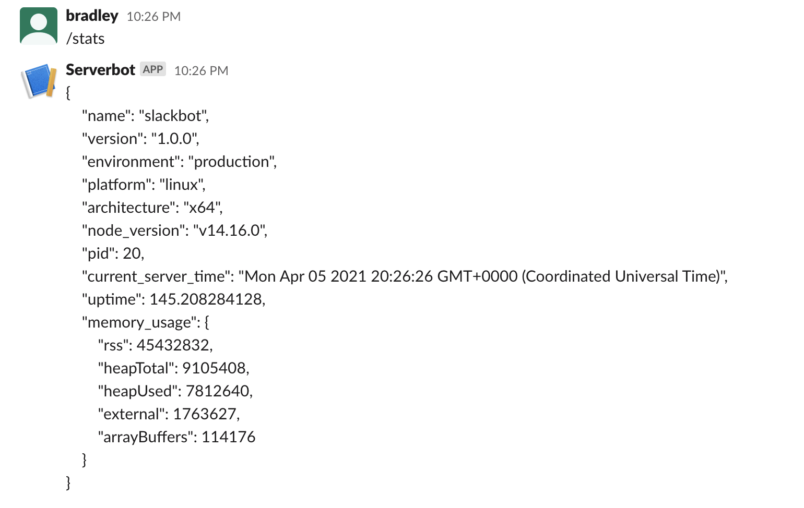


### Adding Verification

This is pretty cool - we can ask our app via Slack (which we use constantly!) how it is doing. There is a problem though. If we call our slash command endpoint from anywhere else, for instance if we just call it using [Postman](https://www.postman.com), it also returns all the information and stats! This would not be good for a production system, as senstive information will be easily found by attackers. 

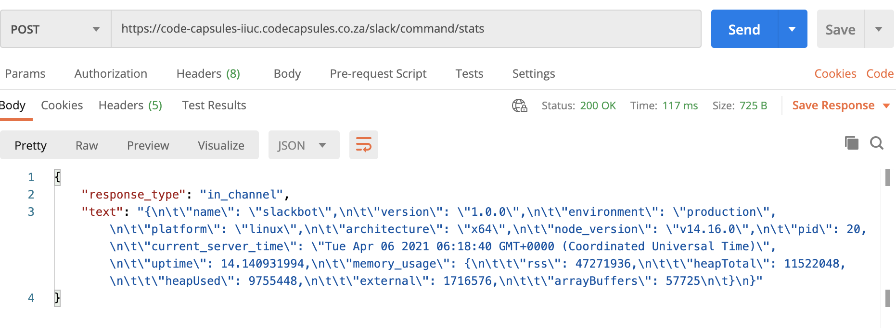

So how can we ensure that the request comes from our Slack workspace? Luckily, Slack has thought about this, and sends a [message signature with its requests](https://api.slack.com/authentication/verifying-requests-from-slack). From the [guide in Slack's docs](https://api.slack.com/authentication/verifying-requests-from-slack#verifying-requests-from-slack-using-signing-secrets__a-recipe-for-security__step-by-step-walk-through-for-validating-a-request), we can put together some code to check that the request is legitimately from Slack. The main parts of the check, copied from the docs, looks like this: 

>- Retrieve the X-Slack-Request-Timestamp header on the HTTP request, and the body of the request.
>- Concatenate the version number, the timestamp, and the body of the request to form a basestring. Use a colon as the delimiter between the three elements. For example, v0:123456789:command=/weather&text=94070. The version number right now is always v0.
>- With the help of HMAC SHA256 implemented in your favorite programming language, hash the above basestring, using the Slack Signing Secret as the key.
>- Compare this computed signature to the X-Slack-Signature header on the request.

We can also check the timestamp to ensure that it is not a [replay attack](https://en.wikipedia.org/wiki/Replay_attack) of a message from long ago. 


Ok, let's implement this in our project. First, we somehow need to access the raw body of the request, before it has been parsed by `body-parser`. This is to ensure that the signing hash we calculate is using the same data that Slack did - after parsing, there could be extra characters and formatting etc. Luckily, the [body parser package has a verify option](https://github.com/expressjs/body-parser#verify-3), which passes a binary buffer of the raw body request to a user defined function. Let's make a function that conforms to the specs given by body parser. Add this code to your `index.js` file: 

```javascript
var rawBodySaver = function (req, res, buf, encoding) {
  if (buf && buf.length) {
    req.rawBody = buf.toString(encoding || 'utf8');
  }
}
```

In this function, we grab the bit stream buffer `buf`, and check that it is not null and that it is not empty (by checking that it has a length). Then we tack it onto the request `req` as a new property `rawBody`. We also convert the buffer to a string, using the encoding supplied, or fall back to `utf8` as a default. Now that the `rawBody` is added to the request, it will be available to subsequent middleware to use. We can add it to the body parser by modifying the code where we add the body parser to the app. 

```javascript
app.use(bodyParser.urlencoded({ verify: rawBodySaver}));
```

In the code above, we added options to our body parser intitialisation. We set the `verify` option to the method we added above. 

Now, lets make new [middleware function](http://expressjs.com/en/guide/writing-middleware.html) to calculate the signature and compare it. We'll be able to call this middleware before our current code for responding to our Slack slash command. Making it as a middleware function will also allow us to easily re-use it on other routes, if we want to add more slash commands, or other commands from Slack in the future.  We'll make a new file to hold this code. We'll call it `signing.js`. 

In the new file, let's add this code:

```javascript
const crypto = require('crypto');

function checkSlackMessageSignature(req, res, next){
    const timestamp = req.headers['x-slack-request-timestamp']; 
    const fiveMinutesAgo = Math.floor(Date.now() / 1000) - (60 * 5);

    if (timestamp < fiveMinutesAgo) {
        return res.sendFail(401, "mismatched timestamp");
    }

    const signing_secret = process.env.SLACK_SIGNING_SECRET; 
   
    const slack_signature = req.headers['x-slack-signature']; 
    const [version, slack_hash] = slack_signature.split('=');

    const sig_basestring = version + ':' + timestamp + ':' + req.rawBody;
    const hmac = crypto.createHmac('sha256', signing_secret); 
    hmac.update(sig_basestring); 
    const our_hash = hmac.digest('hex');    

    if (crypto.timingSafeEqual(Buffer.from(slack_hash), Buffer.from(our_hash))) {
        return next(); 
    }
    else {
        return res.send(401, "Invalid request signature");
    }
}

module.exports = checkSlackMessageSignature; 

```

Let's take a look at this code. Firstly, we import the [crypto (cryptography) library](https://nodejs.org/api/crypto.html#crypto_crypto). We don't need to install this as a package, as it is built in to Node.js. This library will allow us to perfom the [hash](https://en.wikipedia.org/wiki/Secure_Hash_Algorithms) of the basestring to compare with the signature. 

Next, we create a function, with the [standard Express middleware parameters](http://expressjs.com/en/guide/writing-middleware.html) :
- `req` representing the request data;
- `res` representing an output object that we return results to the user via; and 
- `next` representing a function to call if we want to hand control to the next middleware function in the chain. It can also be used to pass an error object back up if something goes wrong processing the request

Then, on the first few lines of the function, we get the timestamp Slack sends from the request headers, and check that it is withing the last few minutes. Note the the name of the header is all in lower case, even though Slack specifies that the header is capitalised. This is because Express converts all header keys to lower case when serving a request. 

After that, we retrieve the Slack Signing Secret from our environment variables. Let's get our Signing Secret from Slack and add it to the Code Capsules environment now. Head over to your Slack app dashboard, and click on _Basic Information_ in the left hand side bar. Then scroll down to _App Credentials_, and look for the _Signing Secret_. Click _Show_, and copy the secret. 

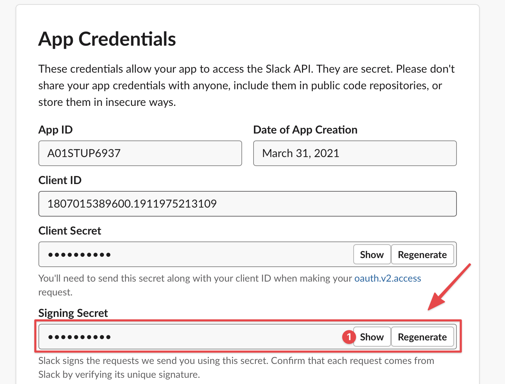

Now head over to your Capsule on Code Capsules, and click on the _Config_ tab. Add a new environment variable with _Name_ `SLACK_SIGNING_SECRET` and paste in the value of the _Signing Secret_ we copied above. Click _Update_ to save the changes. 


Ok, back to the function. After we retrieve the signing secret from the environment variables, we read out the hash calculated and sent by Slack from the headers using `const slack_signature = req.headers['x-slack-signature']`. This will be a string that looks something like `v0=xxxxxxxxxxxxxxxxxxxxxxx`, where the `xxxx` represents the actual hash value. We need to split the version identifier `v0` from the beginning of the string though, as this is not part of the hash value. We do this in the next line, `const [version, slack_hash] = slack_signature.split('=')`. Now we have both the version and the hash string in variables that we can access. 

After this, we construct our base string, made from the version we extracted above, the timestamp of the request, and the `rawBody` (which we extracted in our body-parser `verify` function earlier). 

The next 2 line are where we actually calculate the hash. First, we setup the `crypto` module with our crypto algorithm type [`SHA256`](https://en.wikipedia.org/wiki/SHA-2), and with our unique Signing Secret. This allows us to then create an [HMAC - or Hash Based Message Authentication code](https://en.wikipedia.org/wiki/HMAC), which is the fancy name for the message signature. We then use the `update` method on our newly created HMAC to load in our Basestring that we constructed above. 

Now that the crypto HMAC is primed with all the info it needs, we can call the `digest` function to actually calculate the hash. We pass in as a paramater `hex` to indicate we want the result back in [hexadecimal format](https://en.wikipedia.org/wiki/Hexadecimal), as this is the same format that Slack sends their calculated hash value in. 

Great, so now we have Slack's signature hash, and our hash. We need to check that they are the same, which will prove that the message was legitimately sent by Slack. We could just use a normal String compare, i.e. `if (slack_hash === our_hash)`, but there is a slight security issue with this, known as a [timing attack](https://codahale.com/a-lesson-in-timing-attacks/). This type of attack is based on the knowledge that a normal string compare function takes a different amount of time to compare two strings, depending on how close the strings are to each other. An attacker can take advantage of this timing difference to repeatedly send messages, and based on the time for our server to respond, can guess at how close their hash is to what we are expecting. With much patience and many thousands of message, an attacked could eventually guess our Signing Secret, compromising all our checks. 

Luckily, there is a simple way to protect from this, and it's built right into the `crypto` library. This is where we call `crypto.timingSafeEqual`. This compare always returns in the same amount of time, regardless of how close the hashes are to each other. Therefore, we don't give any extra information away to would be attackers. 

Now, if the hashes are equal, from our `timingSafeEqual` test, we just call `return next()` which exits our function and  passes control to the next middleware function (which will be our slash command handler). 

If the hashes are not equal, then we know this request is not genuinely from Slack, so we can end early and send a `401`, which is a [standard HTTP code](https://en.wikipedia.org/wiki/List_of_HTTP_status_codes#4xx_client_errors) for `Unauthorized`. Basically, we boot the imposter out. 

Now, the last line in this file, is `module.exports = checkSlackMessageSignature`. This allow our middleware function to be visible to other modules that import this file. 


Ok, now that we've got this middleware created, let's hook it up into out slash command handler. Head on back to the `index.js` file, and import the middleware function by adding this line near the top of the file: 

```javascript
const checkSlackMessageSignature = require('./signing'); 
```

Now, we can navigate to our slack command handler, which started like this :`app.post('/slack/command/stats'`. Modify that to include a call to the message signature check before the actual handler, like this: 

```javascript
app.post('/slack/command/stats', [checkSlackMessageSignature, function(req,res){
```

Fantastic, now our app is secure. Commit all the changes, and push it up to Git, which will kick off our final deploy to Code Capsules: 


```bash
git add . 
git commit -am 'added message signature checking'
git push origin
```

Once the code is up and running on Code Capsules, test it out to see that it still responds to the Slack slash command. Then you can try again from Postman and similar, and see that it will not send any info without a valid signature: 

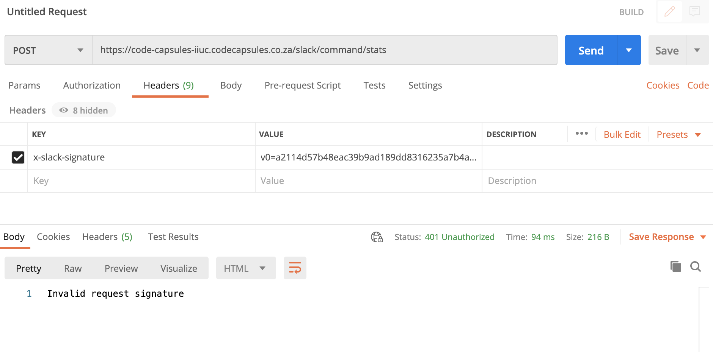


## Things to Try Next

What else can we do? Its almost endless!

- Add this code to an existing app you have built to get easy info straight from Slack!
- Add in more slash commands for more info - for example, you could get current user count on your app, number of database records etc. Basically any information you could need for [dev ops](https://en.wikipedia.org/wiki/DevOps)
- Look at some of the other functionality Slack offers for integration - for example using [modals](https://api.slack.com/surfaces/modals), or listening in for [keywords in messages](https://api.slack.com/messaging/managing)

