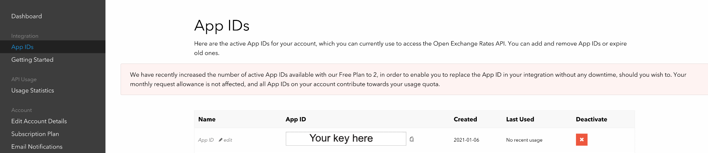
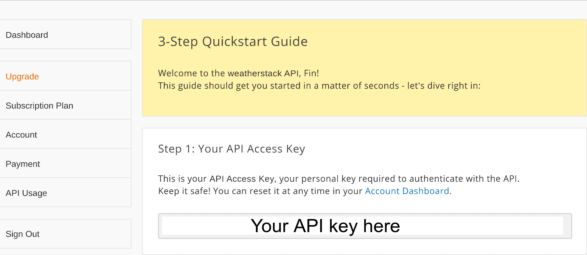
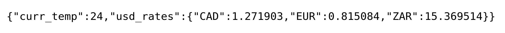

# Creating and Hosting a Personal API with Flask and Code Capsules

## What is an API and why care? 

An API, or Application Programming Interface, is a tool that enables developers to interact with data online. Imagine, you navigate to a weather website and see your location's current temperature displayed on the homepage. How did they display the temperature?

Without a doubt, they used an API. APIs are hosted on a server and act as an access point between the user and some data. 

Part of this lesson takes a look at the [WeatherStack](https://weatherstack.com/) API - an API that provides weather data. For the weather website to retrieve your location's temperature, they likely sent a request to an API like WeatherStack, including information about your computer's location in the request. WeatherStacks API would then return the data related to your locale - the temperature and other weather information. The weather website then would display this data. 

Following this tutorial, we'll learn how to create a personal API with Python (using [Flask](https://palletsprojects.com/p/flask/)) and host it on [Code Capsules](https://codecapsules.io/), so you can request information from your API. Our API will give us access to USD exchange rates, and the temperature of a given city. 

## Prerequisites
Before starting, we'll need a [GitHub](www.github.com) account and the following installed:

- [Git](https://git-scm.com/downloads)
- [Python](https://www.python.org/downloads/) 3.xx
- [Virtualenv](https://virtualenv.pypa.io/en/latest/installation.html) 

## Setting up our environment

First, we need to set up a virtual Python environment using Virtualenv. Virtualenv provides a "virtual" Python install any 3rd-party libraries or packages. This will ensure we are using the same dependencies. Let's set up the environment.

1. Open your terminal and create an empty folder.
2. Open the folder in your terminal and enter `virtualenv env`.

To activate the virtual environment enter one of the following:

**Linux/MacOSX**
`source env/bin/activate`

**Windows**
`\env\Scripts\activate.bat`

If the virtual environment is properly activated, you'll see `(env)` to the left of your name in your terminal.


### Installing the dependencies 

Now that we've activated the virtual environment, we can download the packages we'll use for our API. We'll install the following:

- [Flask](https://palletsprojects.com/p/flask/) is a minimal web-development framework for Python. Flask provides resources and tools for building and maintaining web applications, websites, and more.
- [Gunicorn](https://gunicorn.org/) is a [WSGI](https://medium.com/analytics-vidhya/what-is-wsgi-web-server-gateway-interface-ed2d290449e) server for sending code to the production environment. 
- [Requests](https://pypi.org/project/requests/) is a Python library that will help us interact with APIs.

From your virtual environment, install these packages using `pip3 install flask gunicorn requests`. 

## Setting up accounts with OpenExchangeRates and WeatherStack

Our API will return the current temperature of a chosen city and the exchange rate between USD and three currencies. We'll create our API by combining data from two other APIs - [WeatherStack](https://weatherstack.com) and [OpenExchangeRates](https://openexchangerates.org/). As their names suggest, WeatherStack will provide the temperature data, and OpenExchangeRates the exchange rate data. 

To use these APIs, we need to register for each them to recieve a unique API key. An API key ensures that a user is allowed to use an API. Let's create an account and retrieve API keys for OpenExchangeRates and WeatherStack. 

### Creating an account with OpenExchangeRates

Perform the following:
1. Navigate to https://openexchangerates.org/signup/free.
2. Sign up and log in.
3. On the dashboard, click "App IDs". 
4. Save your "App ID" (API key) on your computer.
 
	

### Creating an account with WeatherStack

Create a free account with [Weatherstack](https://weatherstack.com/product). Log in and save the API key on your computer.



### Testing OpenExchangeRates and WeatherStack

We've obtained our API keys. Now we can test the APIs. Open a terminal in the folder created earlier and re-activate the virtual environment. 

Let's see what happens when we request data from OpenExchangeRates. Create a file named `app.py` and open it.

To request data from an API, the provider gives its customers a URL which acts as an access point for the API. Enter the following code, replacing "YOUR-API-KEY-HERE" with your OpenExchangeRates API key:

```python
import requests

EXCHANGE_URL = 'https://openexchangerates.org/api/latest.json?app_id=YOUR-API-KEY-HERE'
exchange_data = requests.get(EXCHANGE_URL)  

print(exchange_data.json())
```

We use the requests module to "get" data from the API, accessed through the EXCHANGE_URL variable. Near the end of the URL, notice `/api/latest.json`. 

`latest` signifies an API _endpoint_. OpenExchangeRates has many endpoints. Each endpoint provides different data. One could request data from the `historical` endpoint (`https://openexchangerates.org/api/historical/`) to access past exchange rates.

After returning the data, we print it using the `.json()` object method. The `.json()` method displays the data in [JSON](https://www.json.org/json-en.html) (Javascript Object Notation), which we can work with like a Python dictionary. 

Notice, a lot of data has returned. Let's modify the code so that we only receive exchange rates from USD to EUR, CAD, and ZAR. Replace your code with the below:

```python
import requests

EXCHANGE_URL = 'https://openexchangerates.org/api/latest.json?app_id=YOUR-API-KEY-HERE'
EXCHANGE_PARAMS =  {'symbols':'ZAR,EUR,CAD'}

exchange_data = requests.get(EXCHANGE_URL, EXCHANGE_PARAMS)  

print(exchange_data.json()['rates']) # Print only exchange rates

```

Now we've included an `EXCHANGE_PARAMS` variable. Providing an API parameter determines the data recieved. In this case, we supplied the OpenExchangeRates parameter `symbols` with our three currencies.

Parameters vary depending on the API endpoint. Find a list of parameters for the `latest` endpoint [here](https://docs.openexchangerates.org/docs/latest-json). 

Now that we've obtained the exchange rates, let's retrieve the temperature for a city. Modify our code by adding the following below the `print(exchange_data.json())` line. This time, replace 'YOUR-API-KEY-HERE' with your WeatherStack API key.

```python
WEATHERSTACK_URL = 'http://api.weatherstack.com/current?access_key=YOUR-API-KEY-HERE'
WEATHERSTACK_PARAMS = {'query':'Cape Town'}

weather = requests.get(WEATHERSTACK_URL,params=WEATHERSTACK_PARAMS) 

print(weather.jsonify()['current']['temperature']) # Print nly the temperature - print without indexing to see all the values returned!

```

This example returns the current temperature for Cape Town, South Africa. One may request any cities temperature.

## Creating our API

We have our data - let's use it to create our API utilizing Flask.

### Beginning steps with Flask

We don't need the print statements in our file anymore. Remove them. After removing the print statements, edit the file accordingly:

```python
import requests
from flask import Flask, jsonify # Import Flask, import jsonify to return JSON info
app = Flask(__name__) 

@app.route('/') # Create main page of web-application
def index():
	return "Welcome to my API!" # Display text on main page

EXCHANGE_URL = 'https://openexchangerates.org/api/latest.json?app_id=YOUR-API-KEY-HERE'
EXCHANGE_PARAMS =  {'symbols':'ZAR,EUR,CAD'}

exchange_data = requests.get(EXCHANGE_URL, EXCHANGE_PARAMS)  

WEATHERSTACK_URL = 'http://api.weatherstack.com/current?access_key=YOUR-API-KEY-HERE'
WEATHERSTACK_PARAMS = {'query':'Cape Town'}

weather = requests.get(WEATHERSTACK_URL,params=WEATHERSTACK_PARAMS) 


if __name__ == '__main__':
	app.run() # Run the application

```

After instantiating a Flask object, we add `@app.route('/')`. The `@` symbol is known as a [Python decorator](https://realpython.com/primer-on-python-decorators/). For now, know that 

```python
@app.route(`/`)
def index():
	return "Welcome to my API!"
```

creates the homepage for your API. After hosting it on Code Capsules, "Welcome to my API!" will greet you upon connecting to the API. 


### Combining the APIS

When we request data from our API, we want to return the temperature from a city, and the exchange rates of three currencies. We've already written code to retrieve this data - now we must "combine" it and give it a location on our Flask application. 

Modify our current code using the below:

```python
import requests
from flask import Flask, jsonify # Import Flask, import jsonify to return JSON info
app = Flask(__name__) 

@app.route('/') # Create main page of web-application
def index():
	return "Welcome to my API!" # Display text on main page

@app.route('/get',methods=['GET']) # Add an endpoint to access our API
def get():
	EXCHANGE_URL = 'https://openexchangerates.org/api/latest.json?app_id=YOUR-API-KEY-HERE'
	EXCHANGE_PARAMS =  {'symbols':'ZAR,EUR,CAD'}

	exchange_data = requests.get(EXCHANGE_URL, EXCHANGE_PARAMS)  

	WEATHERSTACK_URL = 'http://api.weatherstack.com/current?access_key=YOUR-API-KEY-HERE'
	WEATHERSTACK_PARAMS = {'query':'Cape Town'}

	weather = requests.get(WEATHERSTACK_URL,params=WEATHERSTACK_PARAMS)

	return jsonify({'usd_rates':exchange_data.json()['rates'],'curr_temp':weather.json()['current']['temperature']})

if __name__ == '__main__':
	app.run()
``` 

The line `@app.route('/get', methods=['GET'])` adds an endpoint to access and retrieve data from the API. This will become clearer when we host our API on Code Capsules. For now, imagine entering "myAPI.123-codecapsules.space". 

`@app.route('/')` would point to "myAPI.123-codecapsules.space" and display "Welcome to my API!". 

The line `@app.route('/get',[methods=['GET']])` would allow you to access your API via "myAPI.123-codecapsules.space/get", just like `http://api.weatherstack.com/current?access_key=YOUR-API-KEY-HERE` accesses current weather data. 

The line

```python
return jsonify({'usd_rates':exchange_data.json()['rates'],'curr_temp':weather.json()['current']['temperature']})
``` 

returns our data in JSON. Our data in `exchange_data` will be found under `usd_rates`, and our `weather` data will be found under `curr_temp` 

The API is completed. Only a few steps left before hosting it on Code Capsules.

## Freezing Requirements and Creating the Procfile

Before sending our API to GitHub (so Code Capsules can host it) we need to create a list of requirements and a "Procfile".

#### Creating a list of requirements
To create a list of requirements, ensure your terminal is still in the virtual environment. In the same directory as our `app.py` file, Enter `pip3 freeze > requirements.txt`. A `requirements.txt` file will be created. When hosting our API, Code Capsules will know what to install on its server.

#### Creating the Procfile
Create a new file named `Procfile` within the same directory. Open it and enter the following:

`web: gunicorn app.py:app`

This tells Code Capsules to use the gunicorn web-framework.

## Hosting the API on Code Capsules

We're almost ready to host the API, next:

1. Create a remote repository on Github.
2. Push the `Procfile`, `requirements.txt`, and `app.py` files to the repository.
3. Link the repository to your Code Capsules account.
4. Create a new Code Capsules Team and Space (as necessary).

With our repository linked to Code Capsules, we can host the API:

1. Create a new Capsule.
2. Choose the "Backend" Capsule and continue.
3. Select your product type and GitHub repository, click next. 
4. Leave the "Run Command" blank (our `Procfile` handles this).
5. Create the Capsule.

### Viewing and interacting with our API

After building the Capsule, navigate to the supplied URL. You'll be greeted with "Welcome to my API!". To view the API, add `/get` to the end of your web-applications URL. 

Depending on your browser (Google Chrome was used below), you'll see something like this:



We've created an API. You can also interact with it through code. In a new file, try out the following, replacing the URL with your Code Capsules URL (ensure `/get` is at the end of the URL):

```python
import requests

MY_URL = 'https://my-code-capsules-url.codecapsules.space/get'

api_data = requests.get(MY_URL) 

print(api_data.json())
```
## Conclusions 

We've learned about what APIS are, how to interact with them, and how to create and host an API with Flask and Code Capsules. 

For a more in-depth look at APIs, read [this](https://www.smashingmagazine.com/2018/01/understanding-using-rest-api/).

If you're interested in learning more about Flask, start with their [tutorial](https://flask.palletsprojects.com/en/1.1.x/tutorial/).
