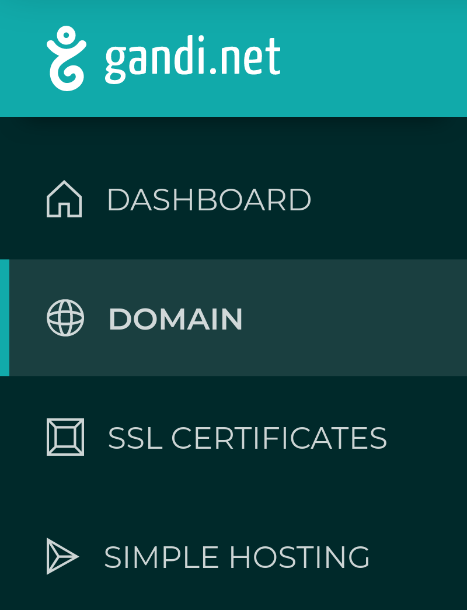

# Customizing Your Domain on CodeCapsules

## How domains work

Custom domains garner name recognition for your web-application (or website). Take Google: the URL "www.google.com" is instantly recognizable. Typing in the address, you're taken to Google's search engine. Without a domain, one would need to type in the [IP](https://www.popularmechanics.com/technology/a32729384/how-to-find-ip-address/) address for www.google.com

The web-address www.google.com is a placeholder to help us remember the website. When one types a URL in a search bar, the computer sends a request to the Domain Name System (DNS) - a series of servers located worldwide containing domain names and corresponding IP addresses.

When phone books were still widely used, one found a person's phone number by searching for their name and corresponding phone number in the book. Requesting a domain from the DNS behaves similarly. If the computer doesn't already have the IP address saved (or "cached"), the computer sends a request to the DNS with the domain being  searching for. The DNS then returns the corresponding IP address, and one connects to the website.

In this lesson we'll learn how to buy a domain and route it to a CodeCapsules hosted web-application. Along the way we'll learn more about the DNS and related topics.

## Prerequisites

To complete this tutorial, we'll need:

- A web-application hosted on [CodeCapsules](www.codecapsules.io).
- A valid payment method (credit card, PayPal, cryptocurrency, bank transfer) to purchase a custom domain.

## Where to buy domain

Accredited businesses that sell domains are called domain registrars. We'll purchase a domain from the registrar www.gandi.net. Domains that aren't very desired are usually inexpensive. 

### Purchasing a domain from Gandi

To purchase a domain on [Gandi](www.gandi.net):

1. Navigate to www.gandi.net.

2. Enter the domain you want in the domain search box (ex: https://www.lincolnportfolio.co.za)

3. Add the domain to the shopping cart.

4. Checkout by clicking the shopping cart at the top right of the screen.

5. Decide how many years you would like to host the domain, and press the Checkout button.

Follow the prompts to create an account and purchase your domain. After purchasing, view the domain by:

1. Logging in to www.gandi.net.

2. Pressing the "Domain" button on the dashboard.

	

If Gandi has processed the domain, find it under the "Active" tab - if it is still processing, view it under the "Pending" tab (this can take some time).

Before routing we route the domain to a web application, we have one more step to complete. 

## Setting up HTTPS for the domain

HTTP stands for Hypertext Transfer Protocol. When you see HTTP before a web address such as http://www.google.com, you know that the information retrieved from entering this address is returned in [clear text](https://www.pcmag.com/encyclopedia/term/cleartext). This means data is vulnerable when interacting with this website.

HTTPS is HTTP with S - secure. HTTPS encrypts data that is sent between you and the server you are connected to. Setting up HTTPS is quick with Gandi and is good practice regardless of the information your web-application is exchanging with its users.

To set up HTTPS with the domain, we need to register a free SSL (Secure Sockets Layer) certificate. In short, an SSL certificate helps encrypt the data sent when connected via HTTPS.

To register an SSL certificate for our domain we must:

1. Click on the domain under the active tab.

2. Navigate to the "Web Forwarding" tab.

3. Click "Create" at the top right.

4. From the address drop-down menu, choose "HTTP:// + HTTPS://"

5. Type "www" in the text-box to the right. 

6. From the "Address to forward to" drop-down menu, choose "HTTPS://"

7. Type in the name of the domain. 

8. Choose "Permanent" under "Type of web forwarding"

	

9. The above image shows an example form - click create when done.

10. Repeat this process, this time choosing "HTTP://" for step four and typing "*" for step five.

This will forward any users connecting to the domain with `http://www.yourdomainhere.extension` or `http://yourdomainhere.extension` to `https://yourdomainhere.extension` - it forces users to utilize HTTPS. By creating this forwarding address, Gandi also automatically creates an SSL certificate. This can take some time to process. 

To view this verification process, navigate to "SSL Certificates" on the Gandi dashboard. Soon you will receive an email from Gandi with a link asking you to verify your account before receiving the SSL certificate. Click the link you receive. 

Now that the domain has an SSL certificate, we'll route your CodeCapsules web-application to the domain. Navigate to your domain on the Gandi Dashboard. Click the "DNS Records" tab at the top of the page and continue to the next section.

## Routing your web-application to your new domain

DNS records contain information about a domain. When a user enters a domain in their search bar, their computer will receive these records. When creating a new domain with Gandi, various DNS records are supplied with default values. For this tutorial, only the entries with type "A" and "CNAME" are important.

An A record stores the IP address of the server where your web-application is hosted (in this case, CodeCapsules). When you type in a domain name, your computer requests the A record associated with the domain from the DNS. The DNS returns the A record containing the IP address, and you connect to what you were requesting. Let's modify the default A record to route to your web-application:

1. On [CodeCapsules](www.codecapsules.io), navigate to the Capsule you wish to route to your new domain to.

2. Click Overview.

3. Press "Add A Custom Domain".

4. Copy the supplied IP address and type in the name of the web-address purchased.

5. Click "Create Domain".

6. At the DNS record tab in domain view on Gandi, edit the entry with "A" as the type.

7. Enter "@" for its name and paste the CodeCapsules supplied IP address in the IPv4 address text box.

8. Click create.

View your web-application by typing `https://yourdomainname.extension`, replacing your domain name with "yourdomainname" and your extension (such as .com) with ".extension".

Notice that if you type `https://www.yourdomainhere.com`, you will receive a 404 error. To fix this, we'll add a new "CNAME" record. A CNAME is like an alias for a domain. The best way to understand how CNAME records work is by creating one.

To allow users to enter in "www." before your domain name:

1. Return to CodeCapsules and press the "Add A Custom Domain" button again.

2. Under domain name, enter `www.yourdomainname.extension`, replacing your name and extension appropriately.

3. Return to the DNS record tab on Gandi, and press "Add" at the top right.

4. Choose the CNAME type.

5. Enter "www" in the name text-box.

6. Type your default CodeCapsules web-application URL under "Hostname" (you can find this in the "Overview" tab in your web-applications Capsule).
	

7. Click create.

You can now view your web-application by entering either `https://yourdomainname.extension` or `https://www.yourdomainname.extension`. 

## What next?

We've learned how to purchase, secure, and configure a domain, route a domain to your CodeCapsules application, and even a little bit about DNS. 

If you are interested, there is still a lot to learn about DNS. A fine place to start is by following this link: https://aws.amazon.com/route53/what-is-dns/

If you'd like to know about the rest of the DNS records associated with your new domain, I recommend reading through this Google support ticket: https://support.google.com/a/answer/48090?hl=en 

There is also much more to learn about how you and your users receive data via HTTP/S, read this for more information:  https://developer.mozilla.org/en-US/docs/Web/HTTP/Overview
