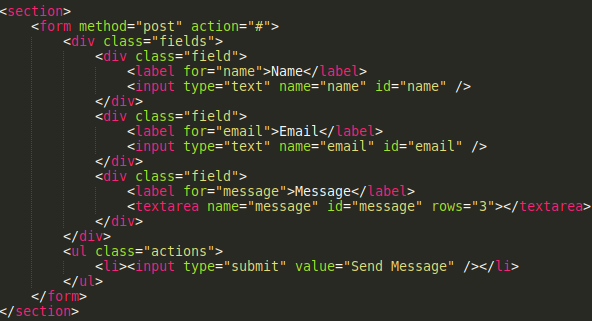
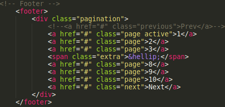
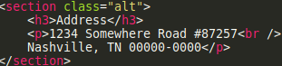
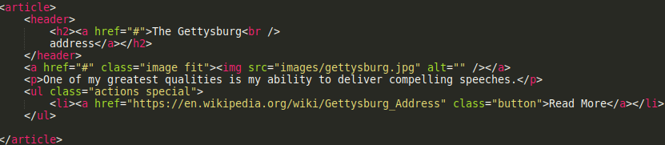

# Easily hosting your portfolio online: an introduction to CodeCapsules.io

Deploying a web application to a production environment is complex. Traditionally you set up a server and micromanage the tasks associated with hosting one: choosing the servers' operating system, editing its configurations, and monitoring the server to ensure it is running.

This time-consuming process is no longer necessary. In this lesson, you'll learn how to create a portfolio and host it on [CodeCapsules](https://codecapsules.io/), a _Platform as a Service_, which:

- Manages servers hosting your web-applications
- Integrates with GitHub to deploy your web-applications

All in a few clicks.

The first half of this guide covers choosing and personalizing a portfolio template. After, we will push it to a GitHub repository and see how CodeCapsules interfaces with GitHub to make your portfolio public.

## Requirements & Prerequisite knowledge

Hosting your portfolio on CodeCapsules is the easy part - so no knowledge about servers is necessary. To personalize and deploy your portfolio to CodeCapsules, you will need:

- A text editor (I use [Sublime Text](https://www.sublimetext.com/)). 
- A [GitHub](https://www.github.com) account and [Git](https://git-scm.com/book/en/v2/Getting-Started-Installing-Git) installed. 

It will also be helpful (though not necessary) to have some HTML knowledge to edit a portfolio template we will use.

## Creating a portfolio

[HTML5 UP](https/www.html5up.net) provides HTML5 site templates for free. We will use [Massively](https://html5up.net/massively) template. The Massively template is elegant and is easily edited.

Download the Massively template and extract it to a directory on your computer. **Within that directory, create _another_ directory, and transfer the template files into it**. This step is necessary for hosting a web-page on CodeCapsules.

The names of both directories are irrelevant. The file structure should look something like this:

```
MyPortfolio  
    PortfolioFiles 
        + assets
        + images
        + generic.html
        + elements.html
        + index.html
```

We only need to worry about the `index.html` file. The `index.html` file contains all of the HTML code for the main page of your template. 

### Personalizing the template

I will demonstrate how to edit the Massively template by creating a portfolio for Abraham Lincoln - the 16th president of the U.S.A. Looking at the template, you may have noticed some things we don't need for a portfolio. Things Abraham Lincoln (and probably you) wont need in a portfolio include:

- Social Media Accounts
- Extra tabs
- Date Entries 
- Irrelevant text
- Pagination
- Email contact form
- Your address

Let's start with the title and subheading of To start editing, open the `index.html` file with your text editor. The following steps outline where to start:

1. At the top of the file, change the text located within the `<title>` tags to whatever you like - I wrote: "Abraham Lincoln".

2. Customize the words wrapped in the `<h1>` tags.

3. Below the previously edited `<h1>` tags, edit the text within the `<p>` tags.  

4. Scroll down until you see text that looks like: `<!-- Header -->`, delete all text from `<header id="header">` down to and including the `</header>` tag.

Your portfolio should now look something like this: 


Next, we need to delete the extra tabs, social media links, and dates above each portfolio piece. 

### Tabs, dates, and links

To delete the unnecessary tabs, find these lines:
```html
<li class="active"><a href="index.html">This is Massively</a></li>
<li><a href="generic.html">Generic Page</a></li>
<li><a href="elements.html">Elements Reference</a></li>
```
Personalize the "This is Massively" text, and delete the two lines below containing the "Generic Page" and "Elements Reference" text.

The code for social media accounts is located at the top and bottom of the index.html file. Starting at the top, find and delete:

```html
<ul class="icons">
    <li><a href="#" class="icon brands fa-twitter"><span class="label">Twitter</span></a></li>
    <li><a href="#" class="icon brands fa-facebook-f"><span class="label">Facebook</span></a></li>
    <li><a href="#" class="icon brands fa-instagram"><span class="label">Instagram</span></a></li>
    <li><a href="#" class="icon brands fa-github"><span class="label">GitHub</span></a></li>
</ul>
```

At the bottom, find and delete this code-block:

```html
<section>
  <h3>Social</h3>
    <ul class="icons alt">
        <li><a href="#" class="icon brands alt fa-twitter"><span class="label">Twitter</span></a></li>
        <li><a href="#" class="icon brands alt fa-facebook-f"><span class="label">Facebook</span></a></li>
        <li><a href="#" class="icon brands alt fa-instagram"><span class="label">Instagram</span></a></li>
        <li><a href="#" class="icon brands alt fa-github"><span class="label">GitHub</span></a></li>
    </ul>
</section>
```

Finally, find and delete all lines that begin with `<span class="date"...>`. This will delete all the date entries in your portfolio.

### Personalizing text and removing the excess

To complete the portfolio we must: 

- Personalize default text.
- Change the "Full Story" button's text.
- Replace images with personal images.
- Remove the contact form.
- Update or remove the contact information.
- Delete the "next" button. 

Personalizing the default text is simple. View the HTML document in a text editor while also viewing the document in a web browser (by opening the index.html document). Find the corresponding text and tailor it to yourself. Next:

1. Find and change all text with "Full Story" to edit the buttons of the same name. 
 
2. Remove the email feature by deleting lines:

    

3. Remove pagination by deleting lines:

    

For contact information, we have two options:

- To delete all contact information, navigate to the bottom of the file and delete the `<section class="split contact">` tag and all lines below it, up to the `</footer>` tag. 

- To delete specific sections (an example section is shown below), delete the `<section>` tag, the information you want to delete, and the corresponding `</section>` tag.

  

### Custom images and button linking

The portfolio is almost complete! You just need to customize the images in your portfolio and link the buttons to your work. First, let's customize the images: 

1. Find the images directory in the directory where the `index.html` file is located.
2. Place your image in the images directory - remember the images' name and file extension.
3. Find lines with `class="image main"` or `class="image fit"` - to the right, you will see `src="images/pichere.jpg"` - change the name of the image with your image name and file extension.

Link buttons to your work by locating `<article>` tags. Below each `<article>` tag, you will see a line that contains `class="button"`. On that line, find `href="#"` and replace the "#" with your link. 

Ensure you provide a full link, including `https://`. An example section for Abraham Lincoln looks like this:



We can now send our portfolio to GitHub!

## Uploading to GitHub

### Creating the remote repository

CodeCapsules will interface with your GitHub repository and use it to create a web-application. What's better - every time you update your repository, CodeCapsules will automatically detect the changes made and update your CodeCapsules hosted web-application.

If you already know how to send code from a local repository to a remote repository on GitHub, send the sub-directory containing the portfolio to GitHub and [skip](#deploying-to-codecapsules) to the next section. 

Otherwise, follow these steps:

- Go to www.github.com and log in.
- Find the "Create new repository" button and click it.
- Name your repository anything. I named mine "AbesPortfolio".
- Copy the URL given to you under "Quick setup".


_The link to your repository is located under Quick setup_

### Sending files to the GitHub repository 

The final step before deploying your portfolio to CodeCapsules is to send the files located in your portfolio folder to GitHub. Open your terminal and navigate to the top-level directory you created. This directory should contain the sub-directory that has your template files. Enter each command in order:

```
git init
git add .
git commit -m "First commit!"
git branch -M main
git remote add origin https://github.com/yourusername/yourrepositoryname.git
git push -u origin main
```
Replace "yourusername" with your GitHub username, and "yourrepositoryname.git" with the URL copied previously. 

Now, you can see your code in your GitHub repository. Your repository should look similar to this, where all of your portfolio code is contained in a sub-directory (mine is portFolder):


We are ready to host our portfolio on CodeCapsules!

## Deploying to CodeCapsules 

Now that all of the hard work is done, we can move on to the easy part; deploying our portfolio on CodeCapsules.

To deploy your portfolio on CodeCapsules, go to https://codecapsules.io/, and create an account. After creating your account, log in. 

When you log in, you will be prompted to create a team. CodeCapsules provide teams for collaborative development - you can invite other people to view and edit your web-applications by adding them to your team. 

Regardless if you are working with other people, you must create a team. Click the "Create A New Team" button.


After creating a team, you are prompted to enter your team's billing information and invite Team Members. For now, we can skip this.

### Linking the repository

For CodeCapsules to interface with your portfolio hosted on GitHub, you must give CodeCapsules access to your repository containing your portfolio. Click "Get Started By Installing The GitHub App"


You are redirected to GitHub to install CodeCapsules.

1. Click your user name.
2. Press "Only select repositories".
3. From the drop-down menu, choose the name of the repository containing your portfolio.
4. Press "Install & Authorize"

With CodeCaspsules connected to your portfolio, you can now deploy it!

### Creating a Capsule and viewing the portfolio

The final step to deploy your portfolio is to press "Create A New Capsule For Your Space". Within a space, you can have many capsules - these are your web-applications (in our case, a portfolio), that the world can view. Let's create a capsule, and get our portfolio online. 

You will be prompted to choose a capsule type. Choose a Frontend capsule and:

1. Select your product type.
2. Click the repository that contains your portfolio.
3. Press "Next".
4. Leave the build command blank and enter the name of the sub-directory containing your portfolio files in the "Static Content Folder Path" entry box.

  

5. Press "Create Capsule". 

Your Capsule is now building. This process will make your portfolio visible online. After it has deployed, click the "Overview" tab, then press the link under "Domains" to view your portfolio! 


## Conclusion

By using CodeCapsules, the hardest part is creating your web-application. Hosting your web-application is made dramatically easier with CodeCapsules. CodeCapsules follows a simple process, guiding you from start to finish without having to mess around with any servers. 

In little time, you can have a portfolio ready for the entire world to see - and with CodeCapsules, the moment you update you update your portfolio on GitHub, the changes will be visible to all. 
