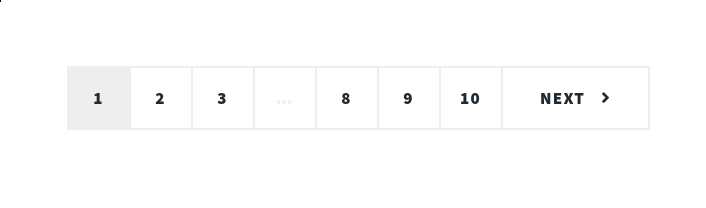
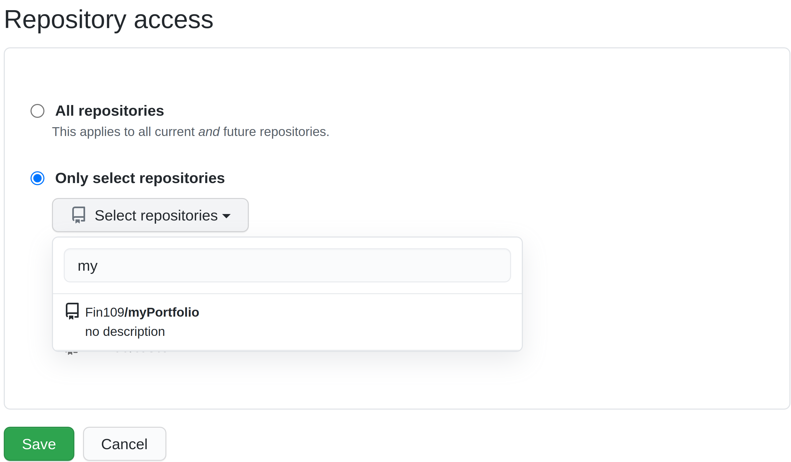
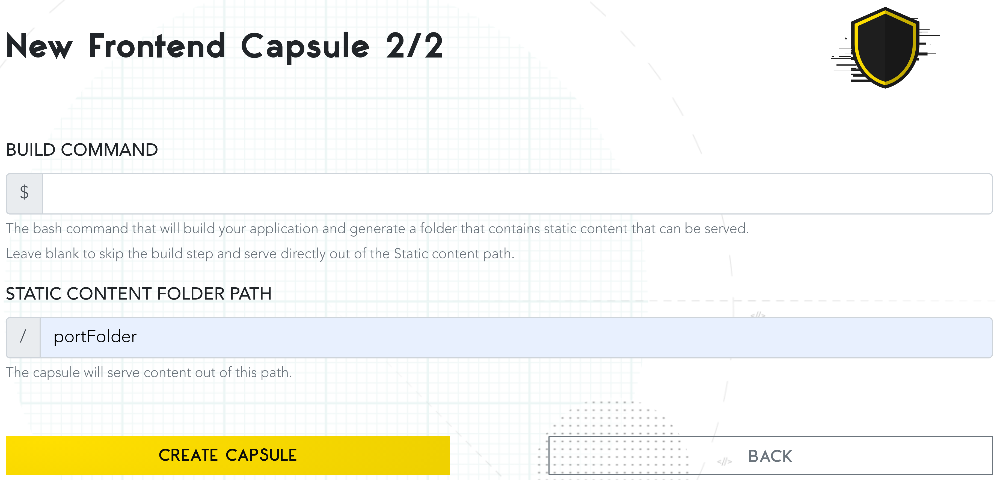
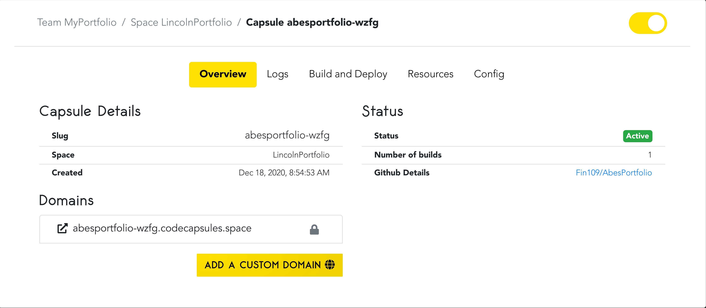

# Hosting a front-end: building and deploying your portfolio to Code Capsules

Publishing your portfolio online requires a solid technical background - managing servers can be challenging. You need to choose a server's operating system, maintain and update the server, and figure out where to host the server itself. 

In this tutorial, we'll work with an alternative to the traditional method of hosting a front-end (content that visitors see when they load your website), called [Code Capsules](www.codecapsules.io). Code Capsules is a service that hosts front-end (and back-end) code online. Furthermore, Code Capsules:

- Manages all of the technical details - no server management required 
- Integrates with GitHub to deploy your code with a single `git push`

First, we'll take a look at choosing a portfolio template and personalising it. After, we'll push the portfolio to a GitHub repository and see how Code Capsules connects to GitHub and makes your portfolio visible to the world. [Here is a preview](https://abesportfoliowzfg.codecapsules.space/) of what it'll look like - let's get started. 

## Requirements & Prerequisite knowledge

Hosting a portfolio on Code Capsules requires no previous knowledge about servers or front-end development. To personalize a portfolio template and deploy it to Code Capsules, we'll need:

- A text editor, such as [Sublime Text](https://www.sublimetext.com/), or [VSCode](https://code.visualstudio.com/). 
- A registered [GitHub](https://www.github.com) account.
- The [Git command-line interface](https://git-scm.com/book/en/v2/Getting-Started-Installing-Git) installed. 

## Creating a portfolio

[HTML5 UP](https/www.html5up.net) provides HTML site templates for free. We'll use the [Massively](https://html5up.net/massively) template - an easy to modify and elegent HTML template.

Download the Massively template and extract it to a directory on your computer. **Within that directory, create _another_ directory, and extract the template files into it**. This step is necessary for hosting a web-page on Code Capsules.

The names of both directories are irrelevant. The file structure should look something like this:

```
myPortfolio  
    portFolder 
        + assets
        + images
        + generic.html
        + elements.html
        + index.html
```

The `index.html` file contains all of the HTML code for our portfolio - any changes to this code will result in a change to the portfolio. To view changes you make as we begin to modify the template, double click the `index.html` file to open the portfolio in a web-browser.

## Personalizing the template

This tutorial will following the creation of a portfolio for Abraham Lincoln - the 16th president of the U.S.A. We'll take a closer look at some things Abraham Lincoln wouldn't want in a portfolio - and maybe you too. The next few sections will cover how to modify the following elements of the portfolio template:

- Unpersonalized text
- The "Generic Page" and "Elements Reference" tabs
- Pagination
- The email contact form
- Personal information (address, social media account)


Let's start with the title and subheading of the portfolio. Open the index.html file in your text editor. You'll see the following block of HTML near the top of the file:

```html
<head>
    <title>Massively by HTML5 UP</title>
    <meta charset="utf-8" />
    <meta name="viewport" content="width=device-width, initial-scale=1, user-scalable=no" />
    <link rel="stylesheet" href="assets/css/main.css" />
    <noscript><link rel="stylesheet" href="assets/css/noscript.css" /></noscript>
</head>
```

Change the text within the `<title>` tags to whatever you'd like, such as: "Abraham Lincoln". This is what will appear in search engines and browser tabs.


Now we'll change the text that displays at the top of the portfolio. Scroll down in your text editor, until you see the following code:

```html
<!-- Intro -->
    <div id="intro">
        <h1>This is<br />
        Massively</h1>
        <p>A free, fully responsive HTML5 + CSS3 site template designed by <a href="https://twitter.com/ajlkn">@ajlkn</a> for <a href="https://html5up.net">HTML5 UP</a><br />
        and released for free under the <a href="https://html5up.net/license">Creative Commons license</a>.</p>
        <ul class="actions">
            <li><a href="#header" class="button icon solid solo fa-arrow-down scrolly">Continue</a></li>
        </ul>
    </div>

<!-- Header -->
    <header id="header">
        <a href="index.html" class="logo">Massively</a>
    </header>
```

1. Customize the words wrapped in the `<h1>...</h1>` tags - this is the large text that displays at the top of the portfolio. 

2. Change the text within the `<p>...</p>` tags to edit the subheading of the portfolio - the `<br />` tags and the `<a>...</a>` tags are safe to delete.

3. Delete the "Massively" button that appears as you scroll down the portfolio by deleting the three lines under the `<!-- Header -- >` text wrapped in `<header>...</header>` tags.

Save the file and open it in a web browser. Our portfolio should now look something like this: 


Next, we'll take a look at deleting the date entries above each portfolio piece, removing the "Generic Page" and "Elements Reference" tabs, and modifying the social media links. 

### Removing the tabs, dates, and links

The default layout for Massively is designed for a blog or news website containing articles. To look like a portfolio, we should delete the dates above each article entry. Do so by locating and deleting all lines beginning with `<span class="date"...>`.


To make this a single-page portfolio, we can delete the "Generic Page" and "Elements Reference" tabs by finding:

```html
<li class="active"><a href="index.html">This is Massively</a></li>
<li><a href="generic.html">Generic Page</a></li>
<li><a href="elements.html">Elements Reference</a></li>
```

and deleting the last two lines. While we're at it, alter the title of the main tab by changing the "This is Massively" text.

The code for social media accounts is located at the top and bottom of the index.html file. Starting at the top, find this block of code:

```html
<ul class="icons">
    <li><a href="#" class="icon brands fa-twitter"><span class="label">Twitter</span></a></li>
    <li><a href="#" class="icon brands fa-facebook-f"><span class="label">Facebook</span></a></li>
    <li><a href="#" class="icon brands fa-instagram"><span class="label">Instagram</span></a></li>
    <li><a href="#" class="icon brands fa-github"><span class="label">GitHub</span></a></li>
</ul>
```

Delete any social media account you don't need - Abraham Lincoln doesn't have Instagram, so he would delete the following line to remove the Instagram link: 

```html
<li><a href="#" class="icon brands fa-instagram"><span class="label">Instagram</span></a></li>
```

If you'd like to link your social media accounts, enter the account link in place of the `#` in `href="#"`. For example, to link Abraham Lincoln's Twitter account, you'd edit the Twitter line like so: 

```html
<li><a href="https://twitter.com/Abe_Lincoln" class="icon brands fa-twitter"><span class="label">Twitter</span></a></li>
```

The social media code at the bottom of the `index.html` is nearly identical - follow this same process to edit the code at the bottom. 

### Removing unnecessary content and further personalisation


In this section we'll:

- Remove the contact form
- Remove pagination
    
- Update or remove contact information

1. Remove the contact form found at the bottom of the portfolio by deleting the following code:

  ```html
  <section>
    <form method="post" action="#">
        <div class="fields">
            <div class="field">
                <label for="name">Name</label>
                <input type="text" name="name" id="name" />
            </div>
            <div class="field">
                <label for="email">Email</label>
                <input type="text" name="email" id="email" />
            </div>
            <div class="field">
                <label for="message">Message</label>
                <textarea name="message" id="message" rows="3"></textarea>
            </div>
        </div>
        <ul class="actions">
            <li><input type="submit" value="Send Message" /></li>
        </ul>
    </form>
 </section>
 ```

2. Remove pagination by deleting:

  ```html
  <footer>
    <div class="pagination">
        <!--<a href="#" class="previous">Prev</a>-->
        <a href="#" class="page active">1</a>
        <a href="#" class="page">2</a>
        <a href="#" class="page">3</a>
        <span class="extra">&hellip;</span>
        <a href="#" class="page">8</a>
        <a href="#" class="page">9</a>
        <a href="#" class="page">10</a>
        <a href="#" class="next">Next</a>
    </div>
  </footer>
  ```

3. To delete specific contact information sections (the address section is shown below), delete the `<section>` tag, the information you want to delete, and the corresponding `</section>` tag. 

```html
<section class="alt">
    <h3>Address</h3>
    <p>1234 Somewhere Road #87257<br />
    Nashville, TN 00000-0000</p>
</section>
```

If you'd like to personalise your contact information instead, edit the text within the `<h3>...</h3>` tags and the `<p>...</p>` tags.

### Personalising portfolio pieces

Our portfolio is almost complete - we just need to personalise the actual portfolio pieces - customizing the images, button links, and other text. Let's start with the images.

Gather any images you'd like to replace with the default images. Then, place your images in the `images` directory, located in the same directory as the `index.html` file.

You can swap images by finding lines wrapped in `` tags, like the below line.

```html

```
`images` is the directories name where you placed your image. To change the image, replace the text "pic01.jpg" with the **name and file extension** of your desired image.

Once we've replaced the images, we should change the text for each portfolio entry. Find code blocks wrapped in `<article>...</article>` tags, such as: 

```html
<article>
    <header>
        <h2><a href="#">Sed magna<br />
        ipsum faucibus</a></h2>
    </header>
    <a href="#" class="image fit"></a>
    <p>Donec eget ex magna. Interdum et malesuada fames ac ante ipsum primis in faucibus. Pellentesque venenatis dolor imperdiet dolor mattis sagittis magna etiam.</p>
    <ul class="actions special">
        <li><a href="#" class="button">Full Story</a></li>
    </ul>
</article>

```
You can:

 - Change the entries title by editing the text within the `<h2>...</h2>` tags. 
 
 - Personalise the entry text by editing the Latin wrapped in the `<p>...</p>2` tags.
 - Customize buttons by finding the `<li><a href="#" class="button">Full Story</a></li>` lines and replacing the "#" with a link to your portfolio piece.
    - Replace "Full Story" text with something more appropriate.
 
If you would like to remove a portfolio piece, delete the `<article>...</article>` tags and all the text wrapped in the tags.

Once finished with the portfolio, we need to push it to GitHub. After, the portfolio can be deployed to Code Capsules, making the portfolio publicly viewable. 

## Uploading to GitHub
If you already know how to push code from a local repository to a remote repository on GitHub, push the **sub-directory** containing the portfolio to GitHub and [skip](#deploying-to-code-capsules) to the next section. 

Otherwise, we'll _push_ (or send) our portfolio code to a GitHub remote repository (a place where your code stores on GitHub). Once complete, Code Capsules can connect to the repository and automatically "deploy" the portfolio online. Let's create the remote repository now. 

### Creating the remote repository

Follow the steps below to create a remote repository on GitHub: 

- Go to www.github.com and log in.
- Find the "Create new repository" button and click it.
- Name your repository anything (in this picture it was named "myPortfolio").
- Copy the URL given to you under "Quick setup".

    
    _Locate the link to your repository under "Quick Setup"_

### Sending files to the GitHub repository 

We've created the remote repository - now we need to push the portfolio to GitHub.

Open a terminal and navigate to the top-level directory containing the portfolio. This directory should contain the sub-directory that has all the portfolio files. 

If your file structure looked like:
```
myPortfolio  
    portFolder 
        + assets
        + images
        + generic.html
        + elements.html
        + index.html
```

You would open the terminal in the `myPortfolio` directory. _Not_ the `portFolder` directory.

Enter each command in order:

```
git init
git add .
git commit -m "First commit!"
git branch -M main
git remote add origin https://github.com/yourusername/yourrepositoryname.git  
git push -u origin main
```

Replace the URL above with the URL to your remote repository (copied in the [previous](creating-the-remote-repository) section).

Now you can see the portfolio code in your GitHub repository. Your repository should look similar to the below, where all of your portfolio code is contained in a sub-directory (in this image the sub-directory is "portFolder"):


Now Code Capsules can host the portfolio. 

## Deploying to Code Capsules 

To deploy the portfolio to Code Capsules, navigate to https://codecapsules.io/, and create an account. After creating an account, log in. 

Follow the prompt to create a _Team_. Code Capsules provides Teams for collaborative development - you can invite other people to your Team and Team members can view and edit your web-applications.

Even if you're working alone, you'll still need a Team (containing only yourself).


After creating a Team, enter your billing information when prompted. Code Capsules requires billing information to create Capsules, but will **not** charge you for hosting the portfolio. 


### Linking the repository

For Code Capsules to connect to our portfolio on GitHub, we need to permit Code Capsules to do so. Click "Get started by installing the GitHub pp". Code Capsules will redirect you to GitHub.


Then: 

1. Click your username.
2. Press "Only select repositories".
3. From the drop-down menu, type the repositories name containing your portfolio and select it.
4. Press "Install & Authorize".
    
    

Almost ready to deploy our portfolio.

### Creating a Space, Capsule, and viewing the portfolio

The next step is to create a _Space_. Spaces act as a further layer of organization. Spaces can contain one or many Capsules (more on Capsules shortly) and can help organize large projects. Click "Create a new Space for your apps" and follow the prompts. Afterward, enter the Space. 

Now we can create a _Capsule_. Capsules provide the server for your application or code - in our case, we'll create a Capsule that'll host our portfolio. Click "Create a new Capsule for your Space". 

You'll be prompted to choose a Capsule type - our portfolio contains only front-end code, so choose a "Frontend" Capsule and:

1. Select the "Trial" product type.
2. Click the repository containing the portfolio.
3. Press "Next".
4. Leave the build command blank and enter the name of the sub-directory containing the portfolio files in the "Static Content Folder Path" entry box.

  

5. Press "Create Capsule". 

Your Capsule is now building. This process will make your portfolio visible online. After it has deployed, click the "Overview" tab, then press the link under "Domains" to view your portfolio.



## Conclusion and further reading


We've created a portfolio, pushed it to GitHub, and made the portfolio visible to the world. In the future, we'll take a look at "Backend" capsules. These "Backend" capsules will enable us to host back-end code and provide additional functionality - like implementing the contact form we removed at the beginning of the tutorial. 

We'll also take a look at customizing your domain, so people can view your portfolio by typing something like `https://www.myportfolio.co.za`

If any of the HTML code was confusing, or you'd like to learn more for further customization, check out this [tutorial](https://developer.mozilla.org/en-US/docs/Learn/HTML) written by Mozilla. 

For any help with GitHub, take a look at their [documentation](https://docs.github.com/en).